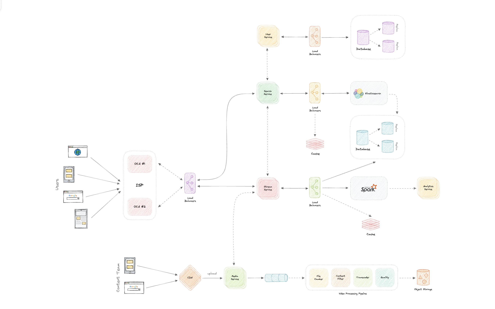

# ДЗ 1. Анализ референсной архитектуры — решение

> Условие: [../Задание.md](../Задание.md) · Чек-лист: [../Чеклист.md](../Чеклист.md)
> Схемы складывайте в [diagrams/](diagrams/).

## Выбранная архитектура

_Видеостриминг_  
Цель задания научиться читать и анализировать архитектурные схемы.
В материалах курса обнаружил лишь поверхностную схему Netflix, делаю вывод, что анализировать надо ее:
  

  
## 1. Компоненты

_Основные сервисы и их ответственности (5–10 компонентов)._

1. CDN - Open Connect Appliance (OCA1 OCA2)
   - Кеширование данных медиафайлов "ближе к клиенту", уменьшение нагрузки на Stream Service
2. LoadBalancer
   - Распределение нагрузки на несколько инстансов сервиса, масштабируемость, высокая доступность.
3. User Service
   - Сервис, который отвечает за работу с пользователями, авторизацию, аутентификацию. Взаимодействует с базой данных пользователей, обычно реляционная база данных.
4. Search Service
   - Сервис, который отвечает за поиск по методанным видео, работает с базой данных в которой хранятся методанных медиаконтента.
5. Stream Service
   - Сервис, который отвечает за воспроизведения медиаконтента, собирает метрики пользователей, взаимодействует с Media Service, Analytics Service
6. Media Service
   - Взаимодействует с Object Storage, отвечает за предварительную обработку видео, разделение на чанки, кодирование, шифрование, разбиение на пресеты по quality.
7. Analytics Service
   - Взаимодействует с базой данных методанных и инструментами для анализа данных (Spark), формирует дашборды и прочие аналитические данные 
8. ELK cluster
   - Хранит метрики и методанные медиафайлов, обеспечивает быстрый полнотекстовый поиск
9. Object Storage
   - Хранилище для медиафайлов
10. User database cluster
   - SQL база данных с данными пользователей.
11. Cache
   - in-memory cache для разрузки поисковой базы данных Elasticsearch, автокомплит, снижение latency.
12. Брокер очередей
   - Асинхронное выполнение тяжелых задач, таких как проверка, фильтрация, транскодирование медиафайлов.
   - Распределение задач между воркерами
   - Надежность при сбоях

## 2. Потоки данных

_3–5 ключевых сценариев со схемами._

1. Загрузка нового видео
   - [ ] Content Team загружает исходный мастер-файл. Данные проходят через CDN.
     Файл принимает Media Service. Media Service сохраняет метаданные через Stream Service и отправляет задачу в Message Broker. 
     Воркеры Video Processing Pipeline (File Checker -> Content Filter -> Transcoder -> Quality) поочередно обрабатывают файл.
     Готовые видео в нескольких разрешениях сохраняются в Object Storage.
     - Синхронно: Загрузка файла от контент-команды в Media Service через CDN. Пользователь (контент-менеджер) ждет, пока файл полностью зальется на сервер, и получает ответ: "Файл успешно загружен, начата обработка".  
     - Асинхронно: Все операции после Media Service. Брокер очередей изолирует тяжелый процесс обработки. Конвейер транскодирования работает независимо в фоновом режиме, не заставляя человека держать браузер открытым.
   - [ ] При сбоях
     - Сбой при загрузке в Media Service: Пользователь сразу видит ошибку на экране (Error 500 / Network Error). 
     - Сбой на этапе pipline: Брокер очередей не получает подтверждение (ACK) от упавшего воркера. Брокер возвращает задачу в очередь (Retry). Другой свободный воркер забирает задачу.
     - Сбой записи в Object Storage: Транскодер выполняет несколько автоматических попыток записи (Retry с экспоненциальной задержкой). Если хранилище недоступно долго, задача падает в очередь ошибок.
2. Поиск видео по базе
   - [ ] User вводит поисковый запрос в приложении. Запрос попадает на внешний Load Balancer. Маршрутизируется в Search Service. Search Service проверяет быстрый Cache (Redis/Memcached). Если данных нет, запрос идет в Elasticsearch. Результат возвращается пользователю и попутно сохраняется в Cache.
     - Синхронно: Весь путь от ввода букв пользователем до отображения результатов на экране происходит синхронно.
     - Асинхронно: На схеме присутствует стрелка от Search Service в Stream Service вероятно для аналитики. Факт того, что пользователь искал конкретное слово, отправляется вероятно асинхронно как событие, чтобы не тормозить выдачу результатов поиска, но брокера на схеме я не вижу.
   - [ ] При сбоях
     - Сбой Cache: Сервис поиска игнорирует кэш и напрямую идет в Elasticsearch (Fallback). Пользователь получит ответ, но задержка (Latency) может незначительно вырасти.
     - Сбой Elasticsearch: Сервис поиска не может вернуть результаты. Включается Fallback: пользователю выдается дефолтный (заранее закэшированный) список популярных фильмов вместо пустой страницы, либо выводится сообщение вроде: «Поиск временно недоступен».
     - Сбой Load Balancer: Полная недоступность сервиса поиска, клиент получает ошибку сети (Connection Timeout / 502).
3. Воспроизведение видео
   - [ ] User воспроизводит видео, наживает допусти кнопку play. Запрос идет через Load Balancer в Stream Service. Stream Service проверяет права доступа пользователя через User Service и в своей БД/Кэше. Stream Service генерирует временную зашифрованную ссылку на манифест видео. Ссылка указывает на конкретный сервер OCA1 или OCA2 внутри сети ISP провайдера (на основе геолокации и нагрузки). Плеер начинает запрашивать куски видео напрямую с OCA интернет-провайдера. Если файла нет на OCA, сервер OCA запрашивает оригинал из центрального Object Storage.
     - Все синхронно, так как это потоковая передача.
   - [ ] При сбоях
     - Сбой Stream Service: Плеер выдает ошибку. Пользователь видит крутилку загрузки. Клиентское приложение пытается повторить запрос ссылки (Retry).
     - Сбой сервера OCA1 во время просмотра: Плеер на клиенте моментально переключается на альтернативный сервер OCA2.

## 3. Проблемы и решения

_Какие проблемы решает каждый компонент._
  
1. CDN и OCA решают проблемы высокой latency и сетевой нагрузки на облачное хранилище. несколько OCA для высокой доступности при отказе
2. Load Balancers - распределение нагрузки по инстансам сервисов, чтобы не было OOM килл или тротлинга
3. Elasticsearch - Обычные реляционные базы данных (SQL) плохо и долго ищут по тексту, особенно если пользователь пишет с опечатками, Elasticsearch индексирует весь каталог
4. Cache - Выделенный Cache перед поисковым движком хранит готовые результаты для топ-100 популярных запросов в оперативной памяти. Помогает при большом кол-ве однотипных запросов, например во время премьер
5. Брокер очередей - Он гарантирует, что задача не потеряется, даже если вся система перезагрузится во время выполнения долгих задач таких как обработка видео, и позволяет выполнять обработку асинхронно в фоне. Распредилить задачи на несколько консюмеров
6. Media Service + (File Checker → Content Filter → Transcoder → Quality) - Разделяет видео на чанки и обрабатывает асинхронно на разных серверах, позволяет преобразовать медиафайл в разные форматы по качеству. Тем самым решает проблему воспроизведения на разных устройствах с разным интернет соединением.

## 4. Вопросы к авторам архитектуры

1. Как обеспечивается гарантия доставки методанных файлов в базу данных, на схеме нет брокера очередей, стрелка после Stream Service и балансировщика идет напрямую на базу elasticsearch? Такая же проблема с метриками. Что произойдет если при загрузке видео произойдет ошибка в stream service, а не video processing pipline
2. Как происходит шардирование или балансировка нагрузка на user service и Analitics Service, по схеме видно что инстансов несколько.
3. Базы данных изображены как кластер с репликами, наличие реплик подразумевает обеспечение высокой доступности, но не всегда масштабируемости и высокой пропускной способности. Как происходит шардирование и горизонтальное масштабирования баз данных пользователей?
4. Какую базу данных использовать для user service? Это похоже на критический узел который является точкой отказа при этом используется довольно активно и не кешируется.
5. Как масштабируется Video Processing pipline и шардируются чанки по инстансам Video Processing pipline?
6. На схеме не отображено что происходит взаимодействие между ISP и object storage, почему?
