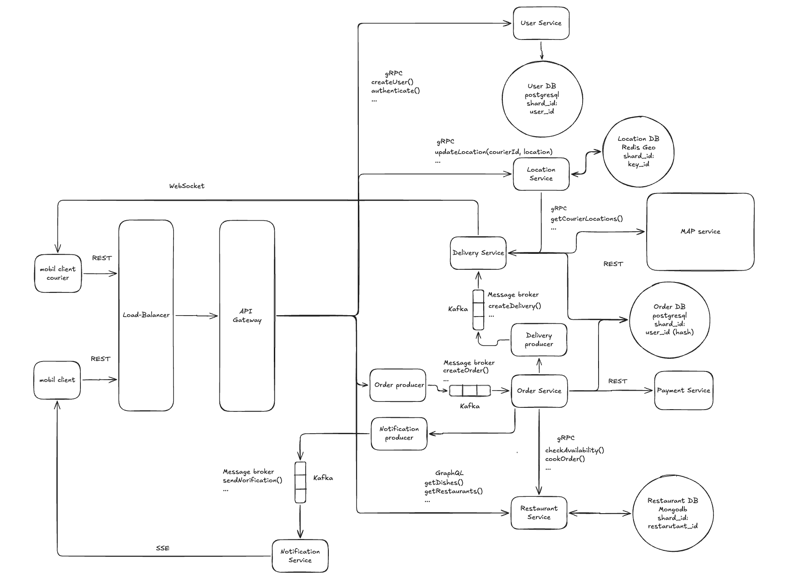

# ДЗ 2. Проектирование взаимодействия сервисов — решение

> Условие: [../Задание.md](../Задание.md) · Таблица протоколов: [../Таблица протоколов.md](../Таблица%20протоколов.md)
> Схемы складывайте в [diagrams/](diagrams/).

## Выбранная система

_Доставка еды_
  
Чтобы ничего не упустить набросаю базовые ФТ и НФТ  
ФТ:
1. Клиент может зарегистрироваться и авторизоваться
2. Клиент может просмотреть каталог ресторанов поблизости и узнать приблизительное время доставки
3. Клиент может просмотреть меню ресторана
4. Клиент может собрать корзину заказа и выбрать адрес доставки
5. Клиент может оплатить заказ
6. Клиент может получать уведомления о статусе заказа
7. Клиент может видеть геолокацию курьера пока ждет заказ  

## 1. Декомпозиция

1. User Service - Операции над данными пользователей, регистрация авторизация и тд
2. Delivery Service - Расчет времени доставки, присвоение заказов курьерам, расчет стоимости доставки
3. Order Service - Создание заказов, оплата, формирование уведомлений по статусам
4. Location Service - Сбор и обработка локации курьеров
5. Restaurant Service - Получение списка блюд меню и информации о ценах, отправка заказа в ресторан
6. Payment Service - Работа с платежным шлюзом. Payment Service — stateless-прокси к внешнему api, а запись в базу данных о платеже пишет сам Order Service
7. Notification Service - отправка уведомлений из очереди
8. Map Service - внешний сервис карт

## 2. Протоколы

1. Между мобильным приложение и балансировщиком, запросы на Map и payment сервисы - REST так как публичные API, легко дебажить, не большое тело запроса
2. На Restaurant Service - GraphQL, для агрегации данных и борьбы с over/underfetching. Важно иметь ввиду риск проблемы N+1
3. Delivery service c приложением курьера webSocket так как нужно получать информацию о новых заказах и иметь возможность соглашаться или отказываться от них
4. Notification service и приложение пользователя SSE так как нужно получать статусы в одностороннем порядке
5. Межсервисное взаимодействие - gRPS, высокая пропускная способность, низкая задержка

## 3. Схема взаимодействия



## 4. API-контракты

1. CreateOrder(CreateOrderRequest) returns (CreateOrderResponse)
    ```    
      Request:
      {
          dishesList,
          restaurantLocation,
          destinationLocation,
      }
        
      Response:
      {
          orderId,
          status
      }
    ```
2.  CreateDelivery(CreateDeliveryRequest) returns (CreateDeliveryResponse)
    ```
      Request:
      {
          orderId,
          deliveryPrice
      }
    
      Response:
      {
          deliveryId,
          status
      }
    ```
3. GetRestaurants
    ```   
       query GetRestaurants($name: String) {
         restaurants(name: $name) {
           id
           name
           description
           latitude
           longitude
           radius
         }
       }
    
       Response:
       {
         "data": {
           "restaurants": [
             {
               "id": "...",
               "name": "...",
               "description": "...",
               "location": "..."
             }
           ]
         }
       }
    ```
4.  UpdateLocation(UpdateLocationRequest) returns (UpdateLocationResponse)
    ```
       Request:
       {
           courierId,
           location
       }
        
       Response:
       {
           success
       }
    ```
5. POST /api/v1/payments/charge
   Content-Type: application/json
   Idempotency-Key: 8f14e45f-ceea-467e-a0c5-b8c6f1a1b3d1
    ```
        {
          "orderId": "order-123",
          "amount": 10,
          "currency": "USD",
          "paymentMethodId": "pm-321"
        }
    ```

## 5. Асинхронность

1. В уведомлениях, чтобы не потерять статусы во время пиков или сбоев
2. В запросах на Order service, долгая операция, чтобы гарантированно обработать заказ
3. В запросах на Delivery Service, долгая операция подбора курьера, чтобы гарантированно обработать заказ

## 6. Паттерны

SAGA - сложные многоэтапные задачи такие как создание заказа и подбор курьера, оплата, различные проверки необходимо контролировать и распределять на разные сервисы. В данном случае хореография.
Пример: 
1. Поступил заказ
2. Order Service генерит idempotencyKey заказа, пишет его в базу, при проблемах на этом этапе вернет ошибку
3. Отправляет запрос на платежный шлюз, при проблемах с оплатой делает ретрай с idempotencyKey 3 раза и возвращает ошибку оплаты
4. При успешной оплате пишет в базу новый статус заказа, генерирует уведомление
5. Запрос идет на Delivery Service, поиск курьера и расчет стоимости доставки. При ошибке в расчетах или отказе курьера, делает повторные попытки. При нескольких правалах отправляет запрос на отмену заказа и refund на Order Service.
6. При успешном закреплении курьера отправляет запрос на Order Service который пишет в базу новый статус, генерит уведомление с информацией о курьере и новом статусе заказа.

read-replicas - на базах Restaurant DB высокая нагрузка на чтение, при пиковых нагрузках чтобы транзакции проходили быстро, выделение запросов на чтение в отдельный поток может помочь снизить нагрузку на базу.
api-gateway - для обеспечения единой точки входа, маршрутизации запросов по ответственным микросервисам, ratelimit, балансировка нагрузки, масштабируемости.


