# Проектная работа: мессенджер на 1 млрд пользователей

> Схемы — в [diagrams/](diagrams/).

## Тема

Мессенджер масштаба Telegram: личные сообщения, группы и каналы для 1 млрд пользователей в месяц по всему миру.

## Требования

- **Функциональные** — scope проекта.
  - Профиль пользователя, с аватаром ФИО тегом и номером телефона
  - Импорт контактов с телефона
  - Писать в личные сообщения текст, файлы, фото, видео (до 2 ГБ)
  - Голосовые сообщения
  - Поиск пользователей по тегу
  - Создавать и писать в групповые чаты
  - Создавать и писать в каналы
  - Push уведомления офлайн-получателям — с агрегацией (политика системы, не пользовательские настройки): личные сообщения и упоминания — не чаще 1 push на чат в 60 сек, остальная групповая активность — дайджест не чаще 1 push на пользователя в 30 мин (в группах до 1 000 участников; в больших группах — только упоминания и ответы)
  - Статусы пользователя (online / last seen) — в заголовке открытого личного чата, в профиле и индикатором «в сети» на аватаре в списке личных чатов
  - Статусы сообщений
  - Синхронизация истории между несколькими устройствами одного аккаунта: свои отправленные сообщения, прочтения и статус «в сети» одинаковы на всех устройствах (ADR «Мультидевайс»)
  - Права и роли в группах/каналах
  - Поиск по сообщениям
  - Редактирование (в течение 48 ч после отправки, как в Telegram) и удаление сообщений (без ограничения по сроку)

- **Нефункциональные**
  - Групповые чаты до 200 000 участников
  - Каналы до 100 000 000 участников
  - MAU 1 000 000 000
  - DAU 500 000 000
  - Хранить данные пользователя и переписок бесконечно долго, удалять только при отсутствии активности в течение 12 месяцев вместе с аккаунтом. История старше 1 года хранится в архиве и доступна листанием (ADR «Архив истории»).
  - SLA 99,95%
  - Отказ целого региона: его пользователи переподключаются к другим регионам за ≤ 90 сек, остальные регионы работают без деградации (ADR «Запас на потерю региона»)
  - Шифрование переписок и файлов пользователей (server-side)
  - Обязательная 2FA авторизация
  - Гарантии порядка сообщений: (1) все участники чата видят сообщения в одном и том же порядке; (2) порядок причинный — ответ всегда отображается после сообщения, которое отвечающий видел на момент отправки; (3) синхронизация без потерь — клиент гарантированно обнаруживает и дозапрашивает пропущенные сообщения. Строгий порядок по «настоящему времени» между одновременными сообщениями из разных регионов не гарантируется (ADR «Порядок и нумерация сообщений»)
  - Пользователи по всему миру
  - Глубина полнотекстового поиска по сообщениям: 1 год
  - latency: p95 ≤ 150–200 мс при получателе в том же регионе (клиент → сервер → push собеседнику, реалтайм через открытое соединение)
  - latency: p95 ≤ 500 мс–1 с при межрегиональной доставке (получатель онлайн, в другом регионе) — через live-роутинг между регионами (обоснование — ADR «Межрегиональная доставка»)
  - Загрузка страницы истории: p95 ≤ 200 мс в пределах последнего года (горячее хранилище), ≤ 500 мс для истории старше года (архив, ADR «Архив истории»)
  - Статус пользователя (online / last seen) актуален с задержкой не более 30 сек
  - Push офлайн-получателю: о личном сообщении или упоминании — не позже 60 сек; о прочей групповой активности — дайджест не реже 1 раза в 60 мин (штатно — 30 мин). Сообщения при этом не теряются — push только уведомляет, содержимое клиент забирает синхронизацией

- **Риски и ограничения.**
  - Большие каналы/группы = экстремальный fan-out — закрыт порогом 1 000 участников: выше него fan-out-on-read + live-подписка открывших чат (ADR «Доставка сообщений группам/каналам»); остаточный риск — нагрузка на Connection Gateway от очень активной большой группы, где все онлайн-участники держат её открытой (≈6,7М кадров/сек для outlier, снижается батчингом)
  - Неограниченный рост хранилища — Cassandra ограничена окном 12–13 месяцев (ADR «Архив истории»); бессрочно растут медиа, архив истории и указатели на него в CHAT_BUCKETS (~0,27 ПБ/год)
  - Квота FCM: после агрегации push (ADR «Push офлайн-получателям») поток в FCM ≈ 252 954/сек — 84% согласуемого потолка (~300 000/сек, 18М/мин) на пессимистичной верхней границе; это в 25 раз выше дефолтной квоты (10 000/сек) — требует заблаговременного согласования с Google. Контроль — адаптивное окно дайджеста (30 → 60 мин снижает загрузку до 55%), при исчерпании деградирует частота уведомлений, не доставка

- **Backlog** — что не входит в scope.
  - Не учитываем регулятора и требования к хранению данных в определенном регионе
  - без звонков, видеосвязи, историй, кружков и других дополнительных фич
  - Bot API / интеграции
  - Платежи внутри чата
  - Звонки, АПИ, боты вне scope
  - Secret chats / самоуничтожающиеся сообщения
  - Система монетизации, подписки, реклама и так далее
  - настройки уведомлений не входят в scope
  - модерация контента
  - Стикеры/гифки/кастомные эмодзи и прочее
  - Система хранения файлов (Object Storage) — вне scope проекта. В документе зафиксированы только требования к ней (объём, durability, DR, раздача через CDN) и архитектурный подход (erasure coding, региональное размещение), не инженерная реализация. Её стоимость в расчёте — допущение по публичным тарифам S3 (#79), а не модель собственной системы

## Концептуальная архитектура

- **Схема C4** (Context + Container) — в [diagrams/](diagrams/).
- **Компоненты**
  - anycast/GeoDNS - внешний managed-провайдер (Cloudflare / AWS Global Accelerator) с anycast-сетью; направляет клиента к ближайшему региону и закрывает DDoS-защиту на периметре. При отказе региона запасной регион выбирает сам клиент — по hash(user_id), чтобы трафик делился 50/50 (ADR «Запас на потерю региона»).
  - CDN - раздаёт статические файлы и медиа из Object Storage через множество точек присутствия, кэширует популярный контент близко к пользователю; сам проверяет подпись ссылки на скачивание (ADR «Скачивание медиа»).
  - API-GATEWAY - принимает stateless HTTP/gRPC-запросы клиента: профиль, поиск, аутентификация, история, админ-операции над группами/каналами. В realtime-доставке не участвует.
  - CONNECTION-GATEWAY - держит постоянные WebSocket-соединения для мгновенной доставки сообщений и статусов, регистрирует подключения и подписки на статус видимых собеседников в региональном Redis (ADR «Presence»).
  - AUTH-SERVICE - аутентификация и управление сессиями: регистрация, логин, 2FA через SMS-шлюз, выдача JWT. Локальная валидация токена на гейтвеях по публичному ключу — Auth Service не участвует в проверке каждого запроса.
  - USER-SERVICE - владеет профилем пользователя (аватар, ФИО, тег, телефон; Aurora), контактами (Cassandra, партиция user_id), поиском по тегу и статусом пользователя online / last seen, а также push-токенами устройств (DynamoDB, ADR «Мультидевайс»). Presence publisher сервиса рассылает смену статуса подписанным спискам чатов (ADR «Presence»).
  - MEDIA-SERVICE - оркестрирует загрузку файлов до 2 ГБ через pre-signed URL напрямую в Object Storage и выпускает подписанные CDN-ссылки для скачивания; сам файл через сервис не проходит, скачивание идёт напрямую в CDN (ADR «Скачивание медиа»).
  - GROUP & CHANNEL SERVICE - владеет членством, ролями и правами (PostgreSQL/Aurora; ~5,6 ТБ — один кластер, шардирование не требуется, раздел «Шардирование»). Проверяет доступ для всех путей чтения (CheckAccess) по кэшу членства пользователя в Redis (ADR «Проверка доступа на чтение»). Для групп до 1 000 участников — fan-out-on-write; для больших групп и каналов — fan-out-on-read + live-подписка открывших чат.
  - MESSAGING SERVICE - принимает, сохраняет и маршрутизирует сообщения, гарантирует порядок и статусы: присваивает сообщению номер в потоке своего региона (seq, через региональный Sequencer) и гибридную временную метку (HLC). Публикует событие в Kafka синхронно из того же запроса, без отдельного CDC-пайплайна и outbox — осознанный best-effort (ADR «Публикация в Kafka»).
  - NOTIFICATION SERVICE - push через FCM/APNs только truly-офлайн пользователям (офлайн на всех устройствах) — на все их устройства; fallback-путь, не основной механизм доставки. Вместе с Delivery consumer агрегирует уведомления в два уровня (не чаще 1 push на личный чат в 60 сек, дайджест по группам — раз в 30 мин на пользователя), поэтому push-поток ограничен числом офлайн-пользователей, а не числом сообщений.
  - CROSS-REGION ROUTER - маршрутизирует realtime-доставку между регионами по текущему региону подключения получателя. Прямой gRPC с durable retry через Kafka — offset коммитится только после успеха; при открытом circuit breaker получатель считается офлайн, событие уходит в push своего региона, offset сдвигается (ADR «Retention Kafka»).
  - SEARCH SERVICE - принимает полнотекстовые запросы, индексирует сообщения параллельным Kafka-consumer'ом, фильтрует по правам доступа через Group & Channel Service. Правку или удаление, записанные в другом регионе, индексатор пересылает в регион исходного сообщения (ADR «Elasticsearch»).
  - Object Storage - custom-система хранения файлов/медиа (не managed S3), origin + bounded edge-кэш. Доступ только через CDN или pre-signed URL.
  - Message Store - Cassandra-подобная wide-column БД для сообщений, партиция (chat_id, region, bucket), clustering (seq, message_id); бакет закрывается через 100 000 событий или на границе месяца, на каждый месяц — отдельная таблица. Горячее окно — 12–13 месяцев, старше — в архиве (ADR «Архив истории»). Active-active: полная копия (RF3) в каждом из 3 регионов, запись и чтение локально (LOCAL_QUORUM), асинхронная репликация между регионами.
  - ARCHIVE SERVICE - отдаёт страницы истории старше года: по указателю из CHAT_BUCKETS читает нужный кусок архивного сегмента из Object Storage (range GET), распаковывает и накладывает удаления (ADR «Архив истории»).
  - ARCHIVER - пакетная задача (Spark): раз в месяц переносит месячную таблицу, которой исполнилось 12 месяцев, в архивные сегменты Object Storage; каждый регион архивирует свои потоки.
  - Elasticsearch - полнотекстовый индекс сообщений (SEARCH SERVICE), глубина 1 год. Tiered hot/warm/cold, по одному кластеру на регион — каждый индексирует сообщения, записанные в своём регионе (правки и удаления — в кластере региона исходного сообщения); поиск опрашивает все 3 кластера.
  - Redis - Connection Registry: user_id → активные устройства/ноды Connection Gateway, региональный, без кросс-региональной репликации. Там же — состояние агрегации push (`push:{user_id}`: счётчики непрочитанного по чатам, время последнего push), Sequencer (`seq:{chat_id}` — счётчик номеров сообщений чата в этом регионе и текущий бакет потока, Lua-скрипт), подписки на большие чаты (`subs:{chat_id}` → ноды Connection Gateway), хвостовой кэш каналов и больших групп (`tail:{chat_id}:{region}`), кэш доступа (`acl:{user_id}`), кэш участников малой группы (`cache:group:{group_id}`), подписки на статус видимых собеседников (`presence_subs:{user_id}`) и online-флаги (`online:{user_id}`).
  - Kafka - региональные кластеры без межкластерной репликации — порядок доставки и durable retry для кросс-региональных событий. Не источник истины (сообщения уже в Cassandra): retention задан по топикам — от 6 ч до 7 сут (ADR «Retention Kafka»).
  - Aurora (PostgreSQL) - managed реляционная БД (Aurora Global Database): профили, сессии, группы, членство и роли. Один writer-регион, read-реплики в двух других; уникальность телефона и тега, ACID (ADR «PostgreSQL: однорегионально vs репликация»).
  - DynamoDB Global Tables - managed глобальный реестр пользователя GLOBAL_REGISTRY: регионы с открытыми устройствами, регион последнего подключения, last_seen и push-токены устройств. Multi-master во всех регионах; читают Delivery consumer, Cross-Region Router, Notification Service и User Service. Поток изменений (DynamoDB Streams) в каждом регионе — источник смен статуса для индикатора «в сети» (ADR «Presence»).
- **Архитектурный стиль**
  - Стиль: микросервисы
    - Различная нагрузка на разные части сервиса
    - Различные технологии хранения, диктуемые НФТ
    - Multi-region - система должна быть распределенной независимо от стиля
- **Региональная модель**
  - 3 региона (EU / US / APAC), все равноправны (active-active). Каждый регион — самодостаточная ячейка с полным набором сервисов и собственными Kafka, Redis, Cassandra и Elasticsearch-кластером. Клиент попадает в ближайший регион через anycast/GeoDNS.
  - «Домашнего региона» у чата нет: сообщение пишется в регион, к которому подключён отправитель, и асинхронно реплицируется в остальные. Для пользователя в DynamoDB Global Tables хранятся регионы, где у него сейчас открыты устройства (`online_regions` — туда доставляются realtime-события), и регион последнего подключения (`current_region` — там срабатывает его push; ADR «Мультидевайс»).
  - Единственная сущность с одним регионом записи — Postresql (Aurora) (профили, сессии, членство): writer в одном регионе, read-реплики в двух других. Это редкие операции (регистрация, логин, смена профиля, изменение состава группы), поэтому +100–200 мс на запись из другого региона допустимы.

    | Данные | Где пишется | Где читается | Между регионами | Потеря региона |
    |---|---|---|---|---|
    | Сообщения (Cassandra) | Регион отправителя, LOCAL_QUORUM | Регион читателя, LOCAL_QUORUM | Асинхронно, полная копия RF3 в каждом регионе | Остальные регионы продолжают без переключения; не доехавшие записи (секунды) догоняются после возврата региона |
    | Поисковый индекс (ES) | Регион, где записано сообщение (локальный Kafka-consumer) | Fan-out по 3 кластерам | Не реплицируется — производный индекс | Поиск по сообщениям этого региона недоступен до переиндексации из Cassandra (копия есть в других регионах) |
    | Kafka | Региональная | Региональная | Не реплицируется; кросс-регион — только Cross-Region Router (gRPC) | Сообщения не теряются — они в Cassandra; живая доставка и push идут через другие регионы, по возвращении — только догон индекса ES (ADR «Retention Kafka») |
    | Connection Registry / push-state (Redis) | Регион подключения | Регион подключения | Нет — эфемерные данные | Клиенты переподключаются в другой регион |
    | Текущий регион и presence пользователя (DynamoDB) | Регион подключения | Любой | Multi-master Global Tables | Без изменений |
    | Профили, сессии, членство (Aurora) | Writer-регион (запись из других — через write forwarding) | Локальная read-реплика | Aurora Global Database, лаг < 1 сек | Managed failover writer'а, ~1 мин |
    | Медиа (Object Storage) | Регион загрузки (origin) | Через CDN/edge-кэш из любого региона | Суточный бэкап в Deep Archive другого региона | Недоступны до восстановления из бэкапа (RPO 24 ч) |
    | Архив истории (Object Storage) | Регион-владелец потока (Archiver) | Любой регион (range GET; из чужого региона +RTT) | Суточный бэкап в Deep Archive другого региона | Недоступен до восстановления; DROP TABLE только после бэкапа — данные не теряются |

- **Ключевые архитектурные решения (ADR)**
  - Региональная модель: active-active ячейки vs primary-регион с DR-копиями
    - Контекст: пользователи по всему миру (НФТ), запись сообщения должна укладываться в p95 150–200 мс в своём регионе. Альтернатива «primary RF3 + 2 DR RF1» противоречит сама себе: запись LOCAL_QUORUM в регионе отправителя невозможна в DR-регионе с RF1 (кворум из одной ноды без отказоустойчивости), а запись в primary из другого региона добавляет 100–200 мс. К тому же Elasticsearch в одном primary-регионе недосягаем для индексаторов других регионов — Kafka региональная, без репликации.
    - Решение: 3 равноправных региона-ячейки. Cassandra — полная копия RF3 в каждом регионе (×9), запись и чтение LOCAL_QUORUM локально. Elasticsearch — кластер на регион, индексирует локальные записи. Kafka — только региональная. Aurora — единственный компонент с одним writer-регионом.
      - (+) Все пути записи сообщений и индексации локальны — ни один не пересекает границу региона
      - (+) Потеря региона не требует ручного promote: остальные продолжают обслуживать всё сразу
      - (+) Сообщения неизменяемы (уникальный message_id), конфликтов при multi-master записи нет; edit/delete — только автор, last-write-wins по HLC достаточно
      - (−) Cassandra ×9 вместо ×5: при плотности 4 ТБ/нода (#34) ~14 520 нод вместо ~8 067, +$6,7М/мес (≈4,9% счёта) — в пределах нескольких процентов, а альтернатива ломает НФТ по latency записи для двух регионов из трёх
      - (−) Поиск опрашивает 3 региона — +RTT межрегиональной сети (~150–250 мс) к ответу поиска
      - (−) Межрегиональный лаг Cassandra: пользователь, переподключившийся в другой регион, может секунды не видеть последние сообщения в истории — покрывается live-доставкой через Cross-Region Router и повторной синхронизацией по read_cursors
  - Message Store: wide-column (Cassandra-подобная) vs PostgreSQL/MongoDB
    - Решение: Wide-column БД (Cassandra/ScyllaDB), partition key = (chat_id, region, bucket), clustering key = (seq, message_id) — ключ раскрыт в ADR «Порядок и нумерация сообщений» и «Размер партиции».
      - (+) Линейное масштабирование write-throughput добавлением нод — нет единого write-лидера, ответственность за партицию распределяется consistent hashing по кольцу
      - (+) Чтение ленты чата — последовательный кусок диска, не N произвольных обращений
      - (−) Query-first modeling — под любой новый паттерн доступа (например, полнотекстовый поиск по сообщениям, который есть в требованиях) нужен отдельный индекс/сервис, Cassandra сама этого не даёт
      - (−) Команде нужна экспертиза в wide-column БД, которой не требовалось бы при выборе Postgres — стоит явно зафиксировать как операционный риск проекта
  - Порядок и нумерация сообщений: время сервера (timeuuid) vs сквозной номер на чат vs номер на (чат, регион) + HLC
    - Контекст: задач две — синхронизация без потерь (клиент после переподключения получает всё, что пропустил) и одинаковый причинный порядок ленты у всех участников. Главная трудность — момент видимости записи: метка времени ставится раньше, чем запись становится видна читателю. Сообщение из US с меткой 100 доезжает до реплики EU через доли секунды, а при разрыве связи между регионами — через часы: недоехавшие записи догоняются после возврата региона со старыми метками. Внутри региона запись тоже может задержаться между выдачей метки и записью в Cassandra (GC-пауза, повтор). Поэтому синхронизация «всё после курсора-времени X» теряет сообщения даже при идеально синхронных часах, а перечитывание хвоста за последние Δ секунд не помогает: межрегиональная задержка не ограничена сверху. Расхождение часов — второстепенный фактор: Amazon Time Sync Service держит его в пределах долей миллисекунды, а ответ пишется через секунды после вопроса; переставить вопрос и ответ могут только аномалии — сбой синхронизации времени, скачок часов, пауза виртуальной машины, бот, отвечающий за миллисекунды.
    - Сквозной номер на чат с одной точкой выдачи — «домашним регионом» чата — решает обе задачи, но: (1) при отказе домашнего региона его чаты перестают принимать сообщения, пока выдача номеров не переедет в другой регион; (2) в смешанной группе EU + US с домашним регионом в US каждая запись автора из EU получает +100–200 мс и нарушает НФТ ≤ 200 мс для получателей в его регионе. Так устроен Telegram — у аккаунта и у канала один счётчик `pts` в своём дата-центре, — но у нас запись принимают все три региона (ADR «Региональная модель»).
    - Решение: разделить две задачи — полноту синхронизации и порядок отображения.
      - Полнота — номер в потоке (чат, регион). Каждый регион ведёт свой счётчик для каждого чата: `seq = INCR seq:{chat_id}` в региональном Redis (Sequencer). Нумеруются все события потока — новое сообщение, правка, удаление, — поэтому синхронизация по seq доставляет и изменения. Курсор клиента — вектор из трёх чисел `{EU: 41, US: 17, APAC: 0}`; пришло 43 без 42 — клиент видит дыру и дозапрашивает. Поздно доехавшее событие из US не сдвигает курсор EU: дыра видна именно в потоке US, сколько бы ни длилась задержка репликации.
      - Порядок — гибридные часы (HLC). Клиент отправляет вместе с сообщением `last_seen_hlc` — максимальную метку среди сообщений, которые он видел; сервер ставит `hlc = max(now, min(last_seen_hlc, now + 5 сек) + 1)`. Ответ получает метку больше вопроса, даже если часы сервера отстают; ограничение сверху не даёт клиенту с ошибкой или злоумышленнику поставить метку из будущего и закрепить своё сообщение в конце ленты. В штатном режиме HLC совпадает со временем сервера — это страховка от аномалий часов ценой одного поля в запросе. Ключ отображения `(hlc, region, seq)` одинаков у всех клиентов → все видят один и тот же порядок.
      - Надёжность Sequencer: Redis с AOF и репликой; после failover счётчик и текущий бакет потока при первом обращении пересеиваются из Cassandra (последняя строка CHAT_BUCKETS и `max(seq)` потока + 1). Если в окне failover один номер всё же выдан дважды, clustering key `(seq, message_id)` не даёт второй записи затереть первую, а клиент читает от курсора включительно и дедуплицирует по message_id.
      - (+) Запись остаётся локальной — ни одного межрегионального вызова, НФТ 150–200 мс сохраняется для всех регионов
      - (+) Отказ региона не останавливает запись ни в один чат: у каждого региона свой поток
      - (+) Потерь при синхронизации нет при любой задержке репликации: плотная нумерация внутри каждого потока делает пропуск видимым
      - (+) Причинный порядок и одинаковая лента у всех участников без синхронизации часов между регионами
      - (−) История чата — слияние до трёх потоков (по одному на регион) по HLC; поток, в который никто не писал, пуст и читается бесплатно
      - (−) Сообщение, доехавшее из другого региона с задержкой, встаёт в ленте выше уже показанных — плата за запись в любом регионе
      - (−) Между одновременными сообщениями из разных регионов порядок задаёт HLC, а не «реальное время» — зафиксировано в НФТ
      - (−) +1 операция Redis (INCR) на каждую запись: 820 417/сек на пике, ~6 нод
  - Размер партиции Message Store: partition = chat_id vs (chat_id, bucket)
    - Контекст: партиция только по chat_id растёт бесконечно. Для группы-outlier (≈333 сообщ/сек × 0,67 КБ) это ≈19 ГБ в сутки в одной партиции — Cassandra деградирует уже на сотнях МБ на партицию (compaction, repair, чтение); популярный канал за годы тоже вырастает за разумный предел.
    - Решение: partition key = (chat_id, region, bucket). Новый бакет открывается через 100 000 событий или при первой записи в новом календарном месяце — что наступит раньше (допущение #60). Партиция ограничена ≈ 67 МБ независимо от активности чата: группа-outlier закрывает бакет примерно за 15 минут, тихий личный чат получает не больше одного бакета в месяц. Граница месяца нужна архиву: у каждого бакета есть возраст, и месяц уходит в архив целиком (ADR «Архив истории»). Каждое открытие бакета пишет строку в CHAT_BUCKETS (chat_id, region → first_seq, bucket, tier); текущий бакет потока Sequencer держит рядом со счётчиком.
      - (+) Размер партиции ограничен сверху для любого чата, включая outlier
      - (+) Партиция не смешивает месяцы — архивация и удаление идут целыми таблицами
      - (−) Номер бакета не вычисляется из seq: при открытии чата и на границе бакета — поиск по диапазону в CHAT_BUCKETS (`first_seq ≤ X`, по убыванию, `LIMIT 1`); дальше клиент держит номер бакета в курсоре рядом с seq
      - (−) Страница на границе бакетов требует чтения двух партиций
  - Архив истории: всё в горячей БД vs TTL в Cassandra vs месячные таблицы + архив в Object Storage
    - Контекст: НФТ — хранить переписку бессрочно, а Cassandra держит горячее окно в 1 год (#32); нужны перенос старых данных, чтение архива и удаление. Хранить всё горячим, у нас нельзя: полная копия в каждом регионе (×9) даёт +~50 ПБ и ~12,5 тыс. нод на каждый год истории. Удаление старого по TTL тоже не подходит: TTL создаёт tombstone на каждую строку, а удаление файлов целиком без компакции (TWCS) работает только для неизменяемых данных, записанных по порядку времени, — у нас в строки дописываются статусы, правки и удаления.
    - Решение:
      - Месячные таблицы. Сообщения пишутся в `messages_YYYY_MM` месяца открытия бакета; бакет не пересекает границу месяца (ADR «Размер партиции»). Таблица, которой исполнилось 12 месяцев, архивируется и удаляется целиком `DROP TABLE` — удаление файлов.
      - Archiver (пакетно, раз в месяц, каждый регион — свои потоки): снапшот таблицы → чтение SSTable напрямую (Spark / Cassandra Analytics, мимо кворумных чтений живого кластера) → группировка по (chat_id, region, bucket), сортировка по seq → блок = один бакет, нарезанный на страницы ~64 КБ (zstd) с индексом seq → смещение в начале блока → блоки упаковываются в сегменты ~256 МБ в Object Storage своего региона (#73: миллиарды тихих чатов не превращаются в миллиарды мелких объектов) → сверка числа событий и контрольной суммы → в CHAT_BUCKETS `tier = archived` и указатель (сегмент, смещение, длина) → `DROP TABLE` через 2 суток, когда месяц заархивирован во всех трёх регионах и сегменты уже в DR-бэкапе.
      - Чтение: GET /messages с `before` — Messaging Service по CHAT_BUCKETS решает для каждого потока отдельно: горячий бакет — Cassandra, архивный — Archive Service (range GET заголовка блока, обычно из кэша, и нужной страницы → распаковка → наложение удалений). Потоки сливаются по (hlc, region, seq), как обычно; для клиента разница только в задержке.
      - Правки и удаления: правка разрешена 48 ч (как в Telegram, #72) — архив для правок неизменяем. Удаление «для всех» архивного сообщения — обычное событие в текущем горячем потоке (синхронизация доставит его устройствам, где сообщение уже есть) плюс строка в ARCHIVE_TOMBSTONES (chat_id → message_id), которую Archive Service накладывает при чтении. Раз в месяц сегменты с удалениями перепаковываются — данные удаляются физически, строки ARCHIVE_TOMBSTONES чистятся. Тот же механизм применяется при удалении аккаунта после 12 месяцев неактивности.
      - (+) НФТ «бессрочно» выполнен при ограниченной Cassandra: архив сжат (×0,4) и хранится в одном экземпляре с erasure coding, а не ×9
      - (+) Нет tombstones от истечения окна и нет рисков TWCS с поздними записями
      - (+) Архивация не нагружает живой кластер — чтение идёт со снапшота SSTable
      - (−) Окно ступенчатое: перед удалением таблицы в Cassandra лежит до ~13,2 месяца данных (13 месяцев + до 3 суток архивации + 2 суток запаса) — сайзинг по максимуму, +10% к объёму сообщений (≈ +1 300 нод вместе с указателями, ≈ $1,4М/мес). Рычаг — недельные таблицы (+~3%), ценой в 4 раза большего числа бакетов и блоков
      - (−) История старше года медленнее: p95 ≤ 500 мс вместо ≤ 200 мс (зафиксировано в НФТ); при чтении из другого региона — +RTT до региона-владельца сегмента
      - (−) CHAT_BUCKETS растёт бессрочно — одна строка на бакет, ~0,27 ПБ/год с учётом ×9 (#74); рычаг на будущее — выносить указатели старше N лет в индексные файлы рядом с сегментами
      - (−) При потере региона его архив недоступен до восстановления из Deep Archive — тот же компромисс, что для медиа (ADR «Object Storage DR»)
      - (−) Статусы «доставлено/прочитано», пришедшие после снапшота, в архив не попадают — для сообщений годичной давности это допустимо
  - Доставка сообщений группам/каналам: fan-out-on-write vs fan-out-on-read
    - Решение: гибридная модель с порогом по размеру чата (допущение #59 — 1 000 участников).
      - Малые группы (≤ 1 000) — fan-out-on-write: Delivery consumer получает список участников от Group & Channel Service (GetMembers, кэш `cache:group:{group_id}`) и доставляет каждому онлайн-участнику напрямую через Connection Registry, офлайн — через агрегацию push. Стоимость — O(N) в момент записи, но N ≤ 1 000.
      - Большие группы (> 1 000) и каналы — fan-out-on-read: сообщение пишется один раз в свой поток. Участник при открытии чата читает поток от своего курсора (через хвостовой кэш, раздел «Кэширование»). Непрочитанное считается без per-member работы: `Σ по регионам (head_seq − cursor_seq)`.
      - Live-доставка для больших чатов — подписка, а не fan-out по участникам: клиент, открывший чат, подписывается через свою ноду Connection Gateway (`subs:{chat_id}` в региональном Redis хранит набор нод CG, у которых есть подписчики). Новое сообщение публикуется один раз на регион (в другие регионы — одно событие через Cross-Region Router), каждой ноде CG из `subs:{chat_id}`; нода рассылает его своим локальным подписчикам. Стоимость — O(нод CG с подписчиками), а не O(участников).
      - Push в больших группах — только упоминания и ответы (дайджест потребовал бы перебора всех участников на каждое сообщение); в каналах push нет.
      - (+) Стоимость записи в любую группу ограничена сверху (≤ 1 000 lookup), outlier на 200 000 участников не создаёт миллионов операций в секунду
      - (+) Подписчики канала и большой группы, у которых чат открыт, получают сообщения мгновенно
      - (+) Fan-out-on-read делает нагрузку пропорциональной реальной активности аудитории, а не размеру подписной базы
      - (−) Два пути доставки — больше кода и тестовых сценариев; переход группы через порог (рост с 1 000 до 1 001) — отдельный сценарий, переключается флаг в метаданных группы
      - (−) Участник большой группы, не открывший её, не получает push о каждом сообщении — только упоминания/ответы и бейдж непрочитанного при открытии приложения
      - (−) Подписочный реестр `subs:{chat_id}` — ещё одна структура в Redis; при потере она восстанавливается повторной подпиской клиентов при переподключении
  - Межрегиональная доставка: live-роутинг между регионами vs push-only
    - Контекст: строгий НФТ на кросс-региональную доставку (p95 ≤ 500мс-1с, получатель онлайн в другом регионе) требует надёжного live-механизма между регионами. Push-провайдеры (FCM/APNs) не подходят на роль единственного пути по двум независимым причинам: латентность — best-effort доставка без SLA, реальный TP99 ~700мс и выше на сравнимых по объёму production-системах, не укладывается в НФТ; throughput — дефолтная квота FCM 600 000/мин (10 000/сек) на проект, официально наращиваемая по запросу (Google допускает диапазон вплоть до >18М/мин ≈300 000/сек при 30-дневном согласовании), но только личные «не найден локально» уже дают 314 667/сек — в 31 раз больше дефолта.
    - Решение: Cross-Region Router (прямой gRPC между регионами, offset в Kafka `cross-region-outbound` коммитится только после успеха — durable retry) и DynamoDB Global Tables (user_id → регионы с открытыми устройствами) для realtime-доставки онлайн-получателям. Notification Service — узкий fallback-путь только для по-настоящему офлайн получателей, не единственный механизм.
      - (+) Реалтайм-доставка для кросс-региональных онлайн-получателей — не упирается в throughput-потолок стороннего push-провайдера
      - (+) Notification Service нагружен минимально — легче пройти официальный процесс согласования квоты FCM для truly-офлайн объёма
      - (−) Операционная сложность — два компонента, circuit breaker/DLQ на cross-region-outbound, глобальный реестр со своей consistency-моделью
      - (−) Cross-Region Router решает latency/throughput только для ОНЛАЙН кросс-региональных получателей. Сырой поток кандидатов на push для truly-офлайн (7 079 320/сек) в 24 раза выше согласуемого потолка FCM — закрывается отдельным решением, агрегацией push (ADR «Push офлайн-получателям»), которое снижает поток до ≈371 991/сек

  - Push офлайн-получателям: по сообщению vs агрегация по пользователю
    - Контекст: при доле онлайн, выведенной из Little's Law (7,9% DAU на пике; с поправкой на активный диалог — 44,7% личные / 17,1% группы, допущения #14, #20, #49), сырой поток кандидатов на push — 7 079 320/сек, в 24 раза выше согласуемого потолка FCM (~300 000/сек). Поток пропорционален «сообщения × получатели», поэтому растёт вместе с fan-out групп — никакая квота такой рост не догонит.
    - Решение: push означает «у тебя есть новое», а не «вот каждое сообщение» — агрегируем на стороне Notification Service:
      - личные сообщения и упоминания/ответы в группах — не чаще 1 push на (пользователь, чат) за 60 сек; первое сообщение уходит сразу (leading edge), остальные копятся в счётчик и попадают в текст следующего push («+3 сообщения»)
      - остальная групповая активность — дайджест не чаще 1 push на пользователя за T = 30 мин суммарно по всем группам («12 сообщений в 3 группах»), первое сообщение после тишины — сразу. Только малые группы (≤ 1 000 участников); в больших группах — только упоминания и ответы (ADR «Доставка сообщений группам/каналам»)
      - адаптивное T: при доле 429-ответов FCM > 1% Notification Service ступенчато увеличивает T до 60 мин
      - состояние — двухуровневое:
        - уровень 1 — регион отправителя, дешёвый фильтр. Если у получателя нет открытых устройств ни в одном регионе, Delivery consumer одним Lua-скриптом обновляет в Redis своего региона `push:{user_id}` — счётчики непрочитанного по чатам и время последнего push. Если push по этому чату уходил меньше 60 сек назад (дайджест по группам — меньше T), событие только увеличивает счётчик и дальше не идёт; иначе оно становится кандидатом на push. Так отсеивается ~95% событий (7,08М → 0,37М/сек)
        - уровень 2 — домашний регион получателя, окончательное решение. Домашний регион — регион последнего подключения (`current_region` в GLOBAL_REGISTRY); Delivery consumer уже прочитал эту запись из DynamoDB, когда проверял, не в сети ли получатель в другом регионе, — отдельного чтения нет. Кандидат попадает в `notification.send` домашнего региона: напрямую, если это регион отправителя, иначе — через `cross-region-outbound` и Cross-Region Router. Notification Service ещё раз проверяет интервал по `push:{user_id}` своего региона: у каждого региона на уровне 1 своё состояние, и если получателю одновременно пишут из EU и APAC, оба региона пропустят по кандидату — второй отсеется здесь. `notification.send` партиционирован по `recipient_user_id`: все кандидаты одного получателя обрабатывает один consumer по очереди, поэтому два экземпляра Notification Service не могут одновременно решить «можно отправить» и прислать два push
      - если домашний регион получателя недоступен (circuit breaker Cross-Region Router открыт), получатель считается офлайн и push отправляет Notification Service региона отправителя; дедупликация уровня 2 в этом режиме не работает — возможен дубль push, это допустимо. Без этого ~1/3 офлайн-пользователей не получали бы уведомлений всё время отказа региона
      - push уходит на все устройства пользователя: push-токены лежат в GLOBAL_REGISTRY и приходят в том же ответе DynamoDB, который Delivery consumer и так читает на промахе Redis, — отдельного чтения нет (ADR «Мультидевайс»)
      - кандидат старше 30 мин не отправляется — после сбоя потребителя или возврата региона устаревшие push не расходуют квоту FCM (ADR «Retention Kafka»)
      - (+) Групповой дайджест ограничен сверху величиной N_офлайн / T — функция числа пользователей, не сообщений; не зависит от размера групп и от спорного допущения о доле онлайн
      - (+) ≈371 991/сек вместо 7 079 320/сек (в 19 раз меньше); в FCM (Android, 68%) — ≈252 954/сек, 84% согласуемого потолка; APNs (iOS, 32%) не имеет квоты на отправителя — ограничение только per-device budget
      - (+) Деградация управляемая: при нехватке квоты растёт T (частота уведомлений), сообщения не теряются — они в Cassandra, клиент синхронизируется по read_cursors при открытии
      - (−) Групповые уведомления реже: после первого — не чаще раза в 30–60 мин
      - (−) +~36 нод Redis под состояние агрегации (одна операция на каждого офлайн-получателя, ≈7,08М/сек); +кросс-регионные кандидаты в Cross-Region Router
      - (−) Квоту FCM всё равно нужно согласовать — в 25 раз выше дефолтной (10 000/сек); это операционная задача с запасом, не структурное несоответствие

  > Остальные ключевые решения оформлены как ADR рядом с расчётом/таблицей, которую они обосновывают: «Хранение данных» — размер ноды Message Store, контакты, Object Storage, Connection Registry, кэш участников группы, партиционирование Kafka, Elasticsearch; «Взаимодействие» — публикация в Kafka (best-effort), мультидевайс, presence, скачивание медиа; «Надёжность» — запас на потерю региона, retention Kafka, репликация Message Store, Object Storage DR, PostgreSQL; «Безопасность» — валидация токена, проверка доступа на чтение.

- **Пользователи и внешние интеграции**
  - Пользователи:
    - Пользователь — отправляет/читает сообщения, управляет профилем и контактами, состоит в группах и каналах, работает с нескольких устройств одновременно (multi-device sync)
    - Администратор группы/канала — дополнительно к обычному пользователю управляет участниками, ролями и правами
  - Внешние интеграции:
    - Push-провайдеры (FCM / APNs) — доставляют push-уведомления пользователям без активного соединения ни на одном устройстве (Notification Service, fallback-путь, не участвует в доставке онлайн-пользователям)
    - SMS/Telephony-шлюз — отправка одноразовых кодов для 2FA-аутентификации (Auth Service)
    - Anycast/GeoDNS-провайдер (Cloudflare / AWS Global Accelerator) — маршрутизация клиента к ближайшему региону, DDoS-защита на периметре
    - CDN-провайдер — раздача статики/медиа из Object Storage через глобальную сеть точек присутствия
    - Managed-сервисы облачного провайдера (Aurora, DynamoDB Global Tables, KMS, Secrets Manager)

## Сайзинг

### Допущения

| # | Допущение | Значение | Статус |
|---|---|---|---|
| 1 | Сообщений/DAU/день | 45 | Источник (середина диапазона 40–50): [Skillademia](https://www.skillademia.com/statistics/whatsapp-statistics/), [XtendedView](https://xtendedview.com/whatsapp-statistics/) |
| 2 | Трафик на одно текстовое сообщение (с протокольными накладными) | 2 КБ | Источник (середина диапазона 1–5 КБ): [Airalo](https://www.airalo.com/blog/how-much-data-does-whatsapp-use). Это расход трафика «на проводе» (TLS, заголовки, ack, статусы) — используется только в Bandwidth. Для хранения — отдельное допущение #56 (сам текст, ~200 Б) |
| 3 | Средний размер фото | 300 КБ | Источник (середина диапазона 100–500 КБ): Airalo, там же |
| 4 | Средний размер видео | 5 МБ | Источник (середина диапазона 2–10 МБ): Airalo, там же |
| 5 | Средняя длина голосового | ~30 сек | Экспертная оценка — источник даёт только цену за минуту, не длительность |
| 6 | Средний размер голосового | 50 КБ | Расчёт: источник (100 КБ/мин, Airalo) × допущение п.5 |
| 7 | Средний размер файла | 3 МБ | Экспертная оценка — нет открытых данных по среднему размеру именно шаренного в чате документа |
| 8 | Состав: текст 80% / фото 8% / видео 2% / голос 7% / файл 3% | — | Интерполяция между расходящимися источниками (Skillademia: 55/22/12/3%; пересчёт сырых чисел XtendedView: ≈90/4.6/0.67/4.7%) |
| 9 | Личные : группы = 65 : 35 | — | Экспертная оценка — нет открытого аналога с каналами такого масштаба |
| 10 | Активных каналов / постов в день | 1 000 000 / 3 | Экспертная оценка |
| 11 | Peak factor | ×3 | Инженерная конвенция для оценки пиковых нагрузок, без отдельного обоснования под мессенджер |
| 12 | Сессий/DAU/день | 3,5 | Источник (середина «3–4»): XtendedView, там же |
| 13 | Длительность одной сессии | ≈651 сек | Расчёт: источник (38 мин/день, [Infobip](https://www.infobip.com/blog/whatsapp-statistics)) / источник (3,5 сессии, п.12) |
| 14 | Доля онлайн-получателей личных сообщений | 44,7% | Расчёт: p = d + (1 − d) × p_base, где p_base = L_peak / DAU = 39 557 292 / 500М ≈ 7,9% (Little's Law, раздел RPS), d = 0,4 — доля доставок внутри активного диалога (получатель онлайн по построению — он только что писал; экспертная оценка, допущение #49). |
| 15 | Средний размер группы на сообщение | 30 получателей | Экспертная оценка — открытых данных о распределении размеров групп нет |
| 16–17 | Heartbeat 30 сек / статусы ×2 на сообщение | — | Архитектурные параметры (Connection Registry, message.status_changed) |
| 18 | Поиск по тегу 5%/день, поиск по сообщениям 2%/день, чтение каналов 2/день | — | Экспертная оценка |
| 19 | Редактирование/удаление | ≈5% от отправки | Экспертная оценка |
| 20 | Доля онлайн среди получателей группы | 17,1% | Та же формула, что #14, с d = 0,1: в группе из ~30 человек в текущем обсуждении участвуют 2–3 (экспертная оценка, допущение #49) — корреляция с активным диалогом слабее, чем в личке |
| 21 | Доля кросс-региональных среди онлайн-получателей | личные 15% / группы 25% | Экспертная оценка — наивная оценка «1-1/3» (3 региона) дала бы 67%, но реальные соцсвязи кластеризуются по языку/культуре/часовому поясу; группы выше личных — крупные интернациональные сообщества вероятнее, чем личный круг общения |
| — | Потолки нод (Cassandra ~15 000/с write и ~30 000/с read, Redis ~200 000/с, Kafka ~20 000/с на партицию, PostgreSQL ~2 000–20 000/с, ES ~1 000/с на шард, Connection Gateway ~50 000/с push на инстанс) | — | Общеинженерный ориентир, не бенчмарк под конкретное железо — ±50%, порядок величины |

### RPS

**Отправка сообщений (личные + группы)**
```
22 500 000 000 сообщ/день = 500М × 45
avg = 22 500 000 000 / 86 400 ≈ 260 417
peak = 260 417 × 3 ≈ 781 250
  личные (65%) ≈ 507 813
  группы (35%) ≈ 273 438
```

**Посты в каналы**
```
3 000 000/день = 1М каналов × 3
avg ≈ 34,7 → peak ≈ 104
```

**Доставка личных — три исхода на каждое сообщение**
```
Redis-lookup (ВСЕ сообщения — заранее неизвестно, найдётся ли получатель): 507 813/сек

Доля онлайн (допущение #14): 0,4 + 0,6 × 0,079 ≈ 44,7% → 227 230

Найден локально (онлайн И тот же регион): 507 813 × 0,447 × 0,85 ≈ 193 146 → прямой push, Connection Gateway
Промах локального Redis: 507 813 − 193 146 ≈ 314 667
  онлайн, другой регион → DynamoDB lookup → Cross-Region Router: 507 813 × 0,447 × 0,15 ≈ 34 085
  truly-офлайн → кандидаты на push: 507 813 × 0,553 ≈ 280 583
```

**Доставка групп (fan-out-on-write, малые группы ≤ 1 000 участников) — та же трёхисходная модель**

Средний fan-out 30 (допущение #15) описывает типичную малую группу. Большие группы (> 1 000) идут по fan-out-on-read с live-подпиской и считаются отдельно — в hotspot-проверке ниже.
```
Redis-lookup (весь fan-out): 273 438 × 30 получателей ≈ 8 203 140/сек

Доля онлайн (допущение #20): 0,1 + 0,9 × 0,079 ≈ 17,1% → 1 404 403

Найден локально: 8 203 140 × 0,171 × 0,75 ≈ 1 053 302
Промах: 8 203 140 − 1 053 302 ≈ 7 149 838
  онлайн, другой регион → Cross-Region Router: 8 203 140 × 0,171 × 0,25 ≈ 351 101
  truly-офлайн → кандидаты на push: 8 203 140 × 0,829 ≈ 6 798 737
```

**Итоговые суммы по трактам**
```
Сообщения:
  Redis lookup (региональный, ВСЕ попытки): 507 813 + 8 203 140 ≈ 8 710 953/сек
  DynamoDB lookup (каждый промах локального Redis): 314 667 + 7 149 838 ≈ 7 464 505/сек
  Cross-Region Router, онлайн-получатели (direct gRPC): 34 085 + 351 101 ≈ 385 186/сек
  Connection Gateway, доставка: 193 146 + 1 053 302 (локальная) + 385 186 (входящая кросс-регион) ≈ 1 631 634/сек

С учётом доставки статусов отправителю (раздел «Статусы личных сообщений» ниже):
  Redis lookup: 8 710 953 + 1 015 626 ≈ 9 726 579/сек
  DynamoDB lookup: 7 464 505 + 629 334 ≈ 8 093 839/сек
  Cross-Region Router (онлайн): 385 186 + 68 169 ≈ 453 355/сек
  Connection Gateway, доставка: 1 631 634 + 386 292 + 68 169 ≈ 2 086 095/сек

С учётом мультидевайса (эхо своих сообщений, read_sync, несколько устройств у получателя — раздел «Мультидевайс» ниже):
  Redis lookup: 9 726 579 + 1 609 111 ≈ 11 335 690/сек
  Connection Gateway, кадры: 2 086 095 + 739 041 ≈ 2 825 136/сек

С учётом индикатора «в сети» в списке чатов (раздел «Presence» ниже):
  Connection Gateway, кадры: 2 825 136 + 253 388 ≈ 3 078 524/сек

Сырые кандидаты на push (truly-офлайн): 280 583 + 6 798 737 ≈ 7 079 320/сек → агрегация, см. ниже
```

**Push-агрегация (ADR «Push офлайн-получателям»)**

Допущения:

| # | Допущение | Значение | Статус |
|---|---|---|---|
| 49 | Доля доставок внутри активного диалога (d) | личные 0,4 / группы 0,1 | Экспертная оценка — используется в #14 и #20 |
| 50 | Средняя серия сообщений одному офлайн-получателю в личном чате за окно 60 сек | 3 | Экспертная оценка — сообщения в личке часто пишут серией («привет / как дела / …») |
| 51 | Доля групповых сообщений с упоминанием/ответом (адресовано одному участнику) | 10% | Экспертная оценка |
| 52 | Окна агрегации | личные/упоминания — 60 сек на (пользователь, чат); группы — T = 30 мин на пользователя (адаптивно до 60 мин) | Архитектурное решение (ADR), не допущение о пользователях |
| 53 | Доля платформ среди получателей push | Android 68% (FCM) / iOS 32% (APNs) | Источник: [StatCounter, август 2026](https://gs.statcounter.com/os-market-share/mobile/worldwide) — 67,6% / 32,4% |
| 54 | Квоты push-провайдеров | FCM — ~300 000/сек согласуемый потолок; APNs — нет квоты на отправителя, только per-device budget | FCM — см. ADR «Межрегиональная доставка»; APNs — ответ инженера Apple на [Developer Forums](https://developer.apple.com/forums/thread/747624) |
| 55 | Ёмкость Connection Gateway по соединениям | ~200 000 WS/инстанс | Экспертная оценка: 32 ГБ RAM / 200 000 ≈ 160 КБ на соединение (буферы + состояние сессии) — с запасом; нужна проверка нагрузочным тестом |

```
Личные:      280 583 / 3 (допущение #50)                          ≈  93 528/сек
Упоминания:  273 438 × 0,10 (#51) × 0,829 (офлайн, #20)            ≈  22 662/сек
Дайджест групп — ВЕРХНЯЯ граница, число офлайн-пользователей / T:
  N_офлайн = DAU − L_peak = 500 000 000 − 39 557 292 ≈ 460 442 708
  460 442 708 / 1 800 сек                                          ≈ 255 802/сек
──────────────────────────────────────────────────
Итого push ≈ 371 991/сек (в 19 раз меньше сырых 7 079 320/сек)

По провайдерам (#53):
  FCM  (68%) ≈ 252 954/сек — 84% согласуемого потолка ~300 000/сек
  APNs (32%) ≈ 119 037/сек — без квоты на отправителя
```

| Окно дайджеста T | Push всего | FCM | % от потолка FCM |
|---|---|---|---|
| 15 мин | 627 793 | 426 899 | 142% ❌ |
| 30 мин (штатно) | 371 991 | 252 954 | 84% ✅ |
| 60 мин (адаптивный максимум) | 244 091 | 165 982 | 55% ✅ |

Почему это работает: без агрегации push-поток пропорционален «сообщения × получатели» и растёт с fan-out групп. С агрегацией групповой дайджест ограничен величиной N_офлайн / T — одному офлайн-пользователю уходит не больше одного дайджеста за окно, сколько бы сообщений ни пришло. Граница зависит от числа людей, а не от размера групп и не от доли онлайн (при 70% онлайн она была бы той же). 84% — пессимистичная оценка: она предполагает, что каждого офлайн-пользователя в каждом окне ждёт новая групповая активность.

Сопутствующие потоки:
```
Redis, состояние агрегации (1 операция на кандидата, уровень 1): ≈ 7 079 320/сек
Кросс-регионные кандидаты на push (уровень 2, через Cross-Region Router),
  верхняя граница — доля кросс-региональных получателей групп (#21): 371 991 × 0,25 ≈ 92 998/сек
Cross-Region Router итого: 453 355 (сообщения + статусы онлайн) + 92 998 ≈ 546 353/сек
```

**Чтение каналов (fan-out-on-read, pull)**
```
1 000 000 000/день = 500М × 2
avg ≈ 11 574 → peak ≈ 34 722
```

**Соединения — Little's Law**
```
λ = 500 000 000 × 3,5 / 86 400 ≈ 20 255/сек
W = 38×60 / 3,5 ≈ 651 сек
L (avg) = 20 255 × 651 ≈ 13 186 000
L (peak, ×3) ≈ 39 558 000
Heartbeat = 39 558 000 / 30 ≈ 1 318 600/сек

Доля DAU онлайн на пике: p_base = 39 558 000 / 500 000 000 ≈ 7,9% — база для допущений #14/#20
Офлайн на пике: N_офлайн = 500 000 000 − 39 558 000 ≈ 460 440 000 — база для границы push-дайджеста
```

**Статусы личных сообщений**
```
События «доставлено» + «прочитано»: 507 813 × 2 ≈ 1 015 626/сек
  запись статуса в строку сообщения (Cassandra): 1 015 626/сек
  доставка статуса ОТПРАВИТЕЛЮ — та же трёхисходная модель, доля онлайн #14 (44,7%):
    Redis lookup отправителя: 1 015 626/сек
    найден локально → Connection Gateway: 1 015 626 × 0,447 × 0,85 ≈ 386 292/сек
    промах → DynamoDB: 1 015 626 − 386 292 ≈ 629 334/сек
      онлайн, другой регион → Cross-Region Router: 1 015 626 × 0,447 × 0,15 ≈ 68 169/сек
      офлайн → статус live не доставляется (push на статусы нет): ≈ 561 165/сек —
        отправитель увидит его при синхронизации, статус уже в Cassandra
```

#### История, синхронизация, медиа, presence, контакты

**Допущения раздела**

| # | Допущение | Значение | Статус |
|---|---|---|---|
| 62 | Загрузок страницы истории (открытие чата, скролл) | 20 на DAU в день | Экспертная оценка: ~6 открытий чата за сессию × 3,5 сессии (#12) |
| 63 | Синхронизация при подключении | 1 запрос на новую сессию; в среднем 10 чатов с изменениями; 1,5 непустого потока на чат | Экспертная оценка; потоки — ADR «Порядок и нумерация сообщений» (большинство чатов пишется из одного региона) |
| 64 | Чтений Cassandra на страницу истории | 2 | ≈1,5 потока + поиск бакета в CHAT_BUCKETS при открытии чата и на границе бакета (дальше номер бакета — в курсоре клиента) |
| 65 | Контакты | 150 найденных в системе контактов на аккаунт; полный импорт телефонной книги (300 номеров) — 1% DAU в день | Экспертная оценка; импорт — при установке/смене устройства, дальше дельты |
| 66 | Чатов на аккаунт (READ_CURSORS) | 50 | Экспертная оценка: личные + группы + каналы, с учётом неактивных аккаунтов (#31) |
| 67 | Подписок на каналы и большие группы на аккаунт | 10 | Экспертная оценка — объём MEMBERSHIPS |
| 68 | Обновление курсора прочтения | личный чат — на каждое «прочитано»; группа — батчем, ≈1 запись на 5 онлайн-доставок | Клиент шлёт ack_read не чаще раза в несколько секунд на чат |
| 69 | Presence | открытый личный чат обновляет статус собеседника раз в 30 сек (в ответе на heartbeat); 30% онлайн-пользователей держат открытым личный чат | Экспертная оценка; 30 сек — НФТ на свежесть статуса |
| 70 | Ссылки на медиа, требующие перевыпуска подписи | 5% скачиваний | Подпись CDN-ссылки живёт 24 ч; перевыпуск — при открытии старой истории |
| 71 | Доля загрузок страниц истории глубже 1 года (архив) | 1% | Экспертная оценка — листание истории сильно смещено к свежему; открытых данных нет, проверяется метрикой после запуска |
| 72 | Окно редактирования сообщения | 48 ч | Как в Telegram ([@telegram](https://x.com/telegram/status/1168523951695437824)); делает архив неизменяемым для правок |
| 73 | Формат архива | сегмент ~256 МБ; блок = один бакет потока; страница ~64 КБ (zstd) с индексом seq → смещение | Архитектурное решение (ADR «Архив истории»): крупные объекты вместо миллиардов мелких, страница истории — 1–2 чтения по диапазону байт |
| 74 | Активных потоков (чат, регион) в месяц | 10 млрд | Экспертная оценка: ~20 чатов с активностью на MAU в месяц; личный чат делится на двоих, группа — на десятки участников. Определяет рост CHAT_BUCKETS |
| 80 | Членств в группах и каналах на пользователя в кэше доступа | ~15; ~360 Б на пользователя (≈20 Б на запись + ключ) | Экспертная оценка: 10 подписок на каналы и большие группы (#67) + ~1,25 малой группы в среднем (22,5 млрд строк MEMBERSHIPS / 2 млрд аккаунтов), у активных — больше |
| 81 | Кэш доступа acl:{user_id} | TTL 1 ч со сдвигом при использовании, жёсткий предел 24 ч; ~200М пользователей в кэше на пике; промах — у ~80% новых сессий | Экспертная оценка: за пиковый час ~219М начал сессий (λ × 3 × 3 600), средний перерыв между сессиями (~4,5 ч) больше TTL |
| 83 | Мультидевайс | у ~20% онлайн-пользователей одновременно открыто второе устройство (в среднем 1,2 онлайн-устройства на онлайн-пользователя) | Экспертная оценка: телефон + десктоп/веб в рабочее время. Число соединений (Little's Law) уже считает устройства — доля нужна только для кадров эха, read_sync и доставки на несколько устройств |
| 84 | Индикатор «в сети» в списке чатов | список чатов открыт у 20% онлайн-пользователей; на экране ~15 личных чатов; набор видимых собеседников меняется (открытие списка, прокрутка) раз в ~60 сек, в среднем 10 новых user_id | Экспертная оценка; проверяется метрикой после запуска |

**История и синхронизация (чтение Cassandra)**
```
Загрузки страниц: 500М × 20 / 86 400 × 3 ≈ 347 222/сек → × 2 чтения (#64) ≈ 694 444/сек
Синхронизация при подключении: 60 765 сессий/сек (λ × 3) × 10 чатов × 1,5 потока ≈ 911 475/сек
  + список чатов пользователя: 1 чтение партиции READ_CURSORS на синхронизацию ≈ 60 765/сек
Итого логических чтений: ≈ 1 666 684/сек
  × 2 реплики (LOCAL_QUORUM) / 30 000 на ноду ≈ 111 нод — кластер сайзится по объёму, не по чтению
Через API Gateway и read-путь Messaging Service: 347 222 + 34 722 (каналы) + 60 765 ≈ 442 709 запросов/сек
```

**Архив истории (ADR «Архив истории»)**
```
Страниц глубже 1 года: 347 222 × 1% (#71) ≈ 3 472/сек → Archive Service
  блоков: × 1,5 потока ≈ 5 208/сек
  range GET в Object Storage: ≤ 2 на блок (заголовок + страница; заголовки горячих
    блоков — в кэше) ≈ до 10 417/сек — несущественно для origin
  ARCHIVE_TOMBSTONES: 1 чтение партиции на страницу ≈ 3 472/сек (Cassandra)
Остальные 99% страниц читаются из горячей Cassandra; чтения Cassandra выше не
  пересчитываем — 1% страниц уходит в архив, это запас

Archiver: сырой объём событий потоков 2,31 ПБ/год (раздел «Хранилище») / 12 / 3 региона
  ≈ 64 ТБ на регион в месяц → за ~3 суток ≈ 248 МБ/сек на регион
```

**Скачивание медиа**
```
Скачиваний = медиа-сообщения (20%, #8) × получатели (та же модель, что egress в Bandwidth):
  личные 507 813 × 0,2 × 1 + группы 273 438 × 0,2 × 30 + каналы 34 722 × 0,2 ≈ 1 749 135/сек
Редирект GET /media/{file_id} → 302 дал бы 1,75М запросов/сек через API Gateway
и Media Service (+35 инстансов каждого) и лишний RTT на каждое скачивание.
Решение — подписанные CDN-ссылки в самом событии и в странице истории (ADR «Скачивание медиа»):
  скачивание идёт напрямую в CDN (входит в egress раздела Bandwidth)
  перевыпуск подписи через Media Service: 1 749 135 × 5% (#70) ≈ 87 457/сек
```

**Presence (ADR «Presence»)**
```
Запись статуса (DynamoDB GLOBAL_REGISTRY: online_regions / last_seen / current_region):
  подключение + отключение: 60 765 × 2 ≈ 121 530/сек — верхняя граница: с мультидевайсом
  пишутся только переходы (первое устройство в регионе / последнее)
Чтение статуса собеседника:
  при открытии личного чата: 347 222 × 0,65 (доля личных, #9) ≈ 225 694/сек
  обновление в открытом чате: 39 557 292 онлайн × 0,30 (#69) / 30 сек ≈ 395 573/сек
  итого ≈ 621 267/сек — ответ на heartbeat, отдельных кадров WebSocket нет
Индикатор «в сети» в списке чатов — подписка (#84):
  открытых списков чатов: 39 557 292 × 20% ≈ 7 911 458
  presence_subscribe: 7 911 458 / 60 сек ≈ 131 858/сек, по 10 новых user_id ≈ 1 318 580/сек
    Redis: SADD/SREM presence_subs + чтение online-флага ≈ 3 операции на user_id ≈ 3 955 740/сек
  публикация смен статуса: каждый регион читает свой DynamoDB Stream GLOBAL_REGISTRY, в нём
    записи всех регионов: 121 530 × 3 ≈ 364 590 событий/сек (User Service) → online-флаг
    + SMEMBERS presence_subs ≈ 729 180 операций Redis/сек
  кадры CG: смены статуса ≤ 121 530 (верхняя граница — один онлайн-наблюдатель на смену;
    при равномерном распределении ~0,24) + ответы на подписку 131 858 ≈ 253 388/сек
  Redis итого ≈ 4 684 920 операций/сек → ~24 ноды (8 на регион); память на регион —
    online-флаги 39,6 млн × ~60 Б ≈ 2,4 ГБ и подписки ~40 млн пар × ~70 Б ≈ 2,8 ГБ
```

**Контакты**
```
Импорт: 500М × 1% / 86 400 × 3 ≈ 174 импорта/сек
  поиск номеров в USERS (Aurora, локальная read-реплика): 174 × 300 ≈ 52 083/сек
    ≈ 17 361/сек на регион — на read-репликах региона (5–7, раздел «Ресурсы»)
  запись найденных контактов (Cassandra): 174 × 150 ≈ 26 042/сек
```

**Проверка доступа на чтение (ADR «Проверка доступа на чтение»)**
```
Личные чаты — без обращения к хранилищу: chat_id = UUIDv5(min(a, b) ‖ max(a, b)),
  запрос несёт peer_id, сервер пересчитывает chat_id и сравнивает

Группы и каналы — CheckAccess(user_id, chat_ids[]) в Group & Channel Service → Redis acl:{user_id}:
  страницы истории групп: 347 222 × 0,35 (#9)          ≈ 121 528/сек
  чтение каналов:                                       ≈  34 722/сек
  синхронизация: 60 765 запросов × 1 пакетная проверка ≈  60 765/сек
  перевыпуск подписей медиа (#70):                      ≈  87 457/сек
  подписка subscribe_chat — открытия каналов и больших групп
    (та же оценка, что для хвостового кэша: 34 722 × 2):  ≈  69 444/сек
  ─────────────────────────────────────
  итого ≈ 373 916/сек — больше, чем отправок в группы (273 542/сек)
  → Group & Channel Service: +19 инстансов (20 000/инст., #43)

Промахи кэша (#81): 60 765 × 0,8 ≈ 48 612/сек ≈ 16 204/сек на регион —
  SELECT group_id, role FROM memberships WHERE user_id = ? на локальной read-реплике Aurora

Память acl:{user_id}: ~200М пользователей × ~360 Б (#80, #81) ≈ 72 ГБ ≈ 24 ГБ на регион
  → 2 ноды Redis по 16 ГБ на регион (3 — с запасом на отказ региона)
Кэш участников cache:group:{group_id} — на тех же нодах: малые группы с активностью за сутки,
  ~10 млн (оценка: 20% от 50 млн, #29) × 50 участников × ~20 Б ≈ 10 ГБ ≈ 3,3 ГБ на регион,
  вытеснение LRU. Операций на ноды acl: CheckAccess 373 916 (чтение) + 273 542 (автор при
  отправке) + GetMembers 273 438 ≈ 920 896/сек ≈ 307 тыс. на регион — в пределах 2 нод
  (≈ 460 тыс. на 3 нодах при отказе соседнего региона)
```

**Курсоры прочтения (READ_CURSORS)**
```
Личные: 507 813/сек (каждое «прочитано»)
Группы: 1 404 403 онлайн-доставок / 5 (#68) ≈ 280 881/сек
Итого ≈ 788 694 записей/сек
```

**Мультидевайс (ADR «Мультидевайс»)**
```
Эхо своих сообщений на другие устройства отправителя:
  HGETALL user:{sender} на каждое событие потока: 820 417/сек
  кадры CG: 820 417 × 20% (#83) ≈ 164 083/сек
Синхронизация прочтения (read_sync) между своими устройствами:
  HGETALL user:{reader} на каждое обновление курсора: 788 694/сек
  кадры CG: 788 694 × 20% ≈ 157 739/сек
Доставка получателю на несколько устройств — кадры CG × 1,2 (#83):
  2 086 095 × 0,2 ≈ 417 219/сек
─────────────────────────────────────
Redis lookup +1 609 111/сек; кадры CG +739 041/сек
Presence в DynamoDB: пишутся только переходы (первое устройство в регионе / последнее) —
  121 530/сек (подключение + отключение) — верхняя граница
Push-токены: едут в ответе DynamoDB на промахе Redis — новых чтений нет
Список чатов для нового устройства (GET /chats): ~174/сек (≈ импорту контактов, #65)
  × (1 чтение READ_CURSORS + ~75 голов потоков) ≈ 13 224 чтений Cassandra/сек — +0,8%, в пределах округления
```

**Запись в Cassandra — все потоки**
```
Сообщения 781 354 + правки/удаления 39 063 + статусы 1 015 626
  + курсоры 788 694 + контакты 26 042 ≈ 2 650 779/сек
× 9 реплик (RF3 × 3 региона) / 15 000 на ноду ≈ 1 591 нода по throughput
```

#### Прочие потоки

**Поиск**
```
по тегу: 500М × 0,05 / 86 400 × 3 ≈ 868/сек
по сообщениям: 500М × 0,02 / 86 400 × 3 ≈ 347/сек
```

**Индексация Elasticsearch**
```
индексируются только текстовые сообщения (80%, допущение #8) — отправка + edit/delete:
(781 354 + 39 063) × 0,80 ≈ 656 334 док/сек
```

**Редактирование/удаление**
```
≈ 781 250 × 0,05 ≈ 39 063/сек
```

**Sequencer (номер события в потоке чата, ADR «Порядок и нумерация сообщений»)**
```
INCR на каждое событие потока — новое сообщение, правка, удаление:
781 354 + 39 063 ≈ 820 417/сек ≈ 273 472/сек на регион (#58)
```

**Hotspot-проверка (одна группа-outlier, 200 000 участников, 10% онлайн = 20 000, 1 сообщение/мин на онлайн-участника)**
```
20 000 / 60 сек ≈ 333 сообщ/сек ОТ группы

Если бы большая группа шла по fan-out-on-write:
  lookup ВСЕХ участников на каждое сообщение (заранее неизвестно, кто онлайн —
  та же трёхисходная модель): 333 × 200 000 ≈ 66 666 667/сек
  — в 7,7 раза больше всего Redis-lookup доставки сообщений (8,7М). Не выдерживается.

Большая группа (> 1 000, fan-out-on-read + live-подписка):
  запись: 333/сек в поток, партиция закрывается за ~15 мин (bucket 100 000 событий
    на поток ≈ 111 сообщ/сек в регионе)
  реестр подписок: 333 × 3 региона ≈ 1 000 чтений subs:{chat_id}/сек
  рассылка по нодам CG с подписчиками: 333 × до 198 нод ≈ 66 000 внутренних вызовов/сек
  кадры WebSocket подписчикам (верхняя граница — все 20 000 онлайн открыли группу):
    333 × 20 000 ≈ 6 660 000/сек
    + обычная доставка, статусы, мультидевайс и presence 3 078 524/сек → 9 738 524/сек / 50 000 ≈ 195 инстансов CG
    — меньше 198, которые уже нужны по соединениям; с батчингом 100 мс на ноде CG
    (10 пачек/сек на подписчика) — ≈200 000 кадров/сек
  push: только упоминания и ответы (адресованы одному участнику)
```

**Хвостовой кэш каналов и больших групп**
```
Чтение каналов: 34 722/сек + открытия больших групп (оценка — того же порядка)
  ≈ 70 000 чтений/сек — по throughput достаточно одной ноды Redis
Память: горячий набор ≤ 200 000 чатов на регион (#61) × 3 потока × 100 событий × 0,3 КБ
  ≈ 18 ГБ на регион → 2 ноды по 16 ГБ на регион, ~6 нод суммарно
Промахи (TTL 5 сек, single-flight): ≤ 1 чтение Cassandra на поток горячего чата раз в 5 сек
```

#### Сравнение с потолком и выводы

| Компонент | Потолок/нода | Поток | Peak RPS | Нод | Вердикт |
|---|---|---|---|---|---|
| Cassandra write | ~15 000/с | Сообщения + правки + статусы + курсоры + контакты, × RF3 × 3 региона (active-active) | 2 650 779 (×9 = 23 857 011 записей реплик) | ~1 591 | ✅ Кластер сайзится по объёму (~14 520 нод при 4 ТБ/ноду), throughput с запасом ×9,1 |
| Cassandra read | ~30 000/с | История + синхронизация при подключении (× 2 реплики LOCAL_QUORUM); каналы и большие группы — через хвостовой кэш | 1 666 684 (×2 = 3 333 368) | ~111 | ✅ Горячая партиция канала на 100M защищена кэшем: ≤ 1 чтение на поток раз в 5 сек |
| Redis Sequencer | ~200 000/с | INCR на каждое событие потока | 820 417 (273 472 на регион) | ~6 (2 на регион) | ✅ |
| Redis хвостовой кэш | ~200 000/с | Чтение каналов и больших групп | ~70 000 | ~6 (2 на регион, по памяти) | ✅ |
| Redis presence-подписки | ~200 000/с | Подписки на статус видимых собеседников + публикация смен статуса | 4 684 920 | ~24 (8 на регион) | ✅ |
| Redis lookup | ~200 000/с | Fan-out личные+группы (все попытки) + поиск отправителя для статусов + эхо на свои устройства и read_sync | 11 335 690 | ~57 | ✅ Крупный кластер |
| Redis heartbeat | ~200 000/с | Heartbeat | 1 318 600 | ~7 | ✅ Меньше lookup-потока |
| Redis push-state | ~200 000/с | Состояние агрегации push (1 операция на кандидата) | 7 079 320 | ~36 | ✅ Отдельный логический кластер рядом с Connection Registry |
| Connection Gateway | ~50 000/с/инст.; ~200 000 WS-соединений/инст. (допущение #55) | Доставка сообщений и статусов (локальная + входящая кросс-регион, все устройства) / одновременные соединения | 3 078 524 / 39 557 292 соедин. | ~62 по throughput, ~198 по соединениям | ✅ Сайзится по соединениям, не по throughput — при реальной доле онлайн (~8% DAU на пике) доставка не определяющий поток |
| DynamoDB Global Tables | managed | Чтение: lookup региона получателя (промахи Redis, сообщения + статусы) + presence; запись: подключение/отключение | 8 715 107 чтений + 121 530 записей | — | ✅ Managed; цена посчитана по тарифу on-demand (#48) |
| Cross-Region Router | ~50 000/с/инст. (то же допущение, что Connection Gateway) | Direct gRPC между регионами: онлайн-получатели сообщений и статусов + кросс-регионные кандидаты на push | 546 353 | ~11 | ✅ Реализуемо |
| Notification Service / FCM+APNs | FCM ~10 000/с дефолт, до ~300 000/с по согласованию (18М/мин); APNs — без квоты на отправителя | Truly-офлайн, push после агрегации | 371 991 (FCM 252 954) | ~8 | ✅ FCM — 84% согласуемого потолка на пессимистичной границе; при T = 60 мин — 55%. Квоту нужно согласовать заранее (ADR «Push офлайн-получателям») |
| PostgreSQL (Aurora read-реплики) | ~2 000–20 000/с | Поиск по тегу + поиск номеров при импорте контактов + загрузка кэша доступа при промахе + проверка сессии при обновлении токена | 868 + 52 083 + 48 612 + 41 802 (≈47 780 на регион) | 5–7 на регион | ✅ |
| Group & Channel + Redis acl | ~20 000/с/инст. (cache-assisted) / ~200 000/с на ноду Redis | Проверка доступа на чтение (история групп, каналы, подписка, синхронизация, перевыпуск подписей медиа); при отправке — проверка автора и список участников малой группы | 373 916 + 546 980 | ~47 инст. + 6 нод Redis (по памяти) | ✅ Чтений больше, чем отправок |
| API Gateway | ~50 000/с/инст. | Профиль, поиск, auth, загрузка медиа + история, чтение каналов, синхронизация, перевыпуск подписей медиа | 731 169 | ~15 | ✅ Скачивание медиа идёт мимо Gateway — напрямую в CDN (ADR «Скачивание медиа») |
| ES query | ~1 000/с/шард | Поиск по сообщениям — fan-out по шардам 3 региональных кластеров | 347 | — | ✅ Редкий трафик; каждый запрос касается всех шардов, но 347/сек несущественно для ~393 нод |
| ES index | ~10 000 док/с на hot-ноду, с учётом записи в реплику (допущение #57) | Индексация текста (с репликой ×2) | 656 334 (×2 = 1 312 668) | ~132 hot-ноды | ✅ Определяет размер hot-tier — по throughput нужно больше нод, чем по объёму (~84), раздел «Ресурсы» |
| Kafka (партиция message_id) | ~20 000/с | Запись от группы-outlier | 333 | 1 | ✅ |
| Группа-outlier (200 000 участников) | — | Fan-out-on-read + live-подписка | 333 записей; ~66 000 внутренних вызовов; 6,66М кадров WS (верхняя граница) | в составе ~198 CG | ✅ Fan-out-on-write давал бы 66,7М lookup/сек — в 7,7 раза больше всего Redis-lookup доставки сообщений; порог 1 000 участников это снимает |

**Выводы по RPS:** архитектура выдерживает нагрузку по всем сценариям таблицы — ни один компонент не упирается в непреодолимый потолок.

1. **Push укладывается в квоту за счёт агрегации, а не за счёт квоты.** При доле онлайн, выведенной из Little's Law (44,7% личные / 17,1% группы; база — 7,9% DAU онлайн на пике), сырой поток кандидатов на push — 7,08М/сек, в 24 раза выше согласуемого потолка FCM. Агрегация (60 сек на личный чат, дайджест 30 мин на пользователя по группам) превращает поток из «сообщения × получатели» в «офлайн-пользователи / окно»: ≈371 991/сек, из них в FCM ≈252 954/сек (84% потолка), остальное — APNs без квоты. Остаточный риск операционный: квоту FCM нужно согласовать заранее (в 25 раз выше дефолта), при нехватке — адаптивное окно до 60 мин (55%).

2. **Redis сайзится по lookup-потоку (~11,3M/сек с учётом статусов и мультидевайса) и состоянию агрегации push (~7,1M/сек), не по heartbeat (~1,3M/сек).** Connection Gateway — наоборот: доставка через него (~3,1M/сек с учётом статусов, мультидевайса и presence, ~62 инстанса) меньше, чем требует удержание ~39,6М одновременных соединений (~198 инстансов, допущение #55), поэтому он сайзится по соединениям.

3. **Средний fan-out «30 получателей на группу» скрывает hotspot одной аномально активной группы.** Группа-outlier на 200 000 участников (10% онлайн, 1 сообщение/мин на активного) создаёт ≈333 сообщ/сек. По fan-out-on-write это было бы ≈66,7М lookup/сек (все участники на каждое сообщение) — в 7,7 раза больше всего Redis-lookup доставки сообщений. Решение — порог 1 000 участников: большие группы переходят на fan-out-on-read с live-подпиской открывших чат, стоимость записи становится O(нод CG), а не O(участников) (ADR «Доставка сообщений группам/каналам»). Партиционирование `message.delivery` по `message_id` защищает от концентрации на одном Kafka-consumer'е, бакеты по 100 000 событий — от бесконечной партиции Cassandra (ADR «Размер партиции»).

4. **История, синхронизация, статусы, курсоры, контакты, presence и скачивание медиа не создают нового узкого места, но определяют два решения.** Запись в Cassandra по всем потокам — 2,65М/сек; throughput-потребность (~1 591 нода) в ~9,1 раза меньше объёмной (~14 520 нод). Скачивание медиа (1,75М/сек) через 302-редирект потребовало бы +35 инстансов API Gateway и Media Service — поэтому подписанные CDN-ссылки (ADR «Скачивание медиа»). Presence через рассылку контактам дала бы fan-out на каждое подключение — поэтому опрос статуса собеседника в ответе на heartbeat (ADR «Presence»).

5. **Все цифры выше — штатный режим, треть трафика на регион.** При отказе региона каждый из двух оставшихся получает ×1,5: запас заложен в разделе «Ресурсы» (ADR «Запас на потерю региона»), шторм переподключений посчитан в разделе «Надёжность».

### Bandwidth (ingress — загрузка от клиента)

```
текст:    18,0 млрд/день × 2 КБ   ≈    36    ТБ/день   (0,80 × 22,5 млрд)
фото:      1,8 млрд/день × 300 КБ ≈   540    ТБ/день   (0,08 × 22,5 млрд)
видео:     450 млн/день  × 5 МБ   ≈ 2 250    ТБ/день   (0,02 × 22,5 млрд)
голосовые: 1,575 млрд/день × 50 КБ ≈  78,75  ТБ/день   (0,07 × 22,5 млрд)
файлы:     675 млн/день  × 3 МБ   ≈ 2 025    ТБ/день   (0,03 × 22,5 млрд)
─────────────────────────────────────────────────────
Итого ingress ≈ 4 930 ТБ/день ≈ 4,93 ПБ/день

peak bandwidth = (4930 ТБ / 86 400 сек) × 3 ≈ 171 ГБ/сек ≈ 1,37 Тбит/сек
```

Видео и файлы — 87% всего bandwidth при 5% сообщений по количеству — типичный паттерн: большая часть трафика создаётся малой долей тяжёлого контента, не текстом.

### Bandwidth (egress — скачивание получателями через CDN)

Допущение: посты каналов используют тот же состав по типу медиа, что и обычные сообщения (80/8/2/7/3%) — упрощение без лучшей открытой альтернативы.

```
Ingress по типу чата (пропорционально доле сообщений):
  Личные (65% от 22,5 млрд): 4930 × 0,65 ≈ 3 204,3 ТБ/день
  Группы (35% от 22,5 млрд): 4930 × 0,35 ≈ 1 725,4 ТБ/день
  Каналы (3 млн постов, тот же состав):
    текст 2,4М×2КБ + фото 240К×300КБ + видео 60К×5МБ + голос 210К×50КБ + файл 90К×3МБ
    ≈ 657,3 ГБ/день ≈ 0,657 ТБ/день

Read-амплификация (получателей на 1 сообщение/пост):
  Личные ×1 (1 получатель) → 3 204,3 × 1 ≈ 3 204,3 ТБ/день
  Группы ×30 (средний fan-out, та же цифра, что в RPS) → 1 725,4 × 30 ≈ 51 762,3 ТБ/день
  Каналы ×333 (чтения/посты = 1 000 000 000 / 3 000 000) → 0,657 × 333 ≈ 218,8 ТБ/день

Итого egress ≈ 3 204,3 + 51 762,3 + 218,8 ≈ 55 185,4 ТБ/день ≈ 55,2 ПБ/день

peak egress = (55 185,4 / 86 400) × 3 ≈ 1 916,1 ГБ/сек ≈ 1,92 ТБ/сек ≈ 15 329 Гбит/сек ≈ 15,3 Тбит/сек
```

**Главная находка:** egress почти в 11 раз больше ingress (15,3 Тбит/с vs 1,37 Тбит/с), и **94% egress создают группы** (51 762 из 55 185 ТБ/день) — не каналы, несмотря на кажущийся экстремальным масштаб (100M подписчиков): каналы читаются не одновременно, fan-out-on-read размазывает нагрузку во времени, а группы получают тот же ×30 множитель синхронно, в момент отправки. Каналы вносят <0,4% итогового egress.

### Хранилище

**Допущения раздела**

| # | Допущение | Значение | Статус |
|---|---|---|---|
| 22 | Число регионов | 3 (EU/US/APAC) | Экспертная оценка — минимально разумное для «пользователи по всему миру» |
| 23 | Репликация Cassandra | Active-active: RF3 в каждом из 3 регионов (общий множитель ×9) | Против асимметричной ×5 (primary RF3 + 2 DR RF1): ×5 ломает локальную запись в двух регионах из трёх, а экономит лишь ~4,9% счёта (ADR «Региональная модель», «Репликация Message Store») |
| 24 | Накладные БД (Cassandra, индексы/WAL) | ×2,5 | Середина инженерного диапазона ×2–3 |
| 25 | Object Storage — durability | ×1,4 (erasure coding, не полная репликация) | Обоснование — прецедент Dropbox Magic Pocket на сопоставимом масштабе (12 девятков durability через erasure coding, не N-way copy) |
| 26 | Object Storage — edge-кэш поверх origin | 15% файлов запрашивается из другого региона, тёплое окно 14 дней | Экспертная оценка, по мотивам demand-based репликации Telegram (сторонний анализ, не официально подтверждено) |
| 27 | Elasticsearch — index overhead / реплика шарда | ×1,15 / ×2 | Инженерный ориентир для полнотекстового индекса |
| 28 | Elasticsearch — репликация по регионам | ×1: кластер на регион, каждый индексирует только свои записи — суммарно одна копия индекса | Поиск не на критическом пути доставки сообщений — межрегиональная копия индекса не нужна: при потере региона его часть индекса восстанавливается переиндексацией из Cassandra, полная копия которой есть в других регионах |
| 29 | Число групп в системе | 50 000 000 | Экспертная оценка — нужно для оценки Group Store |
| 30 | Средний размер профиля/участника в Group Store | 500 байт / 100 байт | Экспертная оценка, консервативная оценка по аналогии с профилем пользователя (см. User Service) |
| 31 | Общее число хранимых аккаунтов | ≈2× MAU = 2 000 000 000 | Экспертная оценка — MAU считает активных за месяц, а НФТ хранит аккаунт до 12 месяцев неактивности; ×2 — грубая срединная оценка «хвоста» неактивных аккаунтов без реальной кривой оттока для калибровки точнее |
| 32 | Cassandra/ES — hot-окно, rolling | 1 год (Cassandra — ступенчато 12–13 мес, месячные таблицы, ADR «Архив истории») | Тот же горизонт, что уже выбран для глубины поиска (НФТ) — единая граница «активной» истории для всей системы |
| 33 | Компрессия холодного архива сообщений | ×0,4 от сырого объёма | Взвешено: текст (80% сообщений) сжимается ×0,32 (zstd на обычном тексте), медиа-ссылки (20%, в основном UUID/URL) почти не сжимаются, ×0,85 |
| 34 | Ёмкость ноды Cassandra | 4 ТБ данных на ноду (диск 6 ТБ SSD, заполнение ~67%) | Обоснование — ADR «Размер ноды Message Store». Прецедент: у Discord в среднем 4 ТБ на ноду Cassandra ([discord.com/blog](https://discord.com/blog/how-discord-stores-trillions-of-messages)). DataStax без SSD, большого числа CPU и RAM не рекомендует больше 1 ТБ на ноду и советует держать диск заполненным на 50–80% ([DataStax](https://docs.datastax.com/en/planning/oss/capacity-planning.html)) — запас нужен под compaction. 20 ТБ на ноду — цель, которую сообщество Cassandra ставит годами, но не рабочая практика ([rustyrazorblade](https://rustyrazorblade.com/post/2025/03-streaming/)). Для ES это допущение не применяется — см. #37-38 |
| 37 | Границы tier'ов ES (внутри 1-летнего hot-окна) | Hot 0-14 дней / Warm 14-90 дней / Cold 90-365 дней | Экспертная оценка — типичный recency-bias для messaging-поиска (свежее ищут на порядки чаще), нет измеренной кривой |
| 38 | Ёмкость ноды ES по tier'ам | Hot 2 ТБ / Warm 10 ТБ / Cold 20 ТБ | Hot и Cold — источник ([Elastic Cloud sizing](https://runbooks.gitlab.com/logging/scaling/): ~1,88 ТБ/hot-нода; [Elasticsearch Labs](https://www.elastic.co/search-labs/blog/elasticsearch-node-shard-size-best-practices): 20 ТБ/cold-нода), Warm — интерполяция, нет отдельного источника |
| 39 | Целевой размер одного ES-кластера | ≤ 250 нод; кластер на регион (~131 нода) укладывается с запасом | Экспертная оценка, ориентир — обсуждения на форуме Elastic, где 500-1000 нод в одном кластере уже называют edge case из-за overhead master-ноды на публикацию cluster state |
| 40 | Sub-year tiering (hot/warm/cold) внутри Cassandra | Не реализуется | Recency bias чтения истории чата (скролл давнего группового чата) слабее выражен, чем у поисковых запросов (обоснование ES-tiering) — открывший старый чат может листать месяцы истории, не только последние недели. К тому же нативной поддержки нет в open-source Cassandra (открытый feature request [CASSANDRA-14863](https://issues.apache.org/jira/browse/CASSANDRA-14863)) — только DataStax Enterprise (коммерческий) или DIY через TWCS+JBOD. Число нод (~14 520, раздел «Ресурсы») — в пределах реальных прецедентов без тиринга — Apple, 300 000+ нод Cassandra, Uber — десятки тысяч |
| 56 | Размер хранимого текста сообщения (payload) + метаданные строки | 200 Б + 80 Б | Текст: по данным исследования WhatsApp-переписки средняя длина сообщения — 5–6,5 слов, 67% сообщений ≤ 5 слов, < 4% длиннее 20 слов ([Rosenfeld et al., ICWSM 2016](https://u.cs.biu.ac.il/~sarit/data/articles/whatsapp-16-3.pdf)); медиана реплики в Twitter — 38 символов ([Alis et al.](https://discovery-pp.ucl.ac.uk/id/eprint/1470083/1/Alis%20et%20al.%20Quantifying%20Regional%20Differences.pdf)). ~40 символов × до 2 байт (кириллица в UTF-8) ≈ 80 Б + хвост длинных сообщений и эмодзи (4 байта) — 200 Б консервативно, с запасом ~2,5×. Метаданные — сумма фиксированных полей MESSAGES из ER-схемы (3 × uuid/timeuuid по 16 Б, 4 × timestamp по 8 Б, type и флаги) ≈ 80 Б |
| 57 | Пропускная способность индексации ES | ~10 000 док/сек на hot-ноду, включая запись в реплику | Общеинженерный ориентир для коротких документов, ±50% — как и остальные потолки нод (раздел RPS); проверяется нагрузочным тестом |
| 58 | Распределение трафика по регионам | Поровну, 1/3 на регион | Упрощение — реальное распределение (например, APAC больше) меняет размер отдельных региональных кластеров, но не суммарное число нод |
| 59 | Порог «большой группы» | > 1 000 участников | Ориентир — лимит групп WhatsApp (1 024), живущего на fan-out-on-write целиком. До порога запись стоит ≤ 1 000 lookup — доли миллисекунды одной ноды Redis; выше O(N) на каждое сообщение начинает доминировать (outlier на 200 000 — 66,7М lookup/сек) |
| 60 | Размер бакета потока (partition Cassandra) | 100 000 событий ≈ 67 МБ или календарный месяц — что раньше | 100 000 × 0,67 КБ (#56 с накладными); держит партицию ниже ~100 МБ — общеинженерного ориентира для Cassandra (компакция, repair, чтение). Граница месяца — для архивации целыми таблицами (ADR «Архив истории») |
| 61 | Хвостовой кэш каналов и больших групп | последние 100 событий на поток, TTL 5 сек, горячий набор ≤ 200 000 чатов на регион | Экспертная оценка. 100 событий — одна страница ленты; 5 сек — допустимая задержка появления поста для того, кто не держит чат открытым (открывшие получают его live-подпиской) |

**Message Store (Cassandra) — rolling hot-window + active-active репликация**
```
Байт/сообщение (допущение #56):
  текст (80%): 200 Б текста + 80 Б метаданных = 0,28 КБ
  медиа (20%): 0,22 КБ (метаданные + ссылка на файл, не сам файл)
avg = 0,80×0,28 + 0,20×0,22 ≈ 0,268 КБ
С накладными (×2,5): 0,268 × 2,5 ≈ 0,67 КБ/сообщение

Событий потока/год = 22 500 000 000 сообщений × 1,05 (правки и удаления, #19) × 365 ≈ 8,62 трлн
  (правка и удаление — отдельные строки потока, ADR «Порядок и нумерация сообщений»; размер
   строки взят как у сообщения — верхняя оценка, удаление короче)
Объём (1 копия) = 8,62 трлн × 0,67 КБ ≈ 5,78 ПБ/год

Hot (окно 12–13 мес ступенчато, сайзинг по максимуму ~13,2 мес — ADR «Архив истории»;
  active-active: RF3 × 3 региона = ×9, допущение #23):
  5,78 × 9 × 13,2 / 12 ≈ 57,20 ПБ — КОНСТАНТА год к году (не растёт бессрочно)

Холодный архив (сегменты Archiver, ADR «Архив истории»; сжатый ×0,4, durability ×1,4 —
  тот же принцип, что Object Storage, в НЁМ и живёт):
  Raw/год (без БД-overhead) = 8,62 трлн × 0,268 КБ ≈ 2,31 ПБ/год
  Сжато: 2,31 × 0,4 ≈ 0,92 ПБ/год
  С durability: 0,92 × 1,4 ≈ 1,29 ПБ/год
  Год 1: 0 (всё ещё в пределах hot-окна) | Год 3: 2 года архива ≈ 2,59 ПБ
```

**Остальные таблицы в Cassandra (тот же keyspace/кластер, active-active ×9)**
```
READ_CURSORS: 2 000 000 000 аккаунтов (#31) × 50 чатов (#66) = 100 млрд строк
  × ~90 Б (user_id, chat_id, вектор курсора, hlc, updated_at) × 2,5 ≈ 22,5 ТБ на копию
  × 9 ≈ 202,5 ТБ
CONTACTS (ADR «Контакты»): 2 000 000 000 × 150 (#65) = 300 млрд строк
  × ~60 Б (user_id, contact_user_id, имя в книге, created_at) × 2,5 ≈ 45 ТБ на копию
  × 9 ≈ 405 ТБ
CHAT_BUCKETS: одна строка на бакет с указателем на архив — растёт бессрочно:
  10 млрд потоков-месяцев (#74) × ~100 Б × 2,5 × 9 ≈ 22,5 ТБ/мес ≈ 0,27 ПБ/год
ARCHIVE_TOMBSTONES: удаления архивных сообщений, чистятся при перепаковке — пренебрежимо

Итого Cassandra (год 1): 57,20 + 0,20 + 0,41 + 0,27 ≈ 58,07 ПБ (≈ 19,36 ПБ на регион)
Год 3: + 0,54 ПБ CHAT_BUCKETS ≈ 58,61 ПБ
```

**Object Storage**
```
Ingress (1 копия) = фото 540 + видео 2250 + голос 78,75 + файлы 2025 ≈ 4893,75 ТБ/день × 365 ≈ 1786,2 ПБ/год

Origin (durability ×1,4, erasure coding):
  Год 1: 1786,2 × 1,4 ≈ 2500,7 ПБ
  Год 3: 1786,2 × 3 × 1,4 ≈ 7502,0 ПБ

Edge-кэш (bounded, не растёт с годами — держит только «тёплое» окно):
  (1786,2 / 365) × 14 дней × 0,15 ≈ 10,3 ПБ

+ Холодный архив сообщений (из расчёта Message Store выше):
  Год 1: 0 | Год 3: 2,59 ПБ

Итого: Год 1 ≈ 2511,0 ПБ; Год 3 ≈ 7502,0 + 10,3 + 2,59 ≈ 7514,9 ПБ (7,5 ЭБ)
```

**Решение: S3-совместимое managed-хранилище не подходит на этом объёме — нужна собственная система.** 7,5 ЭБ к 3 году — тот же порядок величины, на котором Dropbox реально мигрировал с AWS S3 на Magic Pocket, потому что unit-экономика generic облачного хранилища на эксабайтном масштабе перестаёт сходиться. Закладываем custom объектное хранилище (архитектурно по образцу Magic Pocket — erasure coding, оптимизация под небольшие неизменяемые блобы и преимущественно холодные данные), не managed S3-сервис. Подробности — ADR «Object Storage: managed S3-совместимое хранилище vs собственная (custom) система» в разделе «Хранение данных». Сама система хранения — вне scope проекта (раздел «Backlog»), её стоимость в расчёте — допущение #79.

**Elasticsearch — кластер на регион, одна копия индекса суммарно**
```
Текстовых сообщений/год = 22,5 млрд × 0,80 × 365 ≈ 6,57 трлн
На сообщение: 0,28 КБ (200 Б текста + ~80 Б полей message_id/chat_id/sender_id/created_at, #56)
  × 1,15 (индекс) × 2 (реплика шарда) ≈ 0,644 КБ
Объём (steady state; каждый регион индексирует только свои записи, межрегиональной
копии нет — поиск не на критическом пути доставки, допущение #28):
  6,57 трлн × 0,644 КБ ≈ 4,23 ПБ суммарно ≈ 1,41 ПБ на регион (#58)
```

**Мелкие хранилища**

| Хранилище | Оценка | Формула |
|---|---|---|
| User/Auth (PostgreSQL) | ~2,5 ТБ | 2 000 000 000 аккаунтов (≈2×MAU, допущение #31) × 500 байт × 2,5 (контакты — в Cassandra, ADR «Контакты») |
| Group & Channel Service (PostgreSQL) | ~5,6 ТБ | (50 млн малых групп × 50 участников + 2 млрд аккаунтов × 10 подписок на каналы и большие группы, #67) = 22,5 млрд строк × 100 байт × 2,5 |
| DynamoDB Global Tables | ~1 ТБ на регион, ~3 ТБ суммарно | 2 000 000 000 аккаунтов × ~500 байт (online_regions, current_region, last_seen, устройства с push-токенами ~2 × 200 Б) — запись есть у каждого аккаунта, не только у онлайн |

**Итоговая сводная таблица**

| Хранилище | Год 1 | Год 3 |
|---|---|---|
| Cassandra (сообщения за 12–13 мес + курсоры + контакты + CHAT_BUCKETS, ×9) | ~58,07 ПБ | ~58,61 ПБ (растут только указатели CHAT_BUCKETS, +0,27 ПБ/год) |
| Object Storage (медиа + холодный архив сообщений) | ~2511,0 ПБ | ~7514,9 ПБ (7,5 ЭБ) |
| Elasticsearch (3 региональных кластера) | ~4,23 ПБ | ~4,23 ПБ (steady) |
| Aurora (User/Auth/Group) | ~8,1 ТБ | ~8,1 ТБ |
| DynamoDB | ~3 ТБ | ~3 ТБ |

Сообщения — это мало байт: при реалистичном размере текста (#56) вся годовая история всех чатов с полной копией в каждом регионе (57,2 ПБ) меньше 1% объёма медиа за 3 года. Объём системы определяют медиафайлы, не текст.

Object Storage доминирует (в ~130 раз больше Cassandra) — окно 12–13 месяцев зафиксировало Cassandra почти на месте, а Object Storage продолжает расти с годами (медиа бессрочно + архив сообщений).

### Ресурсы

**Допущения раздела**

| # | Допущение | Значение | Статус |
|---|---|---|---|
| 35 | Broker-throughput Kafka (агрегатный, не per-partition) | 100 000/сек | Отдельно от «~20 000/с на партицию» (раздел RPS) — тот был про упорядоченность одной партиции, не про совокупную ёмкость брокера |
| 36 | PostgreSQL (User/Auth/Group) — Aurora Global Database | writer в одном регионе + read-реплики в двух других (×3 по инстансам) | Нагрузка по записи тривиальна (редкие события), поэтому один writer-регион достаточен; реплики нужны для локального чтения и failover (ADR «Региональная модель», «PostgreSQL: однорегионально vs репликация») |
| 41 | Просмотр/обновление профиля | 10% DAU/день | Экспертная оценка — нужно для нагрузки User Service, отдельной от тег-поиска |
| 42 | Media Service — операций на медиа-сообщение | 2 (pre-signed URL + callback) | Экспертная оценка — URL-запрос идёт через API Gateway (клиент), callback — server-to-server от Object Storage напрямую в Media Service, не через Gateway |
| 43 | Ёмкость инстанса сервиса, RPS/инст. | Тяжёлые (Messaging, Auth): 5 000 / Простые (User, Media, Search, API Gateway): 50 000 / Cache-assisted (Group & Channel): 20 000 | Экспертная оценка — тот же принцип градации, что для потолков БД (раздел RPS), не измеренный бенчмарк |
| 75 | Запас на потерю региона | ×1,5 к региональной потребности на критическом пути (CG, Redis, Messaging, Kafka, API Gateway, Auth, User, Group, Media, Notification, Cross-Region Router) | Худший случай: пики регионов совпадают и трафик упавшего делится 50/50. С учётом часовых поясов реальная нагрузка ~×1,1–1,25 — запас с резервом (ADR «Запас на потерю региона») |
| 76 | Раздел трафика упавшего региона | 50/50 между выжившими | Клиент выбирает запасной регион по hash(user_id). Без этого Global Accelerator уводит клиентов в ближайший здоровый регион — по географии до ~70/30 ([AWS](https://docs.aws.amazon.com/global-accelerator/latest/dg/about-endpoints-endpoint-weights.unhealthy-endpoints.html)) |
| 77 | TLS-рукопожатий на инстанс Connection Gateway | ~5 000/сек | Экспертная оценка для 8 vCPU и ECDSA-сертификата; проверяется нагрузочным тестом |
| 78 | Доля переподключений, которым нужно обновить токен | 20% | Экспертная оценка: клиент был онлайн и обновлял токен заранее, TTL access-токена 15–30 мин |
| 82 | Размер события в Kafka (с ключом и заголовками) | `message.delivery` и `cross-region-outbound` ~0,5 КБ, `message.status_changed` ~0,15 КБ, `notification.send` ~0,3 КБ | Экспертная оценка: payload сообщения (#56: 0,28 КБ) + метаданные события и накладные записи Kafka; статус и push — только идентификаторы. Нужна для проверки дисков брокеров (ADR «Retention Kafka») |

**Message Store (Cassandra) — storage-driven, active-active (×9, раздел «Хранилище»)**
```
Данные на регион (RF3): сообщения 19,07 + курсоры 0,07 + контакты 0,14 + CHAT_BUCKETS 0,09 ≈ 19,36 ПБ
  / 4 ТБ на ноду (#34, ADR «Размер ноды Message Store») ≈ 4 840 нод на регион
EU + US + APAC: 4 840 × 3 ≈ 14 520 нод (год 1; CHAT_BUCKETS добавляет ~68 нод в год)

Throughput-проверка (не определяющий фактор):
  Запись: каждый регион принимает ВСЕ записи (свои + реплицированные) × RF3:
    2 650 779 × 3 / 15 000 ≈ 530 нод на регион → ≈ 1 591 нода на 3 региона
  Чтение: 1 666 684 × 2 (LOCAL_QUORUM) / 30 000 ≈ 111 нод суммарно
  Storage доминирует (в ~9,1 раза)
```

**Elasticsearch — tiered (hot/warm/cold), кластер на регион**

Данные распределены равномерно по дням года (без сезонности), доля каждого tier'а — по его окну; трафик — поровну между регионами (#58). Расчёт на один региональный кластер:
```
Объём на регион: 4,23 / 3 ≈ 1,41 ПБ
Hot  (0-14 дней):   14/365  ≈ 3,84%  × 1,41 ПБ ≈  54 ТБ
Warm (14-90 дней):  76/365  ≈ 20,82% × 1,41 ПБ ≈ 294 ТБ
Cold (90-365 дней): 275/365 ≈ 75,34% × 1,41 ПБ ≈ 1 063 ТБ

Нод по tier'ам (допущение #38) + throughput-проверка hot-tier (#57):
  Hot по объёму:     54 ТБ / 2 ТБ                              ≈ 28 нод
  Hot по индексации: 656 334 / 3 ≈ 218 778 док/сек × 2 / 10 000 ≈ 44 ноды  ← определяющий
  Warm: 294 ТБ / 10 ТБ   ≈ 30 нод
  Cold: 1 063 ТБ / 20 ТБ ≈ 54 ноды
  Master: 3 (минимум для отказоустойчивого election)
  ─────────────────────────────────────────
  На регион: 44 + 30 + 54 + 3 ≈ 131 нода (≤ 250 — допущение #39)
  EU + US + APAC: 128 × 3 ≈ 384 data-ноды + 9 master-нод ≈ 393 ноды
```

Hot-tier throughput-bound: свежие 14 дней занимают мало места, но принимают весь поток индексации. Warm и cold определяются объёмом.

**Индексация и поиск** (обоснование — ADR «Elasticsearch: один кластер в одном регионе vs кластер на регион» в разделе «Хранение данных»):
```
Индексация: Search indexer в каждом регионе читает локальный message.delivery и пишет
  в свой региональный кластер — сообщение попадает в индекс того региона, где записано
  (регион отправителя). Правка или удаление из другого региона пересылается индексатору
  региона исходного сообщения (ADR «Elasticsearch»); остальной путь индексации локален.
Поиск: Search Service рассылает запрос во все 3 региональных кластера параллельно и сливает
  результаты — сообщения одного чата могут лежать в разных регионах, если участники
  пишут из разных регионов. 347 RPS — редкий трафик, +RTT межрегиональной сети допустим.
```

**Итого Elasticsearch: ≈ 384 data-ноды + ≈ 9 master-нод ≈ 393 ноды**, по одному кластеру на регион (~131 нода каждый).

**Остальные компоненты**

| Компонент | Формула                                                                                                                                                                                                                                                                                                                                                                                                                                                                                                                                                                            | Итого |
|---|------------------------------------------------------------------------------------------------------------------------------------------------------------------------------------------------------------------------------------------------------------------------------------------------------------------------------------------------------------------------------------------------------------------------------------------------------------------------------------------------------------------------------------------------------------------------------------|---|
| Redis (Connection Registry + push-state + Sequencer + подписки/хвостовой кэш) | (9 726 579 lookup (сообщения + статусы) + 1 609 111 lookup мультидевайса + 1 318 600 heartbeat + 7 079 320 push-state) / 200 000 ≈ 99 + Sequencer 2 на регион (6) + хвостовой кэш 2 на регион (6, по памяти) + кэш доступа acl 2 на регион (6, по памяти)                                                                                                                                                                                                                                                                                                                          + presence-подписки 4 684 920 / 200 000 ≈ 24 (8 на регион) | ~141 нода |
| Connection Gateway | max(3 078 524 / 50 000 ≈ 62; 39 557 292 соединений / 200 000 ≈ 198) — определяют соединения                                                                                                                                                                                                                                                                                                                                                                                                                                                                                        | ~198 инстансов |
| Cross-Region Router | 546 353 / 50 000                                                                                                                                                                                                                                                                                                                                                                                                                                                                                                                                                                   | ~11 инстансов |
| Notification Service (после агрегации) | 371 991 с/ 50 000                                                                                                                                                                                                                                                                                                                                                                                                                                                                                                                                                                  | ~8 инстансов |
| Kafka | (820 417 message.delivery (сообщения + правки/удаления) + 1 015 626 status_changed + 546 353 cross-region-outbound + 371 991 notification.send) ≈ 2 754 387 / 100 000                                                                                                                                                                                                                                                                                                                                                                                                              | ~28 брокеров (≈9–10/регион) |
| PostgreSQL (User+Auth+Group, Aurora Global Database) | Запись тривиальна (редкие auth-события, изменения профиля и состава групп); чтение — тег-поиск 868 + поиск номеров при импорте контактов 52 083 ≈ 17 650/сек на регион + загрузка кэша доступа при промахе 16 204/сек на регион (ADR «Проверка доступа на чтение») + проверка сессии при обновлении токена 41 802 / 3 ≈ 13 934/сек на регион ≈ 47 784/сек на регион — на read-репликах (≈ 71 700 при отказе соседнего региона — ~10 200 точечных чтений по ключу на реплику при 7 нодах). Writer-регион + read-реплики в двух других; верхняя граница — с запасом на отказ региона | 5-7 нод на регион |
| DynamoDB Global Tables | managed, не считается в нодах                                                                                                                                                                                                                                                                                                                                                                                                                                                                                                                                                      | — |
| Object Storage | custom-система (ADR в разделе «Хранение данных»), единица сайзинга — $/ПБ, не ноды                                                                                                                                                                                                                                                                                                                                                                                                                                                                                                 | → раздел «Стоимость» |

**App-сервисы без своей БД или перед своей БД**

```
Messaging Service (request handler):
  отправка и посты 781 354 + edit/delete 39 063 = 820 417
  + статусы и курсоры: ack_delivered 507 813 + ack_read личных 507 813 + ack_read групп 280 881 (#68)
    = 1 296 507 (каждый — запись в Cassandra; личные — ещё публикация в message.status_changed)
  = 2 116 924 / 5 000 (тяжёлые, допущение #43) ≈ 424 инстанса — самый нагруженный сервис системы

Auth Service — JWT проверяется на гейтвеях, Auth вызывается только на вход и обновление токена:
  обновление онлайн-устройствами раз в TTL: 39 557 292 / 1 350 сек (TTL 15–30 мин, в среднем 22,5) ≈ 29 302
  + переподключения с истёкшим токеном: 60 765 × 20% (#78) ≈ 12 153
  + вход по SMS-коду на новом устройстве: ~174 (≈ импорту контактов, #65) × 2 запроса ≈ 347
  ≈ 41 802/сек / 5 000 ≈ 9 инстансов

Messaging Service (read-путь): история 347 222 + чтение каналов 34 722 + синхронизация 60 765 = 442 709
  / 50 000 (простые чтения + подпись CDN-ссылок в ответе) ≈ 9 инстансов

User Service: профиль 500М×0,10(доп.#41)/86400×3 ≈ 1 736 + тег-поиск 868
  + presence 621 267 (запрос Connection Gateway при heartbeat и открытии чата)
  + импорт контактов 174 + публикация смен статуса 364 590 = 988 635 / 50 000 (просто) ≈ 20 инстансов

Media Service: загрузка 22,5млрд×0,20×2(доп.#42)/86400×3 ≈ 312 500
  + перевыпуск подписей CDN-ссылок 87 457 = 399 957 / 50 000 ≈ 8 инстансов
  (скачивание 1 749 135/сек идёт напрямую в CDN, мимо сервиса — ADR «Скачивание медиа»)

Group & Channel Service: CheckAccess автора при отправке в группу или канал 273 438 + 104 = 273 542
  + GetMembers для рассылки по малой группе 273 438 + проверка доступа на чтение 373 916
  = 920 896 / 20 000 (cache-assisted) ≈ 47 инстансов

Search Service: 347 / 50 000 ≈ 3 инстанса (HA-минимум + fan-out-накладные на 3 региональных ES-кластера)

Archive Service: 3 472 страницы/сек (история глубже года) / 5 000 (тяжёлые — распаковка zstd)
  ≈ 1 → 3 инстанса (по одному на регион, HA)

Archiver: пакетная задача (Spark), ~20 воркеров на регион × ~3 суток в месяц, ~248 МБ/сек на регион

API Gateway: профиль (1 736) + тег-поиск (868) + вход в поиск сообщений (347)
  + auth-трафик (41 802, см. Auth Service) + ТОЛЬКО pre-signed URL от Media (половина от 312 500 ≈ 156 250 —
  callback идёт server-to-server от Object Storage, не через Gateway)
  + история (347 222) + чтение каналов (34 722) + синхронизация (60 765) + перевыпуск подписей медиа (87 457)
  = 731 169 / 50 000 ≈ 15 инстансов
```

**Запас на потерю региона (ADR «Запас на потерю региона», допущение #75)**

Расчёт выше — штатный режим, треть трафика на регион. При отказе одного региона каждый из двух оставшихся получает ×1,5; запас закладывается заранее, на регион, с округлением вверх. Цена за единицу: CG $280 (8 vCPU m6i), Redis $512 (мастер + реплика), Messaging/API GW/Auth $248 (8 vCPU c6i), остальные $124 (4 vCPU c6i), Kafka $600.

| Компонент | Штатно, на регион | С запасом, на регион | Итого | Добавка | $/мес |
|---|---|---|---|---|---|
| Connection Gateway | 66 | 99 | 297 | +99 | 27 752 |
| Redis (lookup, heartbeat, push-state) | 33 | 50 | 150 | +51 | 26 136 |
| Redis Sequencer | 2 | 3 | 9 | +3 | 1 537 |
| Redis presence-подписки | 8 | 12 | 36 | +12 | 6 150 |
| Messaging Service (request handler) | 141,3 | 212 | 636 | +212 | 52 627 |
| Messaging Service (read-путь) | 3 | 5 | 15 | +6 | 1 489 |
| Kafka | 9,3 | 14 | 42 | +14 | 8 404 |
| API Gateway | 5 | 8 | 24 | +9 | 2 234 |
| Auth Service | 3 | 7 * | 21 | +12 | 2 979 |
| User Service | 6,7 | 10 | 30 | +10 | 1 241 |
| Group & Channel Service | 15,7 | 24 | 72 | +25 | 3 103 |
| Redis, кэш доступа acl | 2 | 3 | 9 | +3 | 1 537 |
| Cross-Region Router | 3,7 | 6 | 18 | +7 | 869 |
| Media Service | 2,7 | 4 | 12 | +4 | 496 |
| Notification Service | 2,7 | 4 | 12 | +4 | 496 |
| **Итого** | | | | **+471** | **≈ 137 050** |

\* Auth Service — 7 на регион вместо 5 (по ×1,5): так как нужно еще +2 под обновление токенов в шторм переподключений (раздел «Надёжность»).

Без запаса: Cassandra (сайзится по объёму, запас по записи ×9,1), Elasticsearch (при отказе в пик индексация отстаёт на 2–3 часа и догоняет ночью — поиск не на критическом пути), Search и Archive Service, хвостовой кэш Redis (зависит от числа горячих чатов, а не пользователей), Aurora (5–7 нод на регион уже посчитаны с запасом: ≈47 800 чтений/сек на регион штатно, ≈71 700 при отказе соседнего региона), DynamoDB (оплата по факту, таблица прогрета заранее).

**Сводная таблица**

| Компонент | Нод/инстансов |
|---|---|
| Message Store (Cassandra, 3 региона × RF3, 4 ТБ/нода, окно 12–13 мес) | ~14 520 |
| Elasticsearch (кластер на регион × tiered hot/warm/cold + master-ноды) | ~393 |
| Connection Gateway | ~297 (198 + 99 запас на потерю региона) |
| Messaging Service (request handler: отправка, статусы, курсоры) | ~636 (424 + 212 запас) |
| Redis (Connection Registry + push-state + Sequencer + хвостовой кэш + кэш доступа + presence-подписки) | ~210 (141 + 69 запас) |
| Kafka | ~42 (28 + 14 запас) |
| API Gateway | ~24 (15 + 9 запас) |
| Group & Channel Service | ~72 (47 + 25 запас) |
| Auth Service | ~21 (9 + 12 запас на отказ региона и шторм переподключений) |
| User Service (профиль, контакты, presence) | ~30 (20 + 10 запас) |
| Cross-Region Router | ~18 (11 + 7 запас) |
| Messaging Service (read-путь) | ~15 (9 + 6 запас) |
| Notification Service | ~12 (8 + 4 запас) |
| Media Service | ~12 (8 + 4 запас) |
| Search Service (сервис, не ES-хранилище) | ~3 |
| Archive Service | ~3 |
| Archiver (Spark, пакетно ~3 суток в месяц) | ~20 воркеров на регион |
| PostgreSQL (все, БД; Aurora Global — writer + 2 региона реплик) | 15-21 |

**Сверка с реальным прецедентом.** Discord — 177 нод Cassandra на триллионы накопленных сообщений (2015-2022, MAU 150-200М) — [discord.com/blog](https://discord.com/blog/how-discord-stores-trillions-of-messages). Плотность ноды у нас та же, что у Discord, — в среднем 4 ТБ на ноду Cassandra (#34). Поэтому разница в числе нод — это разница в объёме данных: у Discord ≈177 × 4 ТБ ≈ 0,7 ПБ, у нас ≈58 ПБ, в ~80 раз больше. Разрыв объясним тремя факторами: (1) наш годовой объём (8,21 трлн сообщений/год) сам по себе больше, чем Discord накопил за 7 лет; (2) мы держим полную копию RF3 в каждом из 3 регионов (×3 к объёму одного региона), чего Discord, судя по их же блогу (одна основная инфраструктура, не активная 3-континентальная репликация каждого сообщения), скорее всего не делает; (3) ×2,5 накладных БД (#24) — консервативная оценка. Там же — прецедент рычага: Discord перешёл со 177 нод Cassandra на 72 ноды ScyllaDB по 9 ТБ (ADR «Размер ноды Message Store»).

**Спецификация нод (vCPU / RAM / диск)**

| Компонент | vCPU | RAM | Диск | Источник/обоснование |
|---|---|---|---|---|
| Cassandra | 16 | 64 ГБ (heap ~8 ГБ) | 6 ТБ SSD (EBS gp3; 4 ТБ данных, ~67% заполнения) | При 4 ТБ на ноду (#34) 16 vCPU / 64 ГБ достаточно — throughput-потребность в ~9 раз ниже объёмной. Heap — sweet spot G1GC ([netdata.cloud](https://www.netdata.cloud/guides/cassandra/cassandra-heap-pressure-tuning/)), остальная RAM — page cache. SSD обязателен — HDD непригоден для продакшен-Cassandra (~150 IOPS). EBS gp3 — та же модель, что в «Стоимости»; базовые 3 000 IOPS gp3, доплата за IOPS сверх базы в стоимость не включена |
| ES Hot | 16 | 64 ГБ (heap ~31 ГБ) | 2 ТБ NVMe SSD | Heap — потолок JVM (compressed oops); диск — реальный пример Elastic Cloud (~1,88 ТБ/hot-нода) |
| ES Warm | 8 | 64 ГБ (heap ~31 ГБ) | 10 ТБ SSD | Меньше CPU — нет активной индексации, но нужна разумная latency на чтение |
| ES Cold | 8 | 64 ГБ (heap 31 ГБ) | 20 ТБ SSD | «Cold nodes at 20 TB with 31 GB of heap handle... comfortably» ([Elastic Labs](https://www.elastic.co/search-labs/blog/elasticsearch-node-shard-size-best-practices)) |
| Redis (Connection Registry, push-state, Sequencer, хвостовой кэш, кэш доступа, presence-подписки) | 8 | 16 ГБ | малый SSD (AOF) | Throughput-bound; исключения — хвостовой кэш (~18 ГБ на регион, #61) и кэш доступа acl (~24 ГБ на регион, #80–#81), они сайзятся по памяти |
| Kafka | 8 | 32 ГБ (heap ~6-8 ГБ) | 4 ТБ SSD | Sequential I/O — SSD, не обязателен NVMe; heap скромный, остальное — OS page cache. Диск проверен по retention (ADR «Retention Kafka»): 49% штатно, 74% при отказе соседнего региона |
| Connection Gateway | 8 | 32 ГБ | — | Экспертная оценка — типовой app-server профиль под держание WS-соединений в памяти |
| Cross-Region Router | 4 | 8 ГБ | — | Экспертная оценка — лёгкий stateless-сервис |
| Notification Service | 4 | 8 ГБ | — | Экспертная оценка — лёгкий stateless-сервис |
| Messaging Service | 8 | 16 ГБ | — | Экспертная оценка — Cassandra write + синхронный Kafka publish, тяжелее простого CRUD |
| Auth Service | 8 | 8 ГБ | — | Экспертная оценка — crypto-операции (подпись JWT, хэширование) |
| API Gateway | 8 | 16 ГБ | — | Экспертная оценка — routing/pass-through множества одновременных соединений |
| Group & Channel Service | 4 | 8 ГБ | — | Экспертная оценка — лёгкий, cache-assisted |
| User Service, Media Service, Search Service | 4 | 8 ГБ | — | Экспертная оценка — простые stateless-сервисы, малая нагрузка на инстанс |
| Archive Service | 8 | 16 ГБ | — | Экспертная оценка — распаковка zstd и кэш заголовков блоков в памяти |
| Archiver (Spark-воркер) | 16 | 64 ГБ | локальный SSD под сортировку | Экспертная оценка — пакетная задача, живёт ~3 суток в месяц |
| PostgreSQL (User/Auth/Group) | 8 | 32 ГБ | 4 ТБ SSD | Экспертная оценка, с запасом над расчётным объёмом (~8,1 ТБ на кластер); 5–7 нод на регион — по чтению с учётом кэша доступа и запаса на отказ региона |

### Стоимость

Тарифы — AWS (EC2/EBS/S3/data transfer), реально сорсинговые ставки.

**Допущения раздела**

| # | Допущение | Значение | Статус |
|---|---|---|---|
| 44 | EC2 $/vCPU по семействам | General Purpose (m6i, 4:1) $35,04 / Compute Optimized (c6i, 2:1) $31,03 | Источник: [Vantage](https://instances.vantage.sh/aws/ec2/m6i.large) — m6i.large $0,096/ч, c6i.xlarge и c6i.4xlarge $0,17/ч и $0,68/ч (оба дают одинаковый $/vCPU — не случайность, подтверждает линейность внутри семейства) |
| 45 | EC2 $/vCPU Memory-Optimized (r6i, 8:1) | ≈$43/vCPU | Не найден прямой источник — интерполяция между допущением #44 по двум точкам, явно оценка |
| 46 | EBS gp3, S3 Standard/Glacier | $0,08/ГБ-мес / $0,023/ГБ-мес / $0,004/ГБ-мес | EBS — [costgoat.com](https://costgoat.com/pricing/amazon-ec2); S3 — общеизвестные стабильные ставки, отдельно не проверялись |
| 47 | Data transfer OUT — СТУПЕНЧАТЫЙ, не плоский | 100 ГБ бесплатно → $0,09/ГБ (10 ТБ) → $0,085 (40 ТБ) → $0,07 (100 ТБ) → **$0,05/ГБ (свыше 150 ТБ)** | [spendark.com](https://spendark.com/blog/aws-data-transfer-cost/), [egresscost.com](https://egresscost.com/aws/) — критично для нашего объёма: 1,66 млн ТБ/мес почти целиком попадает в самую дешёвую ступень |
| 48 | DynamoDB Global Tables — тариф on-demand | запись $0,625 за 1М WRU, каждая реплицированная запись в другой регион — ещё $0,625 за 1М rWRU; чтение $0,125 за 1М RRU, eventually consistent чтение — 0,5 RRU | Источник: [spendark.com](https://spendark.com/blog/dynamodb-pricing-explained/) (us-east-1). |
| 79 | Стоимость Object Storage | Публичные тарифы S3 (Standard / Glacier / Deep Archive) как прокси | Допущение: система хранения файлов вне scope проекта (раздел «Backlog»). Известные искажения сознательно не уточняются: durability учтена дважды — ×1,4 к объёму и ещё раз внутри цены S3 (завышение); origin, который отдаёт промахи CDN, оценён по Glacier-классу без платы за извлечение (занижение); собственная система по прецеденту Dropbox Magic Pocket должна стоить дешевле S3 за единицу объёма. Модель $/ПБ собственной системы — задача отдельного проекта системы хранения |

**Compute**
```
Cassandra: (16×$35,04 + 6 000×$0,08) × 14 520 ≈ $15 110 093
  (4 ТБ данных на ноду — ADR «Размер ноды Message Store»; окно 12–13 мес и указатели
   CHAT_BUCKETS — ADR «Архив истории»; объём года 1 — к году 3 указатели добавляют
   ~135 нод, ≈ +$0,14М/мес)
ES (3 региональных кластера):
  Hot:    (16×$35,04 + 2 000×$0,08)  × 132 ≈ $95 124
  Warm:   (8×$43 + 10 000×$0,08)     ×  90 ≈ $102 960
  Cold:   (8×$43 + 20 000×$0,08)     × 162 ≈ $314 928
  Master: ≈ $162                     ×   9 ≈ $1 457
  Итого ES ≈ $514 469
Kafka: (8×$35,04 + 4 000×$0,08) × 42 ≈ $25 213 (28 + 14 запас на потерю региона)
App-сервисы (все, из раздела «Ресурсы», с запасом на потерю региона +$93 286): ≈ $275 020
  (Messaging Service 651 × 8 × $31,03 ≈ $161 604 — крупнейший из app-сервисов: отправка,
   статусы и курсоры; Connection Gateway 297 × 8 × $35,04 ≈ $83 255;
   Archive Service 3 × 8 × $31,03 ≈ $745)
Archiver (Spark, 20 воркеров × 3 региона × 16 vCPU, ~3 суток = 0,1 месяца):
  60 × 16 × $35,04 × 0,1 ≈ $3 364
──────────────────────────────────────
Итого Compute ≈ $15 928 159/мес
```

**Storage (Object Storage — S3 Standard/Glacier/Deep Archive как прокси; объём года 3; допущение #79 — система хранения вне scope)**
```
Hot (edge-кэш, 10,3 ПБ): 10 300 000 ГБ × $0,023 ≈ $236 900
Cold (origin медиа, 7 502,04 ПБ): 7 502 040 000 ГБ × $0,004 ≈ $30 008 160
Архив истории (сегменты читаются по запросу — тёплый класс, 2,59 ПБ к году 3):
  2 590 000 ГБ × $0,023 ≈ $59 570
DR-бэкап origin в Deep Archive другого региона (ADR «Object Storage DR»):
  7 502 000 000 ГБ × $0,00099 ≈ $7 426 980
──────────────────────────────────────
Итого Storage ≈ $37 731 610/мес
```

**Network — ступенчатая формула AWS data transfer**
```
Объём: 1 655 562 000 ГБ/мес

0–100 ГБ:     бесплатно
100 ГБ–10 ТБ: 9 900 ГБ × $0,09   ≈ $891
10–50 ТБ:     40 000 ГБ × $0,085 ≈ $3 400
50–150 ТБ:    100 000 ГБ × $0,07 ≈ $7 000
>150 ТБ:      1 655 412 000 ГБ × $0,05 ≈ $82 770 600

Межрегиональная репликация Cassandra (active-active):
  все записи, не только сообщения (avg = пик / 3), × 2 региона-получателя × 2 592 000 сек:
    сообщения + правки: 273 472/сек × 0,268 КБ ≈ 73 291 КБ/сек
    статусы + курсоры + контакты: 610 121/сек × ~0,1 КБ ≈ 61 012 КБ/сек
  ≈ 696 225 ГБ/мес × $0,02 ≈ $13 925 — пренебрежимо на фоне egress медиа
──────────────────────────────────────
Итого Network ≈ $82 795 816/мес
```

**Managed**
```
Redis: (8×$31,03+$8) × 210 × 2 ≈ $107 621 (141 + 69 запас на потерю региона)
PostgreSQL (Aurora Global: writer-регион + 2 региона реплик): (8×$35,04+4 000×$0,08) × 7 × 3 ≈ $12 607
  (до 7 нод на регион — загрузка кэша доступа при промахе, с запасом на отказ региона)
DynamoDB Global Tables (тариф #48; среднее = пик / 3; месяц = 2 592 000 сек):
  чтение: 8 715 107 / 3 × 2 592 000 × 0,5 RRU × $0,125 / 1М ≈ $470 616
  запись presence: 121 530 / 3 × 2 592 000 × 3 (своя + 2 реплицированные) × $0,625 / 1М ≈ $196 879
  хранение ~3 ТБ × $0,25/ГБ-мес ≈ $750 (запись с push-токенами устройств, ADR «Мультидевайс»)
  DynamoDB Streams (публикация смен статуса, ADR «Presence»): ~125 шардов × 5 GetRecords/сек
    × 3 региона ≈ 1 875/сек × 2 592 000 × $0,02 / 100 000 ≈ $972
  итого ≈ $669 216
──────────────────────────────────────
Итого Managed ≈ $789 444/мес
```

**Итог**

| Ось | $/мес | Доля |
|---|---|---|
| Network | $82 795 816 | 60,3% |
| Storage | $37 731 610 | 27,5% |
| Compute | $15 928 159 | 11,6% |
| Managed | $789 444 | 0,6% |
| **Итого** | **≈ $137 245 029** | 100% |

```
Cost/DAU = 137 245 029 / 500 000 000 ≈ $0,274/мес
```

**Структура стоимости.** Network (60,3%) и Storage (27,5%) — это медиа: их раздача и хранение дают 88% счёта, и прямое следствие вывода из раздела Bandwidth — группы создают 94% egress. Сообщения при реалистичном размере текста (#56) — мало байт: Message Store стоит ≈ $15,1М/мес (11,0%), Elasticsearch — ≈ $0,5М. Решения, принятые ради надёжности и функций, почти не влияют на итог: active-active ×9 вместо ×5 — ≈ $6,7М/мес (4,9%), архив истории с окном 12–13 мес — ≈ $1,4М (1,0%), запас на потерю региона — ≈ $137 тыс. (0,1%), проверка доступа на чтение — ≈ $12 тыс., мультидевайс — ≈ $6 тыс., индикатор «в сети» в списке чатов — ≈ $21 тыс.

Отсюда приоритет оптимизаций: рычаги ниже — про объём байт медиа, а не про БД сообщений; главный рычаг на Message Store — более плотная СУБД (ADR «Размер ноды Message Store»).

**Оптимизация Network — два рычага**

1. **Private Pricing Agreement (PPA)** — AWS официально предлагает индивидуальные ставки клиентам с обязательством от 10 ТБ/мес; наш объём (1,66 млн ТБ/мес) превышает этот порог в ~165 000 раз. Публичная ступень «>150 ТБ = $0,05/ГБ» — стартовая точка переговоров, не потолок. Точная скидка не публична, но это конкретный, реализуемый следующий шаг, не гипотеза.
2. **Снижение самого объёма байт** (адаптивное качество медиа — превью по умолчанию, полный размер по запросу; более эффективные кодеки при загрузке — AVIF/WebP, AV1/HEVC вместо базовых форматов) — единственный рычаг, который снижает счёт при любой тарифной сетке / любом провайдере, не только на AWS.

## Хранение данных

### Выбор БД

| Данные | БД | Обоснование (кратко) | Где решено |
|---|---|---|---|
| Сообщения (Message Store) | Cassandra (wide-column) | Append-heavy, огромный write-throughput, партиция = (chat_id, region, bucket) | ADR «Message Store: wide-column vs Postgres/Mongo» |
| Connection Registry | Redis | TTL+heartbeat на устройство, региональный, throughput-bound не storage-bound | ADR «Connection Registry: TTL на поле хэша» |
| Глобальный реестр региона | DynamoDB Global Tables | Multi-master, managed, active-active репликация между регионами | ADR «Межрегиональная доставка» |
| User/Auth/Group данные | PostgreSQL | Точечные запросы, constraints, ACID, умеренный объём; Aurora Global Database — writer в одном регионе, read-реплики в двух других | Компоненты выше, ADR «PostgreSQL: однорегионально vs репликация» в разделе «Надёжность» |
| Полнотекстовый поиск | Elasticsearch | Единственная технология с native full-text на этот объём | ADR «Elasticsearch: один кластер в одном регионе vs кластер на регион» ниже (раздел «Шардирование») |
| Медиафайлы | Custom Object Storage | Managed S3 экономически не сходится на 7,5 ЭБ (раздел «Хранилище») | ADR ниже |
| История старше 1 года | Object Storage (сегменты архива) | Сжатые неизменяемые блоки, читаются редко и по диапазону байт; в Cassandra остаются только указатели | ADR «Архив истории» |

### Архитектурные решения (ADR)

**Размер ноды Message Store: 4 ТБ на ноду Cassandra vs 20 ТБ vs ScyllaDB**
```
Контекст: Cassandra сайзится по объёму (~58 ПБ с 9 копиями), поэтому плотность ноды напрямую
задаёт число нод и большую часть Compute. 20 ТБ на ноду — цель, которую сообщество Cassandra
называет годами, но не рабочая практика: DataStax без SSD, многих CPU и большой RAM не
рекомендует больше 1 ТБ на ноду и держит диск заполненным на 50–80% — запас нужен под
compaction; у Discord в среднем 4 ТБ на ноду Cassandra. На нодах по 20 ТБ repair, bootstrap
новой ноды и compaction растягиваются до неприемлемых сроков, а отказ одной ноды означает
пересборку 20 ТБ.

Решение: 4 ТБ данных на ноду, диск 6 ТБ SSD (EBS gp3, ~67% заполнения), 16 vCPU / 64 ГБ —
~14 520 нод (с окном архива 12–13 мес, ADR «Архив истории»), Cassandra ≈ $15,1М/мес.
  (+) Плотность подтверждена прецедентом (Discord) и укладывается в рекомендации по запасу диска
  (+) Отказ ноды — пересборка 4 ТБ, а не 20 ТБ: repair и замена ноды остаются рутинными
  (+) Throughput с запасом: по записи нужно ~1 591 нода, по объёму — ~14 520 (×9,1)
  (−) Нод в 5 раз больше, чем при 20 ТБ, — высокие требования к автоматизации (repair, замена нод)
  (−) Cassandra — ~11% счёта; это вторая по величине статья после медиа

Рассмотрено и отложено — ScyllaDB (ADR «Message Store» допускает Cassandra/ScyllaDB):
CQL-совместима, без JVM (снимает риск GC-пауз — алерт 5), рассчитана на плотные ноды
(рекомендуемое соотношение диск/RAM 30:1, допустимо до 100:1). Discord при переходе сократил
177 нод Cassandra до 72 нод ScyllaDB по 9 ТБ — ориентировочно вдвое меньше нод и у нас.
Не принято: другая СУБД — новая операционная экспертиза; экономию нужно считать на конкретном
железе (плотные ноды дороже). Самый крупный рычаг снижения стоимости Message Store на будущее.
```

**Контакты: PostgreSQL (User Service) vs Cassandra**
```
Контекст: при 2 млрд хранимых аккаунтов (#31) и ~150 найденных контактах на аккаунт (#65)
CONTACTS — 300 млрд строк, ~45 ТБ на копию. Это в 5 раз больше всех остальных таблиц
Aurora вместе (~8 ТБ) и противоречит «данные маленькие» в ADR «PostgreSQL». Паттерн доступа
простой: «все контакты пользователя» по user_id и пакетная запись при импорте — ни джойнов,
ни транзакций между пользователями.

Решение: CONTACTS в Cassandra, partition = user_id, clustering = contact_user_id; тот же
кластер и active-active ×9, что у сообщений. Сопоставление номеров телефонной книги
с аккаунтами — по уникальному индексу USERS.phone на локальной read-реплике Aurora
(≈17 650 поисков/сек на регион).
  (+) Aurora остаётся маленькой (~8 ТБ) — один writer, простой failover
  (+) Запись при импорте локальна в регионе пользователя (active-active)
  (−) +405 ТБ в Cassandra (×9), ~100 нод
  (−) Обратный поиск «кто из моих знакомых уже в мессенджере» при регистрации нового
      пользователя требует отдельного индекса по номеру — вне scope
```

**Object Storage: managed S3-совместимое хранилище vs собственная (custom) система**
```
Контекст: расчётный объём Object Storage — ~2511 ПБ (год 1) до ~7515 ПБ (год 3, 7,5 ЭБ) —
тот же порядок величины, на котором Dropbox в реальности мигрировал с AWS S3
на собственную систему хранения (Magic Pocket), потому что unit-экономика generic
облачного хранилища на эксабайтном масштабе перестаёт сходиться.

Решение: закладывать custom объектное хранилище (архитектурно по образцу Magic Pocket —
erasure coding вместо полной репликации), не S3-совместимый managed-сервис.
  (+) Единственный экономически жизнеспособный путь на расчётном масштабе — подтверждено
      реальным прецедентом (Dropbox), не гипотеза
  (+) Возможность оптимизации под конкретный профиль нагрузки (маленькие иммутабельные
      блобы, преимущественно холодные данные)
  (−) Не готовое решение «из коробки» — Dropbox строил Magic Pocket 2,5 года выделенной
      командой; архитектура описывается на уровне подхода, не детальной реализации
  (−) Требует отдельной, глубокой экспертизы в низкоуровневых распределённых системах
      хранения, отдельной от экспертизы в Cassandra
```

**Connection Registry: TTL на поле хэша vs отдельный ключ на устройство**
```
Решение: Один Redis Hash на пользователя (user:{user_id}, поля — device_id), TTL
применяется не на весь ключ, а на конкретное поле через HEXPIRE (Redis ≥7.4).
  (+) Одним запросом (HGETALL) получаем все активные устройства пользователя —
      нужно для multi-device sync
  (+) TTL корректно работает на уровне отдельного устройства без ручной чистки
  (+) Служебное поле peer_regions — регионы, где у пользователя есть другие устройства:
      при локальном попадании не нужно читать DynamoDB (ADR «Мультидевайс»)
  (−) Жёсткая зависимость от версии Redis ≥7.4 — constraint при выборе managed-провайдера
```

**Кэш списка участников группы: TTL vs инвалидация по записи**
```
Контекст: Group & Channel Service отдаёт список участников заново на каждое сообщение
малой группы (≤ 1 000, fan-out-on-write) — обеспечивает «мгновенное» исключение без
отдельного события. Активная группа на 1 000 участников с десятками сообщений в секунду —
десятки полных чтений списка в секунду. Для больших групп (> 1 000) список на каждое
сообщение не нужен — там fan-out-on-read, проверяется только членство отправителя
(одна строка).

Решение: кэш cache:group:{group_id} в Redis с инвалидацией по записи (DEL синхронно при
любом изменении членства/роли), не TTL-протуханием.
  (+) Задержка «мгновенного исключения» не страдает — следующее чтение сразу после DEL
      получает промах и свежие данные
  (+) Повторные чтения списка активной группы снимаются с PostgreSQL — между изменениями
      состава список читается один раз
  (−) Требует single-flight на промах кэша — иначе cache stampede
  (−) Кэш должен инвалидироваться синхронно с записью — риск stale-данных при сбое Redis
```

### Шардирование

| Хранилище | Ключ распределения | Порядок внутри | Почему так | Горячие ключи и рост |
|---|---|---|---|---|
| Cassandra — MESSAGES | partition = (chat_id, region, bucket); таблица `messages_YYYY_MM` на месяц | clustering = (seq, message_id) | История чата — последовательное чтение одной партиции; бакет ≤ 100 000 событий и ≤ 1 месяц ограничивает её размер; месяц архивируется и удаляется целой таблицей (ADR «Размер партиции», «Порядок и нумерация сообщений», «Архив истории») | Группа-outlier пишет в один бакет ~111 событий/сек на регион и закрывает его за ~15 мин — партиция ≤ 67 МБ |
| Cassandra — READ_CURSORS | partition = user_id | clustering = chat_id | Список чатов и курсоры пользователя — одно чтение партиции (POST /sync, GET /chats) | ~50 строк на пользователя |
| Cassandra — CONTACTS | partition = user_id | clustering = contact_user_id | «Все контакты пользователя» — одно чтение (ADR «Контакты») | ~150 строк на пользователя |
| Cassandra — CHAT_BUCKETS | partition = (chat_id, region) | clustering = first_seq DESC | Поиск бакета по seq: `first_seq ≤ X`, `LIMIT 1` | Растёт бессрочно: у группы-outlier ~35 тыс. строк в год на регион (~9 МБ с накладными) — в пределах нормы на десятилетие; старые указатели выносятся в индексные файлы рядом с сегментами (ADR «Архив истории») |
| Cassandra — ARCHIVE_TOMBSTONES | partition = chat_id | clustering = message_id | Удаления архивных сообщений одного чата — одно чтение при выдаче страницы архива | Чистится ежемесячной перепаковкой сегментов |
| Cassandra — HIDDEN_MESSAGES | partition = user_id | clustering = (chat_id, message_id) | Скрытые у себя сообщения пользователя по чату | Растёт с числом скрытых сообщений пользователя — единицы-сотни строк |
| Kafka — `message.delivery` | `message_id` исходного сообщения (у правки и удаления — `target.message_id`) | порядок внутри партиции | Все события одного сообщения (создание → правка → удаление) в одной партиции по порядку; активная группа размазана по партициям (ADR ниже) | Нет: ключ — отдельное сообщение, не чат |
| Kafka — `message.status_changed` | `message_id` доставленного / последнего прочитанного сообщения | порядок внутри партиции | Статусы одного сообщения — по порядку | Нет |
| Kafka — `cross-region-outbound` | `message_id` (служебные события — `user_id`) | порядок внутри партиции | Повтор межрегиональной доставки по одному событию | Нет |
| Kafka — `notification.send` | `recipient_user_id` | порядок внутри партиции | Все кандидаты одного получателя — один consumer по очереди: проверка интервала push без гонок (ADR «Push офлайн-получателям») | Нет: поток ограничен интервалами агрегации |
| Kafka — `acl.invalidate` | `user_id` | порядок внутри партиции | Изменения членства одного пользователя применяются по порядку | Нет |
| Elasticsearch | кластер региона исходного сообщения; внутри — индексы по времени (hot/warm/cold) и шарды по `message_id` | — | Индексация локальна; id документа — `message_id` исходного сообщения, версия — hlc (ADR ниже) | Нет |
| Redis Cluster (региональный) | hash-слот ключа: `user:{user_id}`, `push:{user_id}`, `acl:{user_id}`, `presence_subs:{user_id}`, `online:{user_id}` — по пользователю; `seq:{chat_id}`, `subs:{chat_id}`, `tail:{chat_id}:{region}`, `cache:group:{group_id}` — по чату | — | Каждая операция — один ключ: Sequencer хранит счётчик и текущий бакет в одном хэше `seq:{chat_id}`, Lua-скрипт не выходит за один слот | `tail:{chat_id}` большого канала — весь на одной ноде: чтения разносятся по репликам ноды, TTL 5 сек ограничивает промахи; `seq:{chat_id}` группы-outlier — 333 INCR/сек, несущественно |
| DynamoDB — GLOBAL_REGISTRY | partition key = user_id | — | Одна запись на пользователя, доступ только по user_id | Нет |
| Aurora (PostgreSQL) | не шардируется | — | ~8,1 ТБ при пределе кластера Aurora 128 ТиБ — запас на годы; USERS не шардируется в принципе: уникальность телефона и тега глобальна | При росте Group & Channel — MEMBERSHIPS по `group_id` и зеркальная USER_MEMBERSHIPS по `user_id` (из MEMBERSHIPS через logical replication): загрузка кэша доступа читает членства пользователя с одного шарда, а не со всех |


**Архитектурное решение (ADR): партиционирование message.delivery/message.status_changed — chat_id vs message_id**
```
Контекст: интуитивно кажется, что для порядка событий одного чата нужно партиционировать
Kafka по chat_id. Но в рамках одной consumer group партицию читает ровно один consumer
одновременно (свойство протокола Kafka): активная малая группа с fan-out ~1 000 на
сообщение, а тем более группа-outlier (≈333 сообщ/сек), концентрировали бы всю свою
доставку на единственном потоке.

Решение: партиционировать по message_id исходного сообщения, не chat_id. У правки и удаления
ключ — target.message_id, поэтому все события одного сообщения (создание → правка →
удаление) идут в одну партицию по порядку. Между разными сообщениями чата порядок в Kafka
не нужен — порядок ленты задают seq и HLC в самом событии (ADR «Порядок и нумерация
сообщений»). Правка может быть записана в другом регионе, то есть в другом кластере Kafka,
где порядок относительно создания не гарантирован: клиенты применяют правки last-write-wins
по HLC, а индексатор пишет документ с версией hlc (external versioning в Elasticsearch) —
запоздавшее событие не затирает более новое.
  (+) Нагрузка аномально активной группы естественно размазывается по многим
      партициям/consumer'ам вместо концентрации на одной
  (+) Это параметр вызова Kafka producer — отдельного технического риска не добавляет
  (−) Live-push на уже открытый экран может на доли секунды отрисоваться не в идеальном
      порядке — клиент вставляет сообщение на место по ключу (hlc, region, seq)
  (−) Цена по наблюдаемости — события одного чата не лежат последовательно в одной
      партиции, отладка требует собирать события из многих партиций
```

**Архитектурное решение (ADR): Elasticsearch — один кластер в одном регионе vs кластер на регион**
```
Контекст: сообщения пишутся в регионе отправителя (ADR «Региональная модель»), а Kafka
региональная и без межкластерной репликации. Единый ES-кластер в одном регионе означал бы,
что индексаторы двух других регионов пишут в него через межрегиональную сеть — путь
индексации зависел бы от связности регионов. Отдельно — размер: tiered-расчёт с
throughput-проверкой hot-tier даёт ~384 data-ноды суммарно, выше целевых ≤250 на кластер
(допущение #39, cluster state держится единой master-нодой и рассылается всем нодам —
на сотнях-тысячах нод это bottleneck). У Cassandra и Kafka такого узкого места нет
(gossip / распределённые контроллеры). Плоское «20 ТБ/нода» верно только для cold-tier:
hot-ноды держат на порядок меньше (~2 ТБ) из-за heap/JVM и ограничены индексацией.

Решение: tiered hot/warm/cold (по recency внутри 1-летнего окна) + по одному кластеру на
регион. Search indexer региона читает локальный message.delivery и пишет в свой кластер;
Search Service опрашивает все 3 кластера параллельно. Документ живёт в кластере региона
исходного сообщения: id документа — его message_id, версия — hlc. Правку или удаление,
записанные в другом регионе (регион в target не совпадает со своим), индексатор не применяет
у себя, а пересылает через cross-region-outbound индексатору региона исходного сообщения —
иначе в двух кластерах оказались бы две версии текста, а удаление не убрало бы оригинал.
  (+) Путь индексации полностью локален — как и путь записи сообщений
  (+) Каждый кластер ~131 нода — в пределах целевого размера, с запасом на рост
  (+) Разбиение естественное (по региону записи), отдельный ключ шардирования не нужен
  (+) Отказ региона затрагивает поиск только по сообщениям, записанным в нём; индекс
      восстанавливается переиндексацией из Cassandra (полная копия в других регионах)
  (−) Tiered-модель увеличивает число нод (~384 vs ~212 при плоском расчёте) — hot-tier
      определяется индексацией (44 ноды на регион против 28 по объёму); экономия —
      в стоимости (cold на порядок дешевле hot за ТБ), не в числе нод
  (−) Поиск — fan-out в 3 региона: +RTT межрегиональной сети (~150–250 мс) к ответу;
      оправдано низкой частотой запросов (347/сек) и отсутствием НФТ на latency поиска
  (−) +9 master-нод сверх data-нод (3 на кластер)
  (−) Правка или удаление чужого по региону сообщения попадает в индекс с межрегиональной
      задержкой — секунды; таких событий доли процента от 5% правок и удалений
```

### Кэширование

| Кандидат | Решение | Обоснование |
|---|---|---|
| Список участников группы | **Кэшируем** | `cache:group:{group_id}`, инвалидация по записи, не TTL (ADR) |
| Профиль пользователя | Не кэшируем | User Service — 2 604/сек, тривиально против потолка PostgreSQL (~2 000–20 000/сек) |
| Хвост каналов и больших групп (fan-out-on-read) | **Кэшируем** | `tail:{chat_id}:{region}` — последние 100 событий потока, read-through, TTL 5 сек, single-flight на промах (#61). Средний поток чтения (34 722/сек) кластер Cassandra выдержал бы, но чтения не размазаны по кластеру: партиция канала на 100M подписчиков лежит на 3 репликах в регионе, и после поста все открывшие приложение читают именно её. Кэш сводит это к ≤ 1 чтению Cassandra на поток раз в 5 сек. Инвалидация не нужна: новые события дописываются в хвост, открывшие чат получают их live-подпиской, остальным допустима задержка ≤ 5 сек |
| Сообщения личных и малых групповых чатов | Не кэшируем | Read-after-write критичен; у каждого такого чата мало читателей, горячих партиций нет; Cassandra и так спроектирована под этот паттерн (clustering key = seq — последовательный доступ) |
| Членства пользователя (acl:{user_id}) | **Кэшируем** | Проверка доступа на каждом чтении группы или канала (~374 тыс./сек). В кэше полный список членств — отрицательный ответ тоже из кэша. Инвалидация по записи, TTL 1 ч со сдвигом, не больше 24 ч (ADR «Проверка доступа на чтение») |
| Заголовки блоков и страницы архива | **Кэшируем** | Archive Service держит LRU заголовков блоков (индекс seq → страница) и распакованных страниц — повторное чтение той же старой истории не идёт в Object Storage |
| Медиафайлы | **Кэшируем** | CDN + edge-кэш — единственный реально нагруженный кэш системы, обоснован объёмом трафика (14 суток тёплого окна, 15% кросс-регионального спроса), не предположением |

### ER-схема

```mermaid
erDiagram
    USERS ||--o{ CONTACTS : "has"
    USERS ||--o{ SESSIONS : "has"
    USERS ||--o{ MEMBERSHIPS : "member of"
    GROUPS_CHANNELS ||--o{ MEMBERSHIPS : "has"
    USERS ||--o{ USER_MEMBERSHIPS : "memberships by user (при шардировании)"
    USERS ||--o{ MESSAGES : "sends"
    GROUPS_CHANNELS ||--o{ MESSAGES : "contains"
    MESSAGES ||--o| MESSAGES_SEARCH_INDEX : "indexed as"
    USERS ||--o{ READ_CURSORS : "tracks"
    GROUPS_CHANNELS ||--o{ CHAT_BUCKETS : "buckets + archive pointers"
    MESSAGES ||--o| ARCHIVE_TOMBSTONES : "deleted after archive"
    USERS ||--o{ HIDDEN_MESSAGES : "hides"
    USERS ||--o| GLOBAL_REGISTRY : "presence + devices"

    USERS {
        uuid id PK
        string phone UK
        string name
        string tag UK
        string avatar_url
        timestamp created_at
    }
    CONTACTS {
        uuid user_id "partition key (Cassandra)"
        uuid contact_user_id "clustering key"
        string name_in_phonebook
        timestamp created_at
    }
    SESSIONS {
        uuid id PK
        uuid user_id FK
        string device_id
        string platform "ios | android | web | desktop"
        string refresh_token_hash
        boolean revoked
        timestamp created_at
    }
    GROUPS_CHANNELS {
        uuid id PK
        string type "group | channel"
        boolean is_large "> 1 000 участников — fan-out-on-read"
        int member_count "счётчик участников — переход через порог 1 000"
        string name
        uuid owner_id FK
        timestamp created_at
    }
    MEMBERSHIPS {
        uuid group_id PK,FK "ключ шардирования при росте"
        uuid user_id PK,FK "индекс по user_id — загрузка кэша доступа acl"
        string role "member | admin | owner"
        timestamp joined_at
    }
    MESSAGES {
        uuid chat_id "partition key 1/3 — chat_id или channel_id"
        string region "partition key 2/3 — регион записи (поток)"
        int bucket "partition key 3/3 — бакет потока (≤ 100 000 событий, ≤ 1 месяц); таблица messages_YYYY_MM"
        bigint seq "clustering key 1/2 — номер события в потоке (чат, регион)"
        timeuuid message_id "clustering key 2/2 — уникальный id"
        uuid client_message_id "id от клиента — дедупликация повторной отправки"
        bigint hlc "гибридная метка — порядок отображения"
        string event_type "message | edit | delete | member_added | member_removed"
        string target "msg_ref исходного сообщения — для edit и delete"
        uuid sender_id FK
        string sender_device_id "устройство-источник — эхо на другие устройства"
        string type "text|photo|video|voice|file"
        text content "null если удалено/только медиа"
        string attachment_file_id "nullable, ссылка в Object Storage"
        bigint attachment_size
        string attachment_mime
        string reply_to "nullable — msg_ref сообщения, на которое ответ"
        list mentions "user_id упомянутых — push как личное сообщение"
        boolean edited
        boolean deleted_for_everyone
        timestamp delivered_at "только личные чаты"
        timestamp read_at "только личные чаты"
        timestamp created_at
        timestamp updated_at
    }
    READ_CURSORS {
        uuid user_id "partition key"
        uuid chat_id "clustering key — строка = чат в списке чатов пользователя"
        map last_read_seq "region → seq, вектор курсора"
        bigint last_read_hlc
        timestamp updated_at
    }
    CHAT_BUCKETS {
        uuid chat_id "partition key 1/2"
        string region "partition key 2/2"
        bigint first_seq "clustering key DESC — поиск бакета по seq"
        int bucket
        string month "YYYY_MM — таблица сообщений"
        bigint first_hlc
        string tier "hot | archived"
        string segment_id "nullable — сегмент архива в Object Storage"
        bigint block_offset "nullable"
        bigint block_length "nullable"
    }
    ARCHIVE_TOMBSTONES {
        uuid chat_id "partition key"
        timeuuid message_id "clustering key"
        timestamp deleted_at
    }
    HIDDEN_MESSAGES {
        uuid user_id "partition key"
        uuid chat_id "clustering key"
        uuid message_id "clustering key"
    }
    USER_MEMBERSHIPS {
        uuid user_id PK "ключ шардирования; появляется при шардировании MEMBERSHIPS по group_id"
        uuid group_id PK
        string role "копия из MEMBERSHIPS через logical replication"
    }
    MESSAGES_SEARCH_INDEX {
        uuid message_id "id документа — message_id исходного сообщения"
        bigint hlc "версия документа — запоздавшая правка не затирает новую"
        uuid chat_id
        string region
        bigint seq
        list participant_ids "только личные чаты — фильтр доступа поиска"
        uuid sender_id
        text text
        timestamp created_at
    }
    GLOBAL_REGISTRY {
        uuid user_id PK
        set online_regions "регионы с открытыми устройствами; пусто = не в сети"
        string current_region "регион последнего подключения — домашний для push"
        timestamp last_seen "presence — когда закрылось последнее устройство"
        map devices "device_id → {platform, push_token}"
        timestamp updated_at
    }
```



**Что физически где живёт**
```
PostgreSQL (User Service):        USERS
PostgreSQL (Auth Service):        SESSIONS (отдельная БД от User Service — границы микросервисов)
PostgreSQL (Group & Channel):     GROUPS_CHANNELS, MEMBERSHIPS (+ USER_MEMBERSHIPS при шардировании по group_id)
Cassandra (Message Store):        MESSAGES (месячные таблицы messages_YYYY_MM, 12–13 мес), READ_CURSORS,
                                  HIDDEN_MESSAGES, CHAT_BUCKETS, ARCHIVE_TOMBSTONES (один keyspace)
Cassandra (User Service):         CONTACTS (отдельный keyspace в том же кластере, ADR «Контакты»)
Redis (региональный):             seq:{chat_id} (Sequencer), subs:{chat_id} (подписки), tail:{chat_id}:{region} (хвостовой кэш),
                                  acl:{user_id} (кэш доступа — членства пользователя, Group & Channel),
                                  cache:group:{group_id} (участники малой группы), push:{user_id} (агрегация push),
                                  presence_subs:{user_id} и online:{user_id} (индикатор «в сети»)
Elasticsearch (кластер на регион): MESSAGES_SEARCH_INDEX
Aurora — writer-регион + реплики:  все PostgreSQL выше (Aurora Global Database)
DynamoDB Global Tables:           GLOBAL_REGISTRY
Object Storage:                   сам файл вложения — MESSAGES.attachment_file_id только ссылка; владелец, размер
                                  и mime — в метаданных объекта и в подписанном file_id
Object Storage (архив истории):   сегменты ~256 МБ с блоками бакетов старше 12 мес (ADR «Архив истории»)
```

⚠️ MESSAGES объединяет то, что в реляционной модели было бы разными таблицами (сообщение + статус доставки/прочтения) — оправдано тем, что для личных чатов один получатель, статус хранить негде, кроме как на самой строке сообщения; для групп/каналов `delivered_at`/`read_at` остаются `null` по построению (fan-in статусов на множество получателей группы сознательно не реализован — цена RPS/сложности не оправдана при том же выигрыше, что даёт read_cursors).

## Взаимодействие

### Kafka-топики

| Топик | Producer | Consumer(s) | Partition key | Назначение |
|---|---|---|---|---|
| `message.delivery` | Messaging Service (request handler, best-effort синхронная публикация из того же запроса, без отдельного CDC-пайплайна) | Delivery consumer (lookup получателя, fan-out), Search indexer (индексация в Elasticsearch) | `message_id` исходного сообщения (у правки и удаления — `target.message_id`) | Новое/изменённое/удалённое сообщение и служебные события состава группы (`member_added`/`member_removed`); событие личного чата несёт `recipient_id` — из chat_id получателя не восстановить. Порядок гарантирован только для событий ОДНОГО `message_id` (create→edit→delete), не между разными сообщениями чата — порядок ленты задают seq и HLC в самом событии (ADR «Порядок и нумерация сообщений») |
| `message.status_changed` | Messaging Service (обработчики ack_delivered / ack_read) | Delivery consumer (ищет ОТПРАВИТЕЛЯ — направление обратное) | `message_id` (доставленного / последнего прочитанного сообщения) | Статусы доставлено/прочитано — только личные чаты (fan-in на группы сознательно не тащим). read_sync и hidden_sync своим устройствам сюда не идут — их рассылает сам обработчик запроса (ADR «Мультидевайс») |
| `cross-region-outbound` | Delivery consumer — после промаха локального Redis и lookup в DynamoDB Global Tables («получатель онлайн в другом регионе»); сюда же — кросс-регионные кандидаты на push, события больших чатов (по одному на регион), read_sync / hidden_sync в peer_regions, разрыв соединения отозванной сессии (Auth Service), правки и удаления сообщений из другого региона — индексатору региона исходного сообщения (Search indexer) | Cross-Region Router (тот же процесс — retry-цикл: direct gRPC в регион получателя, offset коммитится только после успеха; при открытом circuit breaker получатель считается офлайн — push из своего региона, offset сдвигается) | `message_id` | Узкий поток только кросс-региональных случаев — durable retry без межкластерной репликации Kafka между регионами |
| `notification.send` | Delivery consumer / Cross-Region Router — только кандидаты, прошедшие фильтр уровня 1: push по этому чату не уходил дольше интервала агрегации (региональный Redis `push:{user_id}`); остальные события гасятся в счётчик и в топик не попадают | Notification Service (уровень 2: повторная проверка интервала в домашнем регионе) → внешний FCM/APNs | `recipient_user_id` | Fallback push для по-настоящему офлайн получателей, ≈371 991/сек после агрегации (вместо 7,08М/сек сырых). Ключ — `user_id`, не `message_id`: все уведомления одному пользователю обрабатывает один consumer — агрегация и дедупликация без гонок (ADR «Push офлайн-получателям») |
| `acl.invalidate` | Group & Channel Service — при изменении членства | Cross-Region Router своего региона → gRPC в Group & Channel двух других регионов (HSET/HDEL в `acl:{user_id}`); offset сдвигается только после применения в обоих | `user_id` | Межрегиональная инвалидация кэша доступа; объём ничтожный, терять нельзя (ADR «Проверка доступа на чтение», «Retention Kafka») |

Плюс DLQ на каждый (`message.delivery.dlq`, `message.status_changed.dlq`, `cross-region-outbound.dlq`, `notification.send.dlq`) — poison message не блокирует партицию, уходит в отдельный топик после N неудачных попыток обработки.

Retention по топикам (ADR «Retention Kafka»): `message.delivery` — 48 ч; `message.status_changed`, `cross-region-outbound`, `notification.send` — 6 ч; `acl.invalidate` — 7 сут; на каждую партицию — ещё и потолок `retention.bytes`.

Рассмотрены и отклонены: `group.membership_changed` как отдельный топик — не нужен: изменение членства синхронно обновляет кэш доступа своего региона, в другие регионы — через узкий `acl.invalidate` (ADR «Проверка доступа на чтение»); `channel.post_published` (push для каналов — throughput/UX-цена не оправдана, см. ADR по fan-out).

### API-контракты

```
Общие правила:
  Адрес чата (peer) — в каждом запросе, который работает с чатом:
    {type:"private", peer_id} | {type:"group" | "channel", chat_id}
    Личный чат: сервер сам вычисляет chat_id = UUIDv5(min ‖ max) — это и проверка участия, и способ
    узнать получателя (из chat_id его не восстановить); в ответах и событиях chat_id есть всегда
  Ссылка на сообщение msg_ref = {message_id, region, seq} — ключ строки в Cassandra (бакет сервер
    находит в CHAT_BUCKETS); клиент получает её в ack и в каждом событии
  Курсор = {EU: {seq, bucket}, US: {…}, APAC: {…}} — сервер отдаёт его в ответах, клиент возвращает
    как есть; номер бакета в курсоре избавляет от поиска в CHAT_BUCKETS (ADR «Размер партиции»)
  Access token (JWT): {user_id, session_id, device_id, exp: 15–30 мин} — device_id нужен эху на другие
    устройства, push-токенам и отзыву сессии
  Версия — в пути REST (/v1/…) и в параметре подключения WSS
  Ошибки: 401 — токен, 403 — нет доступа (CheckAccess), 404 — нет чата или сообщения,
    409 — правка после 48 ч или не автором, 413 — файл больше 2 ГБ, 429 — лимит запросов (Retry-After);
    в WSS — error {request_id, code} с теми же кодами
  Повторы: send_message — с тем же client_message_id (дубль скрывают клиенты, ADR «Публикация в Kafka»);
    повтор edit/delete безопасен — правки разрешаются last-write-wins по HLC, повторное удаление ничего не меняет

Auth Service (REST, через API Gateway):
  POST /v1/auth/send-code {phone}                       → {code_id, expires_in} — SMS-код; и вход, и регистрация
  POST /v1/auth/verify {code_id, code, device_id, platform}
                                                        → {access_token, refresh_token, user_id, is_new}
         — номера ещё нет в системе: User Service создаёт пользователя; регистрации без подтверждённого
           кода нет (2FA обязательна, НФТ)
  POST /v1/auth/refresh {refresh_token}                 → {access_token} — refresh_token действует до отзыва
         сессии; проверка — чтение SESSIONS с локальной реплики, без записи
  GET  /v1/auth/sessions                                → {sessions: [{session_id, device_id, platform, created_at}]}
  POST /v1/auth/revoke {session_id}                     — разрыв соединения этого устройства во всех регионах
         и удаление его push-токена (раздел «Безопасность», Revocation)

User Service (REST):
  GET  /v1/users/me                                     → {id, name, tag, avatar_url, phone}
  PUT  /v1/users/me {name?, tag?, avatar_file_id?}      — аватар загружается через Media Service,
         в USERS.avatar_url сохраняется ссылка на файл
  GET  /v1/users?ids=[…]                                → {users: [{id, name, tag, avatar_url}]} — до 100 за запрос:
         имена и аватары собеседников и отправителей
  GET  /v1/users/search?tag={tag}                       → {id, name, avatar_url} — точное совпадение
  POST /v1/contacts/import {phones: []}                 → {matched_users: []} — поиск по USERS.phone (read-реплика),
         запись в CONTACTS (Cassandra)
  GET  /v1/contacts?cursor={}                           → {contacts: [{user_id, name_in_phonebook}], next_cursor}
  DELETE /v1/contacts/{user_id}
  GET  /v1/users/{id}/presence                          → {online, last_seen} — в профиле пользователя;
         online = online_regions не пусто
  PUT  /v1/devices/{device_id}/push-token {platform, push_token} — токен устройства в GLOBAL_REGISTRY.devices
  WSS  heartbeat {watch_user_id?}                       → {ok, presence?: {online, last_seen}}
         — каждые 30 сек и сразу при открытии личного чата; в ответе статус собеседника (ADR «Presence»)
  WSS  presence_subscribe {user_ids: []}                 → {statuses: [{user_id, online}]}
         — собеседники, видимые в списке чатов (≤ 50, только личные чаты); каждый вызов заменяет
           набор этого устройства, пустой список — отписка; дальше сервер присылает presence_update
  WSS  ← presence_update {user_id, online, last_seen?}   — смена статуса собеседника из набора

Messaging Service (WSS через Connection Gateway — realtime; REST через API Gateway — история):
  WSS   send_message {peer, type, content, client_message_id, last_seen_hlc,
                      attachment_file_id?, reply_to?: msg_ref, mentions?: [user_id]}
          → ack {chat_id, message_id, region, seq, hlc, status:"отправлено"}
          — доступ: личный чат — по peer, группа и канал — CheckAccess (в канале пишут только admin/owner);
          — attachment_file_id подписан Media Service: Messaging проверяет подпись и что владелец файла —
            отправитель, без вызова Media Service; оттуда же attachment_size и attachment_mime;
          — reply_to и mentions: ответ и упоминание дают адресату push как личное сообщение
            (ADR «Push офлайн-получателям»), в большой группе push получают только они;
          — первое событие потока (seq = 1) создаёт строку READ_CURSORS обоим участникам личного чата
            (INSERT IF NOT EXISTS) — чат появляется в списке чатов получателя
  WSS   edit_message {peer, target: msg_ref, new_content, last_seen_hlc}
          → ack {region, seq, hlc} — новое событие потока; только автор и только 48 ч после отправки (#72)
  WSS   delete_message {peer, target: msg_ref, scope:"me"|"everyone", last_seen_hlc}
          → everyone: новое событие потока — автор, в группе и канале также admin/owner;
            me: строка в HIDDEN_MESSAGES и hidden_sync своим другим устройствам, в поток не попадает;
            сообщение старше года (в архиве) — ещё строка в ARCHIVE_TOMBSTONES (ADR «Архив истории»)
  WSS   ack_delivered {peer, target: msg_ref}
          — только личные чаты: delivered_at в строке сообщения → message.status_changed → status_update отправителю
  WSS   ack_read {peer, read_up_to: курсор, last_read: msg_ref}
          → READ_CURSORS; личный чат — ещё read_at в строках непрочитанных сообщений собеседника
            и message.status_changed → status_update отправителю; любой чат — read_sync своим другим устройствам
  WSS   subscribe_chat {chat_id} / unsubscribe_chat {chat_id}
          — live-подписка на большую группу или канал, пока чат открыт на экране
  WSS   ← server events:
          new_event {chat_id, event_type, message_id, region, seq, hlc, sender_id, sender_device_id,
                     client_message_id, content?, reply_to?, mentions?, target?,
                     attachment?: {file_id, cdn_url, expires_at, size, mime}}
            — event_type: message | edit | delete | member_added | member_removed; target — msg_ref
              правки или удаления; получателям и другим устройствам отправителя (эхо; исходное устройство
              отбрасывает по sender_device_id)
          read_sync {chat_id, cursor} — «прочитано» с другого своего устройства
          hidden_sync {chat_id, message_id} — «удалить у себя» с другого своего устройства
          status_update {chat_id, message_id, status: "доставлено" | "прочитано"} — «прочитано» относится
            и ко всем более ранним сообщениям отправителя
          sync_hint {chat_id} — «синхронизируй чат» вместо поштучных событий, отставших > 10 мин
            (ADR «Retention Kafka»)
          read_sync и hidden_sync рассылает сам обработчик запроса (HGETALL user:{user_id} → ноды CG других
          устройств; есть peer_regions — через cross-region-outbound): в поток чата они не попадают
  REST  GET /v1/messages?chat_id={id} | peer_id={user_id} & since={курсор}            — вперёд (синхронизация)
        GET /v1/messages?chat_id={id} | peer_id={user_id} & before={курсор} & limit=50 — назад (листание истории)
          → {events: [], cursor} — события всех потоков после (до) курсора (включительно, клиент
            дедуплицирует по message_id); без since/before — последняя страница (CHAT_BUCKETS →
            последний бакет каждого потока); каналы и большие группы — через хвостовой кэш;
            доступ: личный чат — по peer_id (сервер вычисляет chat_id), группа и канал —
            CheckAccess по кэшу членства; нет доступа — 403 (ADR «Проверка доступа на чтение»);
            бакеты старше года — через Archive Service, для клиента прозрачно (ADR «Архив истории»);
            вложения приходят с подписанной CDN-ссылкой (ADR «Скачивание медиа»)
  REST  POST /v1/sync {cursors: {chat_id: курсор, …}, limit_per_chat: 100}
          → {chats: [{chat_id, events: [], cursor, too_long?}],
             new_chats: [{chat_id, type, peer_id?, last_event}]}
          — синхронизация при подключении. Список чатов сервер берёт из READ_CURSORS пользователя, а не из
            запроса: чат, которого у устройства ещё нет (первое личное сообщение, добавление в группу),
            приходит в new_chats; отдаются только чаты с изменениями после курсоров клиента; too_long —
            изменений больше лимита, клиент перечитывает последнюю страницу чата, как по sync_hint.
            POST, а не GET: курсоры десятков чатов не помещаются в URL.
            Доступ: группы и каналы — CheckAccess одним пакетом; строка READ_CURSORS личного чата есть
            только у его участников
  REST  GET /v1/chats?cursor={}
          → {chats: [{chat_id, type, peer_id?, last_event, unread}], next_cursor} — список чатов для нового
            устройства (READ_CURSORS + голова каждого потока); история — при открытии чата

Media Service (REST):
  POST /v1/media/upload-url {filename, size, mime}
         → {file_id, part_size, part_urls: [], complete_url, expires_in}
         — файл до 2 ГБ грузится частями напрямую в Object Storage: оборванную загрузку клиент продолжает
           с последней части; complete_url завершает загрузку там же; сообщение клиент отправляет после неё
         — file_id подписан Media Service (HMAC: owner_id, size, mime) — его проверяет Messaging при send_message
  (callback Object Storage → Media Service, server-to-server, не через API Gateway): загрузка завершена,
   размер и mime сверены с file_id; расхождение — объект удаляется
  POST /v1/media/sign {peer, file_ids: []}               → {urls: [{file_id, cdn_url, expires_at}]}
         — peer нужен для проверки доступа (ADR «Проверка доступа на чтение»)
         — только перевыпуск истёкших подписей (~5% скачиваний); обычная ссылка уже лежит
           в событии new_event и в странице истории, скачивание — напрямую из CDN
           (редирект GET /media/{file_id} → 302 не используется: 1,75М запросов/сек через Gateway)

Group & Channel Service (REST):
  POST   /v1/groups {name, type:"group"|"channel", member_ids?: []}   → {group_id}
  GET    /v1/groups/{id}                                → {id, type, name, owner_id, member_count, is_large, my_role}
  PATCH  /v1/groups/{id} {name?}                        — admin/owner
  POST   /v1/groups/{id}/members {user_id}              — добавляет admin/owner; в канал пользователь вступает сам
  DELETE /v1/groups/{id}/members/{user_id}              — admin/owner или сам участник (выход)
  PUT    /v1/groups/{id}/members/{user_id}/role {role}  — только owner
  GET    /v1/groups/{id}/members?cursor={}              → {members: [], next_cursor}
         Изменение состава: MEMBERSHIPS и member_count (Aurora) → acl:{user_id} (ADR «Проверка доступа
         на чтение»), в другие регионы — через acl.invalidate → DEL cache:group:{id} →
         Messaging AddServiceEvent: member_added / member_removed
         в поток чата и строка READ_CURSORS участника (создаётся / удаляется) — чат появляется или
         исчезает на всех его устройствах; переход member_count через 1 000 переключает is_large
  gRPC   CheckAccess {user_id, chat_ids: []}            → {chat_id: role | none} — внутренний,
         для всех путей чтения и записи; пустой chat_ids — все членства пользователя (фильтр поиска);
         ответ из Redis acl:{user_id}, при промахе — загрузка из реплики Aurora
  gRPC   GetMembers {group_id}                          → {user_ids: []} — внутренний, fan-out малой группы
         (Delivery consumer); ответ из cache:group:{group_id} (ADR «Кэш списка участников группы»)

Search Service (REST):
  GET /v1/search/messages?q={query} & chat_id={id}? & peer_id={user_id}? & limit=20 & cursor={}
         → {results: [{chat_id, msg_ref, snippet, hlc}], next_cursor}
         — fan-out по 3 региональным ES-кластерам; права — фильтром в самом запросе к ES, а не после
           выдачи: chat_id из членств пользователя (группы и каналы) ИЛИ user_id в participant_ids
           (личные чаты) — чужие совпадения не съедают лимит выдачи

Внутренние контракты (gRPC):
  Connection Gateway   Deliver {device_ids: [], event}  — от Delivery consumer, Cross-Region Router
                                                          и обработчиков ack_read / delete_message
                       Disconnect {user_id, device_id}  — от Auth Service при отзыве сессии
                       PresenceChanged {user_id, online, last_seen} — от Presence publisher (User Service):
                                                          нода рассылает своим подписчикам presence_update
  Cross-Region Router  Forward {target_region, payload} — регион → регион; payload: событие, кандидат на push,
                                                          acl.invalidate, Disconnect или правка для индексатора
                                                          региона исходного сообщения; ответ — после применения
  Messaging Service    AddServiceEvent {chat_id, event_type, user_id} — от Group & Channel при изменении состава
```

### Схемы взаимодействия — ключевые сценарии

**1. Личное сообщение, тот же регион, онлайн**
```
Client A → Connection Gateway (WSS): send_message {peer: {private, B}, ..., last_seen_hlc}
Connection Gateway → Messaging Service: internal RPC
Messaging Service → Redis Sequencer: INCR seq:{chat_id} → seq (номер в потоке региона)
Messaging Service: hlc = max(now, min(last_seen_hlc, now + 5 сек) + 1); bucket — текущий бакет потока (тот же ответ
  Sequencer: при 100 000 событий или смене месяца открывается новый + строка в CHAT_BUCKETS)
Messaging Service → Cassandra: запись в партицию (chat_id, region, bucket) (LOCAL_QUORUM)
  seq = 1 (первое событие потока) → строка READ_CURSORS обоим участникам, INSERT IF NOT EXISTS
Messaging Service → Kafka (message.delivery, key=message_id, в событии recipient_id): best-effort синхронная публикация
Messaging Service → Connection Gateway → Client A: ack «отправлено»

Delivery consumer ← Kafka: message.delivery
Delivery consumer → Redis (региональный): HGETALL user:{recipient}
  найден → каждому устройству получателя: Connection Gateway (нода устройства) → Client B
  в хэше есть peer_regions → то же событие через Cross-Region Router в эти регионы
Delivery consumer → Redis: HGETALL user:{sender} → другие устройства отправителя (кроме
  исходного) — эхо, чтобы сообщение появилось и на ноутбуке, и на телефоне
Client B → ack_delivered / ack_read → Messaging Service: delivered_at / read_at в строке сообщения
  (ack_read — ещё READ_CURSORS и read_sync другим устройствам B) → message.status_changed
Delivery consumer → Redis: находит отправителя → status_update → Client A
```

**2. Личное сообщение, кросс-регион**
```
[шаги записи идентичны сценарию 1 — Cassandra пишется локально в регионе отправителя,
 дальше асинхронно реплицируется штатным механизмом Cassandra]

Delivery consumer (EU): Redis EU → промах
Delivery consumer → DynamoDB Global Tables: в каких регионах открыты устройства получателя? → {US}
Delivery consumer → Kafka (cross-region-outbound, key=message_id)
Cross-Region Router (EU) → direct gRPC → Cross-Region Router (US)
  успех → offset коммитится
  неудача → offset НЕ коммитится → Kafka переотдаёт (durable retry)
Cross-Region Router (US) → Redis US → Connection Gateway US → Client B
```

**3. Сообщение в малую группу (≤ 1 000 участников, fan-out-on-write)**
```
Автор → Connection Gateway → Messaging Service
Messaging Service → Group & Channel Service: CheckAccess(автор, [chat_id]) — член группы
Messaging Service → Redis Sequencer: INCR → seq; hlc
Messaging Service → Cassandra: запись
Messaging Service → Kafka (message.delivery)

Delivery consumer → Group & Channel: GetMembers (cache:group, инвалидация по записи)
Delivery consumer: для каждого из ~30 получателей (в среднем) независимо:
  Redis (свой регион) → найден → push через Connection Gateway
  не найден локально → DynamoDB → найден в другом регионе → Cross-Region Router
                      → не найден нигде (офлайн) → Redis push:{user_id}: push по чату уходил недавно?
                            да  → только +1 к счётчику непрочитанного, push не отправляется
                            нет → notification.send (или cross-region-outbound в домашний регион)
                                → Notification Service: повторная проверка интервала → FCM/APNs
```

**4. Сообщение в большую группу (> 1 000) или пост в канал (fan-out-on-read + live-подписка)**
```
Участник открывает чат:
  Client → Connection Gateway: subscribe_chat {chat_id}
  Connection Gateway → Group & Channel: CheckAccess(user_id, [chat_id]) — нет доступа → отказ
  Connection Gateway → Redis: SADD subs:{chat_id} {cg_node} (с TTL, продлевается)
  Client → API Gateway: GET /v1/messages?since={вектор курсора} → хвостовой кэш tail:{chat_id}:{region}
    (промах → Cassandra, single-flight, TTL 5 сек)

Автор → Connection Gateway → Messaging Service
Messaging Service → Group & Channel Service: CheckAccess(автор, [chat_id]) → роль (в канале пишут admin/owner)
Messaging Service → Redis Sequencer: INCR → seq; hlc
Messaging Service → Cassandra: запись в поток; Kafka (message.delivery)

Delivery consumer (регион отправителя):
  Redis: SMEMBERS subs:{chat_id} → ноды CG с подписчиками → по одному вызову на ноду
  Cross-Region Router: по ОДНОМУ событию в каждый другой регион (не на участника) →
    там то же самое по локальному subs:{chat_id}
  Нода CG → всем своим локальным подписчикам чата (батч 100 мс для очень активных чатов)
  Упоминание/ответ (mentions, reply_to в событии) → push адресату через агрегацию (как личное сообщение)
Остальные участники: бейдж непрочитанного Σ(head_seq − cursor_seq) при открытии приложения
```

**5. Открытие приложения: подключение, синхронизация, presence, скачивание медиа**
```
Client → Connection Gateway (WSS): connect (JWT)
  Connection Gateway → Redis: HSET user:{id} {device} (Connection Registry)
  первое устройство пользователя в этом регионе → User Service → DynamoDB GLOBAL_REGISTRY:
    online_regions += регион, current_region = регион
  у пользователя уже есть устройства в другом регионе → peer_regions в хэш того региона
    (через Cross-Region Router) и в свой хэш
Новое устройство: GET /v1/chats → список чатов с последним событием и непрочитанным;
  история чата — при его открытии (курсоров ещё нет, синхронизация «от нуля» не нужна)
Client → API Gateway: POST /v1/sync {cursors}
  → Messaging Service: READ_CURSORS пользователя — полный список чатов; чаты без курсора у клиента → new_chats
  → Group & Channel: CheckAccess(user_id, группы и каналы из списка) — одним пакетом
  → Messaging Service (read-путь) → Cassandra LOCAL_QUORUM: только чаты с изменениями
  ← события с подписанными CDN-ссылками на вложения
Client открывает личный чат:
  heartbeat {watch_user_id: peer} сразу, вне расписания → Connection Gateway → User Service →
    DynamoDB (eventually consistent) → {online, last_seen}; дальше — каждые 30 сек
Client показывает список чатов:
  presence_subscribe {user_ids видимых личных чатов} → Connection Gateway: SADD presence_subs:{user_id}
    {cg_node} + online-флаги из Redis → ответ со статусами; при прокрутке — новый набор
  Собеседник подключил первое устройство / закрыл последнее → DynamoDB GLOBAL_REGISTRY →
    DynamoDB Stream в каждом регионе → Presence publisher (User Service); «не в сети» — после
    20 сек без повторного подключения → SMEMBERS presence_subs:{user_id} → ноды CG → presence_update
Client показывает фото: GET cdn_url (подпись в ссылке) → CDN → edge-кэш / origin Object Storage
  истекла подпись → POST /v1/media/sign → Media Service → новая ссылка
Client закрывает приложение / пропал heartbeat:
  Connection Gateway → Redis: HDEL user:{id} {device}
  хэш опустел (последнее устройство в регионе) → User Service → DynamoDB: online_regions −= регион;
    множество стало пустым → last_seen = now (пользователь «не в сети»)
```

**6. Листание истории старше года (архив)**
```
Client → API Gateway: GET /v1/messages?chat_id=X&before={EU: {seq: 1520, bucket: 7}, US: {seq: 300, bucket: 1}}&limit=50
  → Group & Channel: CheckAccess(user_id, [X]) (личный чат — пересчёт chat_id по peer_id)
  → Messaging Service (read-путь), для каждого потока отдельно:
    CHAT_BUCKETS: строка бакета из курсора → {tier: archived, segment, offset, length}
    (курсора нет — first_seq ≤ X, DESC, LIMIT 1)
  tier = hot      → Cassandra, таблица messages_YYYY_MM
  tier = archived → Archive Service:
    заголовок блока (индекс seq → страница) — из кэша; промах → range GET в Object Storage
    range GET страницы ~64 КБ → распаковка zstd
    ARCHIVE_TOMBSTONES(chat_id) + HIDDEN_MESSAGES(user, chat) → убрать удалённые и скрытые
  Слияние потоков по (hlc, region, seq) → 50 событий, новый курсор по каждому потоку
← {events, cursor}; вложения — с подписанными CDN-ссылками (медиа в Object Storage бессрочно)
```

**7. Архивация месяца (Archiver, раз в месяц; каждый регион — свои потоки)**
```
1. Месяцу M исполнилось 12 месяцев → снапшот таблицы messages_M
2. Spark читает SSTable снапшота напрямую — живой кластер не нагружается
3. Группировка по (chat_id, region, bucket), сортировка по seq, страницы ~64 КБ (zstd)
   с индексом в начале блока → блоки упаковываются в сегменты ~256 МБ → Object Storage
4. Сверка числа событий и контрольной суммы каждого блока с источником
5. CHAT_BUCKETS: tier = archived + указатель — с этого момента читатели идут в архив
6. Месяц заархивирован во всех трёх регионах, сегменты в DR-бэкапе, прошло 2 суток
   → DROP TABLE messages_M (удаление файлов, без tombstones)
Отдельно раз в месяц: перепаковка сегментов, у которых есть строки в ARCHIVE_TOMBSTONES —
  физическое удаление «удалённых для всех» сообщений и данных удалённых аккаунтов
```

**8. Правка и удаление сообщения**
```
Автор → Connection Gateway (WSS): edit_message {peer, target: {message_id, region: EU, seq: 41},
  new_content, last_seen_hlc}
Messaging Service → Cassandra: исходная строка по target (бакет — через CHAT_BUCKETS)
  правит не автор или прошло > 48 ч → 409
Messaging Service → Sequencer → Cassandra: новое событие в потоке своего региона
  (event_type = edit, target = msg_ref, hlc по общим правилам); флаг edited в исходной строке
Messaging Service → Kafka (message.delivery, key = target.message_id)
Delivery consumer: доставка как у нового сообщения — клиенты применяют правку last-write-wins по hlc
Search indexer: target.region = свой регион → документ обновляется с версией hlc;
  иначе → cross-region-outbound → Cross-Region Router → индексатор региона исходного сообщения
Удаление «для всех» — так же (event_type = delete); сообщение старше года уже в архиве →
  ещё строка в ARCHIVE_TOMBSTONES (ADR «Архив истории»)
Удаление «у себя» — строка в HIDDEN_MESSAGES и hidden_sync своим устройствам, без события в потоке
```

**9. Изменение состава группы**
```
Admin → API Gateway: POST /v1/groups/{id}/members {user_id}
Group & Channel Service → Aurora (writer): MEMBERSHIPS + member_count
  → Redis своего региона: HSET acl:{user_id} {group_id: member}; DEL cache:group:{group_id}
  → Kafka acl.invalidate (key = user_id) → Cross-Region Router → Group & Channel двух других
    регионов: HSET в их acl:{user_id}; offset сдвигается только после применения
  → Messaging Service: AddServiceEvent {chat_id, member_added, user_id}
      → событие member_added в поток группы + строка READ_CURSORS нового участника
      → доставка по сценарию 3: группа появляется на всех онлайн-устройствах нового участника,
        остальные получат её в new_chats при POST /v1/sync
  member_count перешёл 1 000 → is_large = true, дальше чат идёт по сценарию 4
Исключение — то же с HDEL и member_removed; строка READ_CURSORS удаляется; доступ пропадает
  сразу в своём регионе и после применения acl.invalidate в остальных (обычно < 1 сек)
```

### Архитектурные решения (ADR)

**Публикация в Kafka: синхронная best-effort vs transactional outbox vs CDC**
```
Контекст: Messaging Service пишет сообщение в Cassandra и публикует событие в Kafka из того
же запроса. Атомарности между двумя записями нет: если Cassandra записала, а публикация не
прошла (сбой брокера, таймаут, падение инстанса между шагами), сообщение сохранено, но не
доставлено вживую и не проиндексировано.

Рассмотрено:
  1. Transactional outbox. В Cassandra нет транзакций между таблицами: LOGGED BATCH
     (сообщение + строка outbox) атомарен только в конечном счёте и удорожает каждую запись
     batchlog'ом на отдельных репликах — на самом горячем пути (820 тыс./сек). Поллеру нужна
     выборка «необработанных» строк: в Cassandra это партиции по времени, сканирование
     и удаление обработанного — поток tombstones, от которого уходит ADR «Архив истории»
  2. CDC из commitlog Cassandra. Агент на каждой ноде (~13,8 тыс.), каждая реплика отдаёт то
     же изменение — нужна дедупликация ×3 в регионе (×9 с учётом других регионов); коннекторы
     для Cassandra менее зрелы, чем для PostgreSQL; задержка CDC ложится на p95 150–200 мс
  3. Синхронная публикация best-effort + компенсация на клиенте

Решение: вариант 3 — осознанный выбор ради простоты горячего пути записи.
  - «Отправлено» подтверждается только после записи в Cassandra И публикации в Kafka;
    публикация повторяется внутри запроса (до 3 попыток за ~300 мс)
  - Не удалось — клиент получает ошибку и повторяет send_message с тем же client_message_id:
    до подтверждения сообщение лежит в локальной очереди клиента (клиентский outbox).
    Повтор создаёт новое событие потока; редкий дубль в хранилище скрывают клиенты
    получателей и страница истории — дедупликация по (sender_id, client_message_id)
  - Клиент отправителя пропал навсегда между записью и повтором — сообщение есть
    в Cassandra, но без live-доставки: получатели увидят его при синхронизации или когда
    следующее событие чата откроет дыру по seq (ADR «Порядок и нумерация сообщений»)
  (+) Горячий путь — одна запись Cassandra и одна публикация, без batchlog, поллеров и CDC-агентов
  (+) Сообщения не теряются — в худшем случае задерживается их live-доставка
  (−) Не exactly-once: в редких сбоях возможен дубль (скрыт на клиенте) или доставка только
      при следующей синхронизации
  (−) Сообщение, которое не опубликовано и не отправлено клиентом повторно, не попадёт в поиск
  (−) Нужна метрика доли неудачных публикаций — рост означает, что компенсация работает часто
```

**Мультидевайс: одно устройство на пользователя vs доставка на все устройства с синхронизацией на клиенте**
```
Контекст: ФТ «синхронизация между несколькими устройствами одного аккаунта». Основа — в самой
модели: реестр соединений хранит каждое устройство (поле device_id в user:{user_id}),
курсоры синхронизации живут на устройстве, а серверное шифрование позволяет новому устройству
читать историю (в отличие от WhatsApp со сквозным шифрованием, где историю переносят с телефона).
Модель «одно устройство на пользователя» ломает шесть сценариев:
  - отправленное не появляется на других устройствах отправителя
  - «прочитано» не снимает бейдж на других своих устройствах
  - отключение любого устройства ставит online=false
  - один регион на пользователя в DynamoDB — устройство в другом регионе (VPN, разные сети)
    не получает событий
  - push-токены устройств негде хранить
  - новому устройству без курсоров не с чего начать: синхронизация «от нуля» потянула бы
    всю историю всех чатов

Решение — сервер источник истины, каждое устройство синхронизируется само (модель Telegram):
  - Эхо: Delivery consumer делает HGETALL и получателя, и отправителя; событие уходит всем
    устройствам отправителя, кроме исходного (sender_device_id в событии). То же для правок
    и удалений
  - Синхронизация прочтения: ack_read пишет READ_CURSORS и при нескольких онлайн-устройствах
    рассылает остальным read_sync {chat_id, cursor}
  - «Удалить у себя»: строка в HIDDEN_MESSAGES и hidden_sync {chat_id, message_id} остальным
    устройствам; в поток чата событие не попадает, поэтому read_sync и hidden_sync рассылает
    сам обработчик запроса, а не Delivery consumer
  - Presence по последнему устройству: GLOBAL_REGISTRY.online_regions — регионы, где у
    пользователя есть открытые устройства; регион добавляется при первом устройстве в нём и
    убирается при последнем; «в сети» = множество не пусто; last_seen — когда стало пусто
  - Несколько регионов: Cross-Region Router доставляет в каждый регион из online_regions.
    Чтобы не читать DynamoDB при локальном попадании, при появлении устройства в новом
    регионе в хэш уже известного региона пишется служебное поле peer_regions (редкое событие)
  - Push-токены: GLOBAL_REGISTRY.devices (device_id → платформа, токен). Офлайн-получатель
    и так читается из DynamoDB на промахе Redis — токены приходят в том же ответе и едут в
    notification.send; push уходит на все устройства, только если пользователь офлайн везде
  - Новое устройство: GET /chats — список чатов из READ_CURSORS с последним событием
    и непрочитанным; история подгружается при открытии чата
  - Новый чат: строку READ_CURSORS создаёт первое событие личного чата и добавление в группу;
    POST /sync отдаёт такой чат в new_chats, даже если у устройства его ещё нет
  (+) Все устройства видят одно и то же: свои сообщения, прочтения, статус «в сети»
  (+) На сервере нет состояния на устройство, кроме реестра соединений и push-токена
  (+) Записей presence в DynamoDB меньше — пишутся только переходы по регионам
  (−) +1,61М lookup/сек в Redis (эхо + read_sync) — +12 нод с запасом на отказ региона,
      ≈ $6 тыс./мес (допущение #83)
  (−) +0,74М кадров/сек на CG — без новых инстансов: CG рассчитан по соединениям
      (57 по нагрузке против 198 по соединениям)
  (−) Запись GLOBAL_REGISTRY — ~0,5 КБ: хранение DynamoDB ~3 ТБ; чтение
      остаётся 0,5 RRU (до 4 КБ)
```

**Presence: рассылка изменений контактам vs опрос vs подписка на видимых собеседников**
```
Контекст: ФТ «статусы пользователя» (online / last seen) — в заголовке открытого личного чата,
в профиле и индикатором «в сети» в списке личных чатов. Рассылать каждое изменение всем
контактам (~150, #65) и участникам общих чатов — 121 530 изменений/сек × сотни получателей
≈ десятки миллионов событий/сек, половина — между регионами, хотя в каждый момент статус
человека видят единицы. Опрашивать статусы собеседников, видимых в списке, раз в 30 сек —
~13 млн чтений DynamoDB/сек (39,6 млн онлайн × ~10 видимых личных чатов / 30 сек).

Решение: статус хранится в DynamoDB GLOBAL_REGISTRY (online_regions, last_seen); запись —
только когда в регионе открылось первое или закрылось последнее устройство пользователя
(ADR «Мультидевайс»).
  - Заголовок открытого личного чата и профиль — pull: статус собеседника приходит в ответе
    на heartbeat, который и так идёт каждые 30 сек, и сразу при открытии чата
  - Индикатор в списке чатов — подписка на видимых собеседников (так устроен presence_sub
    в Slack): клиент присылает presence_subscribe с собеседниками на экране (≤ 50, только
    личные чаты) и заменяет набор при прокрутке; Connection Gateway регистрирует свою ноду
    в presence_subs:{user_id} в Redis региона и отвечает текущими статусами из online:{user_id}
    (промах — чтение GLOBAL_REGISTRY)
  - Публикация: Global Tables и так доставляют каждую запись GLOBAL_REGISTRY во все регионы,
    а stream реплики содержит записи всех регионов. Presence publisher (User Service) каждого
    региона читает свой stream, ведёт online-флаги online:{user_id} в Redis и отправляет смену статуса нодам CG
    из presence_subs:{user_id} — отдельной межрегиональной рассылки нет
  - «Не в сети» публикуется через 20 сек без повторного подключения — свёрнутое на пару секунд
    мобильное приложение не мигает индикатором
  (+) Нагрузка пропорциональна переходам и открытым спискам, а не контактам × подключениям:
      ≤ 121 530 смен/сек и ~132 тыс. подписок/сек против десятков миллионов событий при рассылке
      и ~13 млн чтений/сек при опросе
  (+) Межрегиональную доставку делает репликация DynamoDB Global Tables
  (+) Заголовку чата не нужен новый транспорт — ответ на heartbeat
  (−) Redis +36 нод и User Service +9 инстансов с запасом на отказ региона, DynamoDB Streams —
      ≈ $21 тыс./мес
  (−) Задержка статуса в заголовке — до 30 сек (НФТ) + лаг репликации DynamoDB (секунды);
      «не в сети» в списке — через 20 сек
  (−) Индикатор только для личных чатов: у группы нет одного статуса
```

**Скачивание медиа: 302-редирект через Media Service vs подписанные CDN-ссылки**
```
Контекст: при редиректе GET /media/{file_id} → 302 на CDN каждое скачивание проходило бы
через API Gateway и Media Service. Скачиваний — 1 749 135/сек (медиа-сообщения × получатели,
та же модель, что egress): +35 инстансов API Gateway и +35 Media Service только на редиректы
и лишний RTT перед каждым фото.

Решение: Messaging Service кладёт в событие (new_event) и в страницу истории подписанную
CDN-ссылку (HMAC с file_id и сроком жизни 24 ч); CDN проверяет подпись на edge сама.
Media Service только перевыпускает истёкшие подписи (POST /media/sign, ~5% скачиваний).
  (+) Скачивание не проходит через наши сервисы — нагрузка на Media Service ~87 тыс./сек
      вместо 1,75М
  (+) Минус один RTT на каждое скачивание
  (−) Право на файл проверяется в момент выдачи ссылки, а не скачивания: исключённый из
      группы участник может скачать уже полученную ссылку до истечения срока (≤ 24 ч)
  (−) Подпись — ещё одна операция на read-пути истории (дешёвая, HMAC)
```

## Надёжность

### Архитектурные решения (ADR)

**Репликация Message Store: симметричная ×9 (RF3 во всех регионах) vs асимметричная ×5 (primary RF3 + 2 DR RF1)**
```
Контекст: сообщение пишется в регионе отправителя (ADR «Региональная модель») с p95 150–200 мс.
Асимметричная схема экономит ~6 450 нод (≈$6,7М/мес, 4,9% счёта), но LOCAL_QUORUM при RF1 —
кворум из одной ноды без отказоустойчивости, а запись в primary из других регионов добавляет
100–200 мс и ломает НФТ для двух регионов из трёх.

Решение: RF3 в каждом из 3 регионов, запись и чтение LOCAL_QUORUM локально, асинхронная
репликация между регионами.
  (+) Каждый регион отказоустойчив сам по себе и обслуживает запись без promote
  (+) Потеря целого региона не требует ручных действий с Cassandra (RTO ~0)
  (−) Цена ×9 вместо ×5 — +~6 450 нод, ≈ $6,7М/мес (4,9% счёта)
  (−) Межрегиональная согласованность eventual: секунды лага между регионами
```

**Object Storage DR: полное дублирование origin vs периодический холодный бэкап**
```
Контекст: медиафайлы хранятся бессрочно (НФТ), а erasure coding защищает только внутри
региона — без кросс-региональной копии полная потеря региона означает безвозвратную потерю его медиа. Полное
дублирование origin во второй регион (тот же cold-tier, $0,004/ГБ) удвоило бы уже
доминирующую статью Storage (раздел «Стоимость»: origin ~$30М/мес, ≈22% счёта).

Решение: периодический (раз в сутки) инкрементальный бэкап новых данных в Deep Archive-класс
хранения DR-региона (≈$0,001/ГБ-мес — на порядок дешевле cold-tier origin).
  (+) Экономия ≈$22,6М/мес относительно полного дублирования
  (+) Защищает от безвозвратной потери — данные восстановимы, не только «дороже хранятся»
  (−) RPO = 24 часа, не секунды — явно принятый компромисс
  (−) RTO выше — восстановление из Deep Archive-класса исторически занимает часы, не секунды
```

**PostgreSQL (User/Auth/Group): однорегионально vs репликация**
```
Контекст: однорегиональное размещение User/Auth/Group Service означает, что отказ этого
единственного региона делает недоступной аутентификацию и управление группами глобально,
не только локально. Данные маленькие (~8,1 ТБ; контакты хранятся в Cassandra — ADR «Контакты») — стоимость почти не ограничивает выбор.

Решение: Aurora Global Database (managed, AWS) — один writer-регион и read-реплики в двух
других регионах. Чтения (профиль, членство для проверки прав, сессии) — из локальной реплики;
записи из других регионов — через write forwarding в writer-регион (+100–200 мс, но это
редкие операции: регистрация, логин, изменение профиля и состава группы). Multi-writer здесь
не нужен: нагрузка по записи тривиальна, а один writer избавляет от конфликтов в данных
с constraints (уникальность телефона и тега).
  (+) RPO <1 секунды (репликация на уровне storage-слоя AWS), RTO ~1 минута (managed failover writer'а)
  (+) Лаг реплики <1 сек: исключённый из группы участник может ещё до ~1 сек проходить
      проверку прав в другом регионе — тот же класс компромисса, что уже принят для кэша
      участников (ADR «Кэш списка участников группы»)
  (+) Не требует своей HA-обвязки (Patroni/etcd) и отдельной операционной экспертизы
  (−) Vendor lock-in на AWS — принято осознанно, раз весь расчёт «Стоимости» на AWS-тарифах
  (−) Премия над vanilla PostgreSQL — на объёме ~8,1 ТБ несущественна в деньгах
```

**Запас на потерю региона: постоянный запас ×1,5 vs автомасштабирование vs отказ в обслуживании**
```
Контекст: каждый регион рассчитан на 1/3 пикового трафика. При отказе одного два оставшихся
получают по половине его трафика — ×1,5. Без запаса Connection Gateway не вмещает +6,6М
соединений на регион, Redis и Messaging упираются в потолок; перегрузка вызывает повторы
клиентов и может уронить выживших — отказ одного региона превращается в глобальный.
SLA 99,95% — это 21,9 мин простоя в месяц; двухчасовой отказ региона без запаса (треть
пользователей офлайн) расходует этот бюджет в разы.

Рассмотрено:
  1. Постоянный запас ×1,5 на критическом пути — +471 инстанс/нода, ≈ +$137 тыс./мес (0,1% счёта)
  2. Только автомасштабирование — $0 в простое, но новые машины поднимаются 3–10 мин, а при
     региональном сбое свободной ёмкости EC2 в других регионах может не хватить: переезжают
     все клиенты облака одновременно. Redis под нагрузкой так не масштабируется
  3. Без запаса, с отказом в обслуживании лишних клиентов — треть пользователей офлайн всё
     время сбоя

Решение: вариант 1 для критического пути (допущение #75, раздел «Ресурсы»);
автомасштабирование — поверх него, как второй рубеж. Без запаса остаются Cassandra (запас по
записи и так ×9,1), Elasticsearch (при отказе в пик индексация отстаёт на 2–3 часа: 328 тыс.
док/сек на регион при ёмкости 220 тыс., вне пика нагрузка вдвое ниже ёмкости — индекс
догоняет ночью), Search и Archive Service, DynamoDB (оплата по факту, прогрев заранее).
Раздел трафика — 50/50: клиент выбирает запасной регион по hash(user_id) из списка
региональных адресов (#76). Global Accelerator при отказе уводит клиентов в ближайший
здоровый регион, и по географии одному региону досталось бы до ×1,7; без hash-выбора
понадобился бы запас ×2 (≈ +$270 тыс./мес).
  (+) Отказ региона не выходит за его пределы: выжившие работают в расчётной ёмкости
  (+) Цена — 0,1% счёта: основные статьи (Network, Storage, Cassandra) запаса не требуют
  (+) Не зависит от наличия свободной ёмкости EC2 в момент регионального сбоя
  (−) ~470 инстансов простаивают в штатном режиме
  (−) ×1,5 — худший случай совпадения пиков; из-за разницы часовых поясов реальная нагрузка
      ~×1,1–1,25. Экономия на более точном запасе — ~$60 тыс./мес, не стоит риска
  (−) Логика выбора запасного региона живёт на клиенте
```

**Retention Kafka: «не меньше простоя региона» vs единый срок vs по топикам по ценности события**
```
Контекст: интуитивное правило «retention ≥ максимально допустимый простой региона, простой
длиннее — потеря сообщений» исходит из того, что Kafka хранит сообщения. Это не так:
сообщение сначала пишется в Cassandra (источник истины) и только потом публикуется в Kafka
(ADR «Публикация в Kafka»). Истечение retention теряет лишь производные события — каждое
либо восстанавливается, либо к этому моменту бесполезно:
  message.delivery → живая доставка    полезна минуты; иначе — синхронизация по дыре в seq
  message.delivery → Search indexer    нужна до индексации; иначе — доиндексация из Cassandra
  message.status_changed               полезно минуты; статус уже в строке сообщения
  cross-region-outbound                полезно минуты; при отказе региона получатель → офлайн, push
  notification.send                    полезно ~30 мин; старый push — шум и расход квоты FCM
Значит, retention защищает от сбоя и отставания самих потребителей, а не покрывает
длительность отказа региона. Диски брокеров нужно проверить по retention, а не только
по throughput.

Рассмотрено:
  1. Одинаковые 7 суток «на любой простой» — ~573 ТБ, ~180 брокеров по 4 ТБ вместо 42 даже
     без запаса на отказ региона (≈ +$83 тыс./мес); граница произвольная и ничего не защищает
  2. Одинаковые 24 ч — влезает, но индексатор защищён только сутки, а обновления кэша доступа
     в общем cross-region-outbound могут потеряться — исключённый участник продолжит читать
  3. Retention по топикам + порог устаревания у потребителей — выбран

Решение:
  - Retention: message.delivery — 48 ч (сбой ES или отставание индексатора в пик + выходные);
    message.status_changed, cross-region-outbound, notification.send — 6 ч (откат неудачного
    деплоя потребителя); acl.invalidate — 7 сут (объём ничтожный, терять нельзя)
  - Потолок по объёму: retention.bytes на партицию в дополнение к retention.ms — отставание
    потребителей не может заполнить диск брокера (алерт 10)
  - Порог устаревания у потребителей — после сбоя накопленный поток не выливается разом:
      Delivery consumer: событие старше 10 мин не рассылается поштучно — онлайн-получатель
        получает один sync_hint на чат и синхронизируется сам
      Notification Service: кандидат старше 30 мин отбрасывается
      Search indexer: без порога; отставание больше retention → доиндексация интервала
        из месячных таблиц Cassandra
  - Cross-Region Router при открытом circuit breaker не держит offset: получатели в недоступном
    регионе считаются офлайн, событие уходит в push региона отправителя, offset сдвигается —
    cross-region-outbound не копится, сколько бы ни длился отказ
  - Обновления кэша доступа — отдельный топик acl.invalidate, offset сдвигается только после
    применения в целевом регионе. Дополнительно запись acl живёт не дольше 24 ч независимо от
    продлений, а вернувшийся после отказа регион сбрасывает кэш доступа целиком
  - Вернувшийся регион дочитывает свою Kafka: живая доставка и push по порогам устаревания
    становятся no-op (получатели давно синхронизировались), индексатор догоняет свой ES

Проверка ёмкости (размеры событий — #82; средний поток = пик / 3; RF3):
  message.delivery        273 472/сек × 0,5  КБ → 35,4 ТБ/сут × 48 ч = 70,8 ТБ
  message.status_changed  338 542/сек × 0,15 КБ → 13,2 ТБ/сут ×  6 ч =  3,3 ТБ
  cross-region-outbound   182 118/сек × 0,5  КБ → 23,6 ТБ/сут ×  6 ч =  5,9 ТБ
  notification.send       123 997/сек × 0,3  КБ →  9,6 ТБ/сут ×  6 ч =  2,4 ТБ
  ─────────────────────────────────────────────
  итого ≈ 82 ТБ ≈ 27 ТБ на регион при ёмкости 56 ТБ (14 брокеров × 4 ТБ) — 49%;
  при отказе соседнего региона ×1,5 ≈ 41 ТБ — 74%. Дисков хватает без добавления брокеров

  (+) Retention отвязан от длительности отказа региона — ничего не хранится «на всякий случай»
  (+) Укладывается в 42 брокера, посчитанных по throughput, — без добавления брокеров
  (+) Возврат региона или потребителя после сбоя не порождает лавину устаревших доставок и push
  (−) Сбой ES дольше 48 ч требует доиндексации из Cassandra — отдельная процедура и нагрузка
      на чтение
  (−) При отставании доставки > 10 мин онлайн-получатель видит сообщение не мгновенно,
      а после синхронизации по sync_hint
  (−) Ещё один топик (acl.invalidate) и правило сброса кэша доступа при возврате региона
```

### Отказ региона: шторм переподключений

В упавшем регионе на пике ~13,19М клиентов (39 557 292 / 3). Каждый при переподключении проходит TLS + WebSocket на Connection Gateway, проверку JWT (локально), регистрацию в Redis, запись online_regions/current_region в DynamoDB и синхронизацию POST /sync (~16 чтений Cassandra: #63 и список чатов); ~20% ещё обновляют токен в Auth (#78).

**Без управления — все за ~30 сек** (свободная ёмкость — сверх уже включённого запаса ×1,5):

| Компонент | Нагрузка | Предел | Итог |
|---|---|---|---|
| CG, приём соединений | 439 525/сек | 198 инстансов выживших × ~5 000 TLS/сек (#77) ≈ 990 000/сек | ✅ |
| Redis, регистрация | 439 525/сек | ~20М/сек в двух регионах | ✅ |
| Cassandra, синхронизация | 7,0М/сек (×2 реплики = 14,1М) | 2 × 4 840 нод × 30 000 ≈ 290М/сек | ✅ Кластер большой из-за объёма данных |
| DynamoDB, запись | 439 525 + 121 530 штатных ≈ 561 055/сек | on-demand мгновенно держит до 2× прошлого пика ≈ 243 060/сек, выше — троттлинг ([AWS](https://docs.aws.amazon.com/amazondynamodb/latest/developerguide/on-demand-capacity-mode.html)) | ❌ |
| API Gateway / Messaging read, синхронизация | ~219 763/сек на регион | свободно ~34 000 / ~29 000 на регион | ❌ в ~7 раз |
| Auth, обновление токенов | ~43 953/сек на регион | свободно ~14 100 на регион | ❌ в ~3 раза |

Опаснее всего повторы: троттлинг и ошибки вызывают повторные запросы, волна растёт и валит выживших.

**Решение — растянуть переподключение на две фазы:**
```
0. Обнаружение: обрыв соединения / нет ответа на heartbeat (≤ 30 сек) или health-check
   Global Accelerator (~10–30 сек)
1. Подключение: запасной регион по hash(user_id); случайная пауза 0–60 сек, повторы —
   с экспоненциальной паузой; CG ограничивает приём (token bucket) и отвечает Retry-After
2. Синхронизация: открытый чат клиент сразу показывает из локального кэша и синхронизирует
   первым; остальные чаты — в фоне за ~5 мин; сервер ограничивает поток POST /sync
   (429 + Retry-After)
3. Токены: CG принимает access-токен, истёкший не более 15 мин назад, — только для
   переподключения в первые 5 мин после отказа; обновление — в фоне с паузой 0–5 мин,
   по чтению с локальной реплики Aurora (writer мог быть в упавшем регионе, failover ~1 мин)
4. DynamoDB: warm throughput ≥ 400 000 записей/сек задан заранее (разовая настройка)
```

| Компонент | Фаза 1: подключение за 60 сек | Фаза 2: синхронизация и токены за 5 мин | Итог |
|---|---|---|---|
| CG | 219 763/сек (~1 110 на инстанс) | — | ✅ |
| DynamoDB, запись | 219 763 + 121 530 ≈ 341 293/сек | — | ✅ с прогревом до 400 000 |
| API Gateway / Messaging read | — | 43 953/сек, ~21 977 на регион | ✅ в пределах свободных ~29–34 тыс. |
| Auth, обновление токенов | — (грейс-период 15 мин) | 8 791/сек, ~4 395 на регион | ✅ в пределах свободных ~14 100 |
| Cassandra | — | 703 241/сек (×2 = 1,4М) | ✅ |

Для пользователя упавшего региона: 30–90 сек без связи (обнаружение + пауза), открытый чат виден сразу из кэша, новые сообщения приходят вживую сразу после подключения, полная синхронизация — до ~5 мин. Возврат региона повторного шторма не создаёт: открытые соединения на выживших не рвутся, новые переводятся постепенно (traffic dial 10% → 100% за ~30 мин).

Цена грейс-периода токенов: сессия, отозванная в эти 5 минут, может один раз переподключиться до истечения грейса; активные соединения при revoke рвутся принудительно (раздел «Безопасность»).

### RTO/RPO по сервисам

| Компонент | RPO | RTO | Обоснование |
|---|---|---|---|
| Отказ региона — его пользователи | 0 (сообщения в Cassandra других регионов) | 30–90 сек до переподключения, до ~5 мин до полной синхронизации | Запас ×1,5 в выживших регионах, раздел 50/50 по hash(user_id), переподключение в две фазы (ADR «Запас на потерю региона») |
| Cassandra — потеря ноды | 0 | ~0 | RF3-кворум внутри региона, gossip сам обнаруживает и перенаправляет |
| Cassandra — потеря целого региона | секунды (записи, ещё не доехавшие до других регионов; не теряются, если данные региона уцелели, — догоняются после возврата) | ~0 | Active-active: в каждом регионе полная копия RF3, остальные регионы продолжают обслуживать запись и чтение без promote (ADR «Региональная модель») |
| DynamoDB Global Tables | секунды | ~0 | Managed active-active — другие регионы продолжают обслуживать без вмешательства |
| Kafka | не источник истины — сообщения уже в Cassandra | — | Истечение retention (48 ч / 6 ч по топикам) теряет только живые события и push; индекс достраивается из Cassandra; cross-region-outbound при отказе региона не копится (ADR «Retention Kafka») |
| Redis (Connection Registry, push-state, подписки, хвостовой кэш, кэш доступа, presence-подписки) | Полная потеря приемлема | секунды | Данные эфемерны by design (ADR) — клиент сам переподключается и переподписывается, хвостовой кэш прогревается из Cassandra, кэш доступа — из реплик Aurora по промахам, online-флаги — из DynamoDB GLOBAL_REGISTRY по промахам (single-flight на пользователя) |
| Redis Sequencer | 0 для выданных номеров | секунды | AOF + реплика; после failover счётчик каждого потока пересеивается из Cassandra (max(seq) + 1) при первом обращении. Редкий повторно выданный номер не затирает запись — clustering key (seq, message_id), клиент дедуплицирует (ADR «Порядок и нумерация сообщений») |
| Elasticsearch — потеря региона | N/A (derived index) | часы-дни на переиндексацию части индекса этого региона из Cassandra | Поиск по сообщениям других регионов работает; источник истины — Cassandra, полная копия есть в живых регионах; поиск не на критическом пути (ADR) |
| PostgreSQL (User/Auth/Group) | <1 секунды | ~1 минута | Aurora Global Database: writer-регион + read-реплики в двух других; при потере writer-региона — managed failover (ADR «PostgreSQL: однорегионально vs репликация») |
| Архив истории (сегменты) | 0 | часы–дни (restore из Deep Archive) | DROP TABLE выполняется только после того, как сегменты попали в DR-бэкап; при потере региона история старше года его потоков недоступна до восстановления (ADR «Архив истории») |
| Object Storage (origin) | 24 часа | часы (retrieve из Deep Archive-класса) | Периодический инкрементальный бэкап, не полное дублирование (ADR «Object Storage DR») |

### Схема репликации

```
Cassandra:      Active-active — RF3 в каждом из 3 регионов, LOCAL_QUORUM локально,
                асинхронная межрегиональная репликация (ADR «Региональная модель»)
DynamoDB:       Multi-master active-active, все 3 региона равноправны (managed)
Kafka:          Региональные кластеры, БЕЗ межкластерной репликации (ADR — прямой gRPC вместо этого)
Elasticsearch:  Кластер на регион, индексирует локальные записи; межрегиональной копии нет (ADR)
Redis:          Региональный, без кросс-региональной репликации (by design)
PostgreSQL:     Aurora Global Database — writer-регион + read-реплики в двух других (ADR)
Object Storage: Erasure coding (×1,4) внутри origin-региона + суточный инкрементальный
                бэкап в Deep Archive-класс DR-региона (ADR)
```

### План DR (потеря целого региона)

```
1. Anycast/GeoDNS-провайдер обнаруживает недоступность региона по health-check (~10–30 сек),
   клиенты — по обрыву соединения или пропущенному heartbeat. Клиент выбирает запасной регион
   по hash(user_id) (раздел 50/50) и переподключается в две фазы: подключение за ~60 сек,
   синхронизация — за ~5 мин (раздел «Отказ региона: шторм переподключений»). Выжившие
   регионы держат ×1,5 без автомасштабирования — запас заложен заранее

2. Cassandra: ничего не требуется — в живых регионах полная копия RF3, запись и чтение
   LOCAL_QUORUM продолжаются. Записи упавшего региона, не успевшие реплицироваться,
   догоняются после его возврата (hinted handoff + repair)

3. DynamoDB Global Tables: ничего не требуется — активные регионы продолжают работу;
   у пользователей упавшего региона этот регион остаётся в online_regions до переподключения:
   живой регион при подключении пишет свой регион и убирает недоступный (circuit breaker
   открыт) — presence врёт не дольше времени переподключения. Таблица заранее прогрета (warm throughput ≥ 400 тыс.
   записей/сек) под всплеск записей current_region

4. Kafka: сообщения не теряются — они уже в Cassandra. Cross-Region Router в живых регионах
   при открытом circuit breaker считает получателей упавшего региона офлайн — push им отправляет
   Notification Service региона отправителя, cross-region-outbound не копится
   (ADR «Retention Kafka»)

5. PostgreSQL: если упал writer-регион — Aurora Global Database выполняет managed failover
   (~1 минута), одна из read-реплик становится writer'ом; если упал регион с репликой —
   ничего не требуется

6. Elasticsearch: поиск продолжает работать по кластерам живых регионов; часть индекса
   упавшего региона при длительном простое переиндексируется из Cassandra в живом регионе

7. Object Storage: массовый retrieve из Deep Archive-класса DR-региона (часы) —
   доступность деградирует на период восстановления, данные не теряются за пределами
   последних 24 часов до отказа (то же для архива истории: история старше года потоков
   упавшего региона недоступна до восстановления сегментов)

8. Возврат региона: новые подключения переводятся постепенно (traffic dial 10% → 100%
   за ~30 мин, прогрев кэшей); открытые соединения на выживших не рвутся и расходятся
   по мере окончания сессий (~11 мин) — повторного шторма нет. Вернувшийся регион сбрасывает
   кэш доступа acl целиком (мог пропустить обновления членства) и дочитывает свою Kafka:
   доставка и push по порогам устаревания — no-op, индексатор догоняет ES
```

## Безопасность

### Архитектурное решение (ADR): валидация токена — локально на гейтвеях vs синхронный вызов Auth Service

```
Контекст: токен проверяется на каждом запросе и каждом подключении — синхронный вызов
Auth Service на каждую проверку сделал бы его самым нагруженным сервисом системы.

Решение: JWT с подписью, проверяемой локально на самих гейтвеях (публичным ключом, без
сетевого похода). Auth Service вызывается только на выпуск токена (логин), обновление
(refresh) и явный отзыв сессии.
  (+) Проверка токена — локальная CPU-операция, не сетевой вызов — снимает Auth Service
      с hot path почти всего трафика системы
  (+) Auth Service масштабируется независимо и заметно меньше остальных сервисов
  (−) Мгновенный отзыв токена невозможен в чистом виде — токен с истечением 15-30 минут
      остаётся валидным для гейтвеев до истечения. Компенсируется коротким TTL + форсированным
      разрывом активного WS-соединения через Connection Registry при revoke (см. ниже)

Схема подписи — асимметричная (RS256/ES256), а не HMAC с общим секретом: приватный ключ
живёт только у Auth Service, гейтвеям раздаётся только публичный. При HMAC любой узел
с секретом мог бы подделать токен.
```

### Аутентификация/авторизация

```
2FA — обязательна (НФТ), код через внешний SMS-шлюз
JWT — выдаётся Auth Service при логине, локальная валидация на гейтвеях (см. ADR выше)
Auth Service вызывается синхронно только на: логин, refresh, явный revoke (ADR)
Права в группах/каналах — RBAC (member/admin/owner), Group & Channel Service;
  доступ на чтение — CheckAccess по кэшу членства (ADR ниже)
```

**Revocation.** Naive-решение (revocation-list в Redis, проверяемый на каждый запрос) отклонено — вернуло бы сетевой поход на каждый запрос, ради устранения которого и выбрали локальную валидацию JWT. Вместо этого — переиспользование уже существующего механизма доставки:

```
Revoke (logout / скомпрометированный аккаунт):
  1. Auth Service помечает сессию revoked (Aurora)
  2. Auth Service → User Service → DynamoDB GLOBAL_REGISTRY: удалить devices[device_id] — push на
     отозванное устройство больше не уходит; тем же обращением читается online_regions
  3. Свой регион: Connection Registry (HGET user:{user_id} device_id) → нода Connection Gateway
     этого устройства → Disconnect — рвётся только соединение отозванной сессии, остальные
     устройства пользователя остаются в сети. Другие регионы из online_regions — то же через
     cross-region-outbound (Cross-Region Router, offset после успеха)
  4. Новые подключения с тем же JWT ограничены коротким TTL токена (15-30 мин) —
     отдельный per-request revocation-check не нужен
```
Активный сеанс обрывается сразу (шаг 3), не добавляя ни одного нового Redis-lookup на обычный трафик — только на редкое событие revoke.

### Архитектурное решение (ADR): проверка доступа на чтение — вызов БД vs членство в JWT vs кэш членства пользователя

```
Контекст: GET /messages, POST /sync, чтение каналов, subscribe_chat и перевыпуск подписей
медиа отдают данные по chat_id. Без проверки членства это утечка: любой, кто знает chat_id
закрытой группы или канала, читает её историю. Проверок чтения ≈ 374 тыс./сек — больше, чем
отправок в группы (273 542/сек).

Рассмотрено:
  1. Вызов Group & Channel → PostgreSQL на каждый запрос — ~374 тыс. точечных чтений/сек
     в Aurora (≈125 тыс. на регион): десятки реплик и поход в БД на каждую страницу истории
  2. Членство в JWT — чатов десятки-сотни, токен раздувается; исключение из группы не
     действует до истечения токена
  3. Кэш членства пользователя в Redis + пакетная проверка через Group & Channel Service

Решение: вариант 3.
  - Личные чаты: chat_id = UUIDv5(min(a, b) ‖ max(a, b)); запрос несёт peer_id, сервер
    пересчитывает chat_id — участие проверяется без обращения к хранилищу
  - Группы и каналы: Group & Channel Service держит в региональном Redis acl:{user_id}
    (hash chat_id → роль) — полный список членств пользователя, поэтому и «да», и «нет»
    отвечаются из кэша. Заполняется при первом обращении из read-реплики Aurora
    (индекс MEMBERSHIPS по user_id), TTL 1 ч со сдвигом при использовании, но не больше 24 ч (#80, #81)
  - Все пути чтения проверяют доступ одним вызовом CheckAccess(user_id, chat_ids[]):
    Messaging read-путь (история; синхронизация — пакетом на все чаты пользователя),
    Connection Gateway (subscribe_chat), Media Service (перевыпуск подписи), Search Service
    (фильтр в самом запросе к ES — все членства пользователя). Хвостовой кэш каналов общий для всех — проверка до выдачи из него
  - Изменение членства: запись в Aurora → синхронно HSET/HDEL в acl:{user_id} своего региона;
    в два других региона — через отдельный топик acl.invalidate (offset сдвигается только после
    применения, retention 7 сут; обычно < 1 сек). Запись acl живёт не дольше 24 ч независимо
    от продлений; вернувшийся после отказа регион сбрасывает кэш доступа целиком
  (+) Проверка — одна операция Redis, ~1 мс к странице истории; Aurora видит только промахи
      (~16 тыс./сек на регион)
  (+) Отрицательный ответ тоже из кэша — перебор чужих chat_id не нагружает БД
  (+) Исключение действует сразу в своём регионе и обычно за < 1 сек в остальных — тот же
      класс компромисса, что лаг реплики Aurora (ADR «PostgreSQL: однорегионально vs репликация»)
  (−) Group & Channel Service — 72 инстанса вместе с отправкой, Redis +9 нод, 5–7
      реплик Aurora на регион — ≈ $12 тыс./мес
  (−) Пока межрегиональная инвалидация не доставлена (сбой связи между регионами),
      исключённый участник может читать в другом регионе — окно ограничено доставкой
      acl.invalidate и жёстким сроком записи 24 ч
  (−) Личные чаты требуют peer_id в API: chat_id личного чата не хранит участников
```

### Шифрование и управление секретами

```
В транзите:  TLS везде — клиент↔гейтвей, между сервисами

В покое:     Envelope encryption через KMS (AWS) — Cassandra/PostgreSQL/Object Storage.
             Данные шифруются per-object/per-row data key, сам data key шифруется
             мастер-ключом в KMS — снижает blast radius по сравнению с одним общим
             ключом на все данные, но НЕ отменяет риск server-side шифрования — единой
             точки компрометации на уровне мастер-ключа

Секреты:     JWT signing key, ключ подписи CDN-ссылок (общий у Media/Messaging Service
             и CDN, ADR «Скачивание медиа»), ключ подписи file_id (Media Service подписывает,
             Messaging проверяет), DB-креды, TLS-сертификаты — через Secrets Manager/KMS,
             не хардкод в конфигурации

Ротация:     DB-креды и сертификаты — периодически. JWT signing key — реже, с grace
             period (старый и новый ключ валидны одновременно, чтобы не разлогинить
             всех разом)
```

## Observability

### Ключевые метрики (19) — размечены по RED (сервисы) / USE (ресурсы) / бизнес

| Сервис/ресурс | Метод | Метрика | Как меряем | Зачем |
|---|---|---|---|---|
| Доставка сообщений (end-to-end) | RED — Duration | p95 latency, тот же регион | гистограмма от send_message до push получателю | Прямая проверка НФТ (150-200мс) |
| Доставка сообщений (end-to-end) | RED — Duration | p95 latency, кросс-регион | гистограмма через Cross-Region Router | Прямая проверка НФТ (500мс-1с) |
| Notification Service | RED — Errors | доля 429/quota-ответов от FCM/APNs + push/сек к согласованной квоте FCM + текущее окно дайджеста T | % от общих вызовов; % квоты; минуты | Главный остаточный риск — квота FCM (84% на пессимистичной границе); T показывает, сколько запаса адаптивной агрегации уже израсходовано |
| Cross-Region Router | RED — Errors | доля неуспешных gRPC-вызовов | % от попыток доставки | Здоровье кросс-регионального пути (ADR) |
| Auth Service | RED — Errors | доля неудачных 2FA/login попыток | % от попыток | Симптом деградации ИЛИ сигнал подбора/атаки |
| Cassandra | USE — Saturation | compaction backlog / pending compactions | число ожидающих задач | Ранний tombstone-риск от edit/delete — то, что в итоге увело Discord на ScyllaDB |
| Cassandra | USE — Saturation | GC pause p99 | гистограмма пауз JVM | Та же причина, что заставила Discord мигрировать — измеримая заранее |
| Cassandra | USE — Utilization | заполненность диска ноды | % от 6 ТБ, цель ≤ 67% (4 ТБ данных) | Проверка допущения о плотности ноды (#34) и запаса под compaction |
| Archiver | USE — Saturation | возраст самой старой месячной таблицы в Cassandra | месяцы, цель ≤ 13,2 | Сайзинг Cassandra рассчитан на окно ≤ 13,2 месяца — отставание архиватора прямо съедает запас диска |
| Запас на отказ региона | USE — Utilization | загрузка CG (соединения), Redis (ops/сек), Messaging (RPS) в штатном режиме | % от ёмкости региона | В штатном режиме должно быть ≤ 67% — остальное запас ×1,5 на отказ соседнего региона (ADR «Запас на потерю региона») |
| Messaging → Kafka | RED — Errors | доля публикаций, не прошедших после повторов | % от отправок | Публикация best-effort (ADR «Публикация в Kafka»): каждая неудача — сообщение без live-доставки до повтора клиента или синхронизации |
| Kafka | USE — Utilization | заполненность дисков брокеров; отставание Search indexer | % диска; часы до конца retention | Retention задан по топикам с потолком retention.bytes (ADR «Retention Kafka»): диск > 80% или отставание индексатора, подходящее к 48 ч, требуют реакции до потери событий |
| Redis (Connection Registry) | USE — Saturation | ops/сек, раздельно lookup vs heartbeat | счётчик по типу команды | Валидирует сайзинг-допущение: delivery-поток (~11,3М/сек с учётом статусов и мультидевайса) должен доминировать над heartbeat (~1,3М/сек) |
| Kafka | USE — Saturation | consumer lag, max по партициям `message.delivery` | max среди партиций | Concentration-риск от аномально активной группы, даже после `message_id`-партиционирования |
| PostgreSQL/Aurora | USE — Saturation | утилизация пула соединений | % занятых connections | Приближение к лимиту соединений видно до отказов |
| DynamoDB Global Tables | USE — Saturation | межрегиональный replication lag | секунды отставания | Устаревший глобальный реестр = кросс-регион доставка маршрутизируется не туда |
| Доставленные сообщения | Бизнес | успешно доставлено получателю, шт/сек (end-to-end, не «принято сервером») | счётчик подтверждённых доставок | Core-ценность мессенджера — не инфраструктурная метрика, а то, ради чего система существует |
| Вход в систему | Бизнес | успешные 2FA/login завершения, шт/мин | счётчик успешных verify-2fa | Доступность системы для новых сессий — отличается от Auth Errors (доля), считает абсолютный поток |
| Активные соединения | Бизнес | одновременных открытых WS-соединений | gauge по Connection Gateway | Сколько людей реально могут пользоваться realtime-функциями прямо сейчас |

### Алерты (10)

**1. FCM/APNs quota exhaustion**
```
Условие:            доля 429-ответов от FCM > 1% в течение 10 минут, И окно дайджеста T
                     уже на максимуме (60 мин) — адаптивная агрегация исчерпала запас
Severity:           critical (warning — если T растёт, но ещё не достиг 60 мин)
Что означает:       push не доходит части truly-офлайн получателей — не узнают о сообщении,
                     пока сами не откроют приложение
Вероятная причина:  рост офлайн-аудитории сверх расчёта (N_офлайн) или снижение согласованной
                     квоты FCM
Реакция:            проверить push/сек к квоте и долю личных/упоминаний в потоке → запрос
                     на расширение квоты FCM → данные не теряются, это fallback-путь,
                     не потеря сообщений
Кому:                on-call backend + владелец инфраструктуры
```

**2. Kafka partition hotspot**
```
Условие:            lag одной партиции > 10× медианного лага остальных, устойчиво 5 минут
Severity:           warning
Что означает:       получатели в конкретных немногих чатах получают сообщения с задержкой
Вероятная причина:  несмотря на message_id-партиционирование — аномальная концентрация
                     в конкретной партиции (баг в producer-логике/hash, редкая коллизия)
Реакция:            определить chat_id/message_id в этой партиции → проверить ключ партиционирования в producer →
                     при необходимости временный ручной ребаланс
Кому:                on-call backend (Messaging Service)
```

**3. Cross-Region circuit breaker open**
```
Условие:            circuit breaker в состоянии open дольше 5 минут для любой пары регионов
Severity:           critical
Что означает:       кросс-региональная realtime-доставка недоступна для пары регионов —
                     сообщения сохраняются (Cassandra), но без live push; получатели в том
                     регионе считаются офлайн — push уходит из региона отправителя
Вероятная причина:  сетевой сбой между регионами ИЛИ полный отказ целевого региона
Реакция:            проверить health целевого региона целиком → если недоступен полностью —
                     действовать по плану DR; потери сообщений нет, cross-region-outbound
                     не копится (ADR «Retention Kafka»)
Кому:                on-call backend + incident commander (потенциальный региональный инцидент)
```

**4. Object Storage backup freshness**
```
Условие:            время с последнего успешного Deep Archive-бэкапа > 24 часа
Severity:           critical
Что означает:       заявленный RPO=24ч уже нарушен по факту, не по прогнозу
Вероятная причина:  сбой backup-джоба, недоступность DR-региона, исчерпание квоты/прав
Реакция:            проверить логи джоба → ручной запуск → если блокер — DR-регион
                     недоступен, эскалация как региональный инцидент
Кому:                on-call backend + владелец Object Storage
```

**5. Cassandra degradation pattern**
```
Условие:            GC pause p99 > 500мс ИЛИ pending compactions растёт 15+ минут подряд
Severity:           warning (эскалируется в critical, если начинает страдать delivery latency — алерт 7)
Что означает:       ранняя стадия паттерна, что в итоге увёл Discord со Cassandra
Вероятная причина:  накопление tombstone от edit/delete, недостаточная ёмкость
Реакция:            определить основной вклад в backlog по таблицам/партициям →
                     внеплановая компакция на затронутых нодах → при системном тренде — пересмотр сайзинга
Кому:                on-call backend (Message Store owner)
```

**6. DynamoDB replication lag**
```
Условие:            lag между любой парой регионов > 5 секунд устойчиво 5 минут
Severity:           warning
Что означает:       глобальный реестр устарел — Cross-Region Router может маршрутизировать
                     не в тот регион, где реально находится получатель
Вероятная причина:  сетевые проблемы между регионами, аномальный всплеск записи
Реакция:            проверить сетевую связность → если деградирует сам DynamoDB —
                     кейс в AWS Support (managed-сервис)
Кому:                on-call backend
```

**7. NFR latency breach**
```
Условие:            delivery latency p95 (тот же регион) > 200мс устойчиво 10 минут
Severity:           critical
Что означает:       прямое нарушение заявленного НФТ по латентности — заметная деградация
                     для пользователя в активном диалоге
Вероятная причина:  насыщение Redis lookup, деградация Cassandra (алерт 5), сетевые проблемы в регионе
Реакция:            проверить насыщенность Redis Connection Registry → проверить Cassandra
                     health (алерт 5) → проверить saturation Connection Gateway
Кому:                on-call backend, эскалация incident commander при длительности >30 мин
```

**8. Archiver lag**
```
Условие:            в Cassandra есть месячная таблица старше 13,2 месяца ИЛИ сверка
                     Archiver (число событий / контрольная сумма) не сошлась
Severity:           warning; critical — если заполненность дисков Cassandra > 75%
Что означает:       горячее окно растёт сверх расчёта — съедается запас диска под compaction
Вероятная причина:  сбой Spark-задачи, недоступность Object Storage, расхождение при сверке
Реакция:            перезапуск задачи с последнего незавершённого шага (шаги идемпотентны);
                     DROP TABLE не выполнять, пока сверка не сошлась
Кому:                on-call backend (Message Store owner)
```

**9. Region failover headroom exhausted**
```
Условие:            в штатном режиме (все регионы здоровы) загрузка CG по соединениям, Redis
                     или Messaging в любом регионе > 67% ёмкости дольше 1 часа в пик
Severity:           warning
Что означает:       запаса ×1,5 уже нет — отказ соседнего региона перегрузит этот
Вероятная причина:  рост аудитории сверх расчёта, неравномерный рост регионов
Реакция:            добавить ёмкость до ≤ 67% → пересчитать сайзинг с новыми DAU и долями регионов
Кому:                владелец инфраструктуры (capacity planning)
```

**10. Kafka retention at risk**
```
Условие:            диски брокеров региона > 80% ИЛИ отставание Search indexer > 24 ч
                     (половина retention message.delivery)
Severity:           warning; critical — диски > 90% или отставание > 40 ч
Что означает:       retention.bytes начнёт удалять ещё не прочитанные события / индексатор
                     не успеет до конца 48-часового окна
Вероятная причина:  остановленный или медленный потребитель, сбой ES, всплеск трафика
                     (отказ соседнего региона)
Реакция:            восстановить потребителя → если индексатор не успевает до 48 ч —
                     запланировать доиндексацию интервала из Cassandra; живая доставка и push
                     не страдают (пороги устаревания)
Кому:                on-call backend (Kafka / Search)
```

## Тестирование

### План нагрузочного тестирования

```
Цель: подтвердить расчётные цифры раздела «Сайзинг» реальным тестом, не полагаться
только на арифметику

Профили нагрузки:
  1. Baseline — avg RPS всех потоков одновременно
  2. Peak — ×3 от baseline (допущение #11, peak factor) — основной профиль, ради
     которого всё сайзилось
  3. Outlier — искусственный hotspot одной группы (тот же сценарий, что chaos-
     эксперимент 3 ниже, но как штатный плановый тест, не chaos)
  4. Failover — пиковый профиль, в котором треть соединений за ~60 сек переходит
     в два других региона (шторм переподключений, раздел «Надёжность»)

Ramp-up постепенный, не мгновенный skip к peak — рост нагрузки может обнажить
проблемы, которых нет на стабильном плато (queueing, автоскейлинг)

Что валидируем:
  - Delivery latency p95 держится в пределах НФТ на peak (150-200мс / 500мс-1с)
  - Соотношение Redis lookup/heartbeat соответствует расчётному (~8,6-кратное
    превосходство lookup) — иначе сайзинг Redis занижен
  - Cassandra write-latency не деградирует на peak (throughput << storage)
  - ES hot-tier держит ~656 тыс. док/сек индексации (с репликой) на ~132 нодах без
    роста indexing lag — допущение #57 определяет размер hot-tier, его нужно подтвердить
  - Агрегация push: на peak-профиле push/сек ≤ расчётных ~372 тыс. (FCM ≤ 84% квоты),
    доля событий, погашенных в счётчик на уровне 1, ≈ 95% (7,08М → 0,37М/сек)
  - Адаптивное окно: при искусственно сниженной квоте FCM (mock) T растёт до 60 мин,
    доля 429 держится < 1%, дублей push между регионами нет (уровень 2)
  - Connection Gateway: ~200 000 WS на инстанс при целевой latency (допущение #55)
  - Outlier-профиль: группа на 200 000 участников, 333 сообщ/сек, 20 000 live-подписчиков —
    CG держит кадры в пределах throughput, партиции закрываются по 100 000 событий
    (размер ≤ ~67 МБ), хвостовой кэш канала на 100M даёт ≤ 1 чтение Cassandra на поток
    за 5 сек
  - Порядок и синхронизация: два клиента в разных регионах отвечают друг другу с
    искусственным расхождением часов серверов на 50–100 мс — ответ всегда после вопроса;
    при принудительном failover Sequencer и искусственной задержке репликации клиент
    обнаруживает дыры по seq и дозапрашивает их, итоговые ленты всех участников совпадают
  - Архив истории: p95 страницы глубже года ≤ 500 мс; прогон Archiver на копии месячной
    таблицы — сверка числа событий и контрольных сумм, ленты до и после DROP TABLE совпадают,
    удалённые после архивации сообщения не возвращаются
  - Отказ региона (профиль 4): нет троттлинга DynamoDB, раздел по hash(user_id) ≈ 50/50,
    CG/Redis/Messaging выживших в пределах ёмкости ×1,5, полная синхронизация ≤ 5 мин,
    TLS-рукопожатий ≥ 5 000/сек на инстанс CG (допущение #77)
  - Проверка доступа: история, синхронизация, subscribe_chat и перевыпуск подписи для чужой
    группы/канала → 403; исключённый участник теряет доступ в своём регионе сразу, в других —
    за < 1 сек; на пике CheckAccess ≤ ~1 мс, промахи кэша ≤ ~16 тыс./сек на регион
  - Retention Kafka: индексатор остановлен дольше 48 ч → интервал доиндексирован из Cassandra,
    поиск полный; отставание доставки > 10 мин → онлайн-клиенты получают sync_hint, push
    старше 30 мин не уходят; на профиле 4 (Failover) диски брокеров ≤ 74%
  - Мультидевайс: сообщение с телефона появляется на ноутбуке в пределах p95 доставки;
    прочтение на одном устройстве снимает бейдж на другом; закрытие одного из двух устройств
    не меняет статус «в сети»; устройства одного пользователя в двух регионах (VPN) получают
    события в обоих; новое устройство получает список чатов без синхронизации «от нуля»
  - Индикатор «в сети»: смена статуса собеседника доходит до открытого списка чатов за секунды,
    «не в сети» — через 20 сек; приложение, свёрнутое на 5 сек, не мигает индикатором;
    на peak-профиле presence-ноды Redis держат ~4,7 млн операций/сек
```

### Chaos-эксперименты (3, на разные механизмы отказоустойчивости)

**1. Отказ целого региона (APAC)**
```
Steady state:    p95 delivery latency в норме, Notification 429-rate <1%, Kafka lag стабилен
Гипотеза:        EU/US не деградируют при потере APAC; APAC-пользователи не теряют
                 сообщения — получают их синхронизацией после переподключения к EU/US
Blast radius:    staging, полная изоляция APAC-региона (региональный failure не бывает частичным)
Метод:           firewall-правило на межрегиональном линке APAC ↔ остальные + снятие APAC
                 с health-check Global Accelerator (клиенты теряют регион, а не только линк)
Наблюдаем:       Cross-Region Router circuit breaker → open для пар с APAC (алерт 3);
                 cross-region-outbound к APAC не копится — получатели APAC офлайн, push; delivery latency
                 EU/US не меняется; Cassandra в EU/US принимает запись LOCAL_QUORUM без
                 promote; поиск отвечает по кластерам EU/US; после восстановления —
                 APAC дочитывает свою Kafka (доставка и push — no-op по порогам устаревания,
                 индексатор догоняет ES), Cassandra догоняет APAC через hints/repair;
                 клиенты APAC переподключаются к EU/US за ~60 сек, раздел ~50/50, без
                 троттлинга DynamoDB; офлайн-получатели APAC получают push из региона
                 отправителя
Rollback:        немедленно восстановить связность, если EU/US выходят за расчётную
                 ёмкость ×1,5 или диски Kafka превышают 80% (алерт 10)
Ожидаемый вывод: подтверждает независимость регионов друг от друга (каждый регион —
                 самодостаточная единица обслуживания трафика) — если
                 EU/US деградируют вместе с APAC, есть незадокументированная связность
```

**2. Отказ зависимости (FCM/APNs недоступен)**
```
Steady state:    Notification 429-rate в норме, truly-офлайн получатели получают push
Гипотеза:        сообщения не теряются (уже в Cassandra); truly-офлайн получатели просто
                 не получают push, узнают при следующем открытии приложения; доставка
                 онлайн-пользователям НЕ деградирует — Notification Service изолирован
Blast radius:    staging, mock на уровне Notification Service (не трогаем реальный FCM/APNs)
Метод:           принудительная ошибка/timeout на все вызовы к FCM/APNs на N минут
Наблюдаем:       успешный push падает до 0%, RPS доставки онлайн (Connection Gateway) не
                 меняется; после восстановления backlog разгружается без дублей
                 (идемпотентность consumer'ов)
Rollback:        восстановить сразу по истечении запланированного окна
Ожидаемый вывод: подтверждает изоляцию Notification Service от realtime-пути — отказ
                 внешнего провайдера не каскадирует
```

**3. Hotspot одной Kafka-партиции**
```
Steady state:    consumer lag по партициям message.delivery равномерный, delivery latency в норме
Гипотеза:        при ключе message_id аномально активная группа размазывается по партициям;
                 если концентрация всё же возникла (баг ключа в producer) — она НЕ блокирует
                 остальные партиции; poison-сообщение уходит в DLQ после N попыток,
                 не блокируя партицию бесконечно
Blast radius:    staging, один искусственный «чат» с нагрузкой на уровне расчётного
                 outlier (≈333 сообщ/сек, 200 000 участников, до 20 000 live-подписчиков)
Метод:           (а) скриптовая нагрузка на один chat_id/группу — ожидаем равномерный lag;
                 (б) тот же поток с принудительно фиксированным ключом (эмуляция бага producer)
                 + намеренно «битое» (невалидное) сообщение в ту же партицию
Наблюдаем:       lag конкретной партиции растёт (алерт 2), соседние — в норме; DLQ
                 (`message.delivery.dlq`) получает битое сообщение после ретраев,
                 партиция продолжает обрабатывать остальное
Rollback:        остановить генератор, если lag начинает расти на СОСЕДНИХ партициях —
                 критичный результат, означающий, что изоляция не работает
Ожидаемый вывод: подтверждает (или опровергает) ADR «Партиционирование message.delivery:
                 chat_id vs message_id» — проверка его ключевого допущения
```
